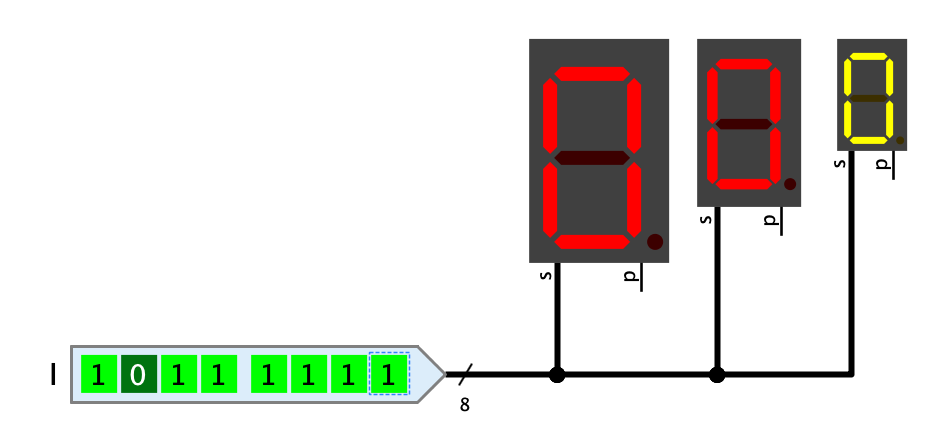
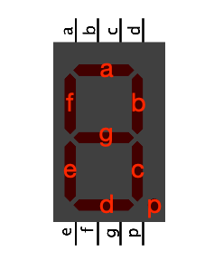

=== image:../../img/base-library/7segment.png[7Segment-Anzeige] 7-Segment-Anzeige

==== Aussehen

==== Verhalten

Die 7-Segment-Anzeige enthält 7 LED, die in der Form einer Ziffer angeordnet sind, sowie eine LED unten rechts, die als Punkt verwendet wird. Die LEDs leuchten in Abhängigkeit der Signale, die an den Eingängen anliegen. Wenn eine 0 anliegt, werden die LEDs in der dunklen Darstellung der ausgewählten Lichtfarbe dargestellt. Bei einer 1 wird die helle Darstellung der Lichtfarbe verwendet.

Die 7-Segment-Anzeige steht in drei verschiedenen Grössen zur Verfügung. Bei der grössen Darstellung kann gewählt werden, ob die Anschlüsse zusammengefasst oder einzeln vorhanden sind.

==== Anschlüsse

p:: Steuert den Dezimalpunkt

a--f:: Nur beim Anschluss-Schema "Einzeln" vorhanden. Steuert die 7 Segmente der Anzeige gemäss obenstehender Abbildung.

s:: Nur beim Anschluss-Schema "Kombiniert" vorhanden. Übernimmt einen 8-Bit-Wert, dessen Bits die 7 Segmente der Anzeige steuern, wobei Bit 0 dem Segment "a" und Bit 6 dem Segment "g" entsprechen. Das höchstwertige Bit wird nicht verwendet.

==== Attribute

LED-Farbe:: Die Farbe der LEDs. Das Menü bietet alle in Antares implementieren Licht-Farben zur Auswahl an.

Grösse:: Die 7-Segment-Anzeige kann in den drei Grössen "gross", "mittel" und "klein" angezeigt werden.

Anschluss-Schema:: Dieses Attribut steht nur zur Verfügung, wenn das Attribut "Grösse" den Wert "gross" hat. Es bestimmt, ob für jedes Segment der LED ein eigener Anschluss vorhanden sein soll (Wert "Einzeln"), oder ob alle 7 Segmente zu einem einzigen 8-Bit-Anschluss zusammengefasst werden sollen (Wert "Kombiniert").
