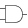
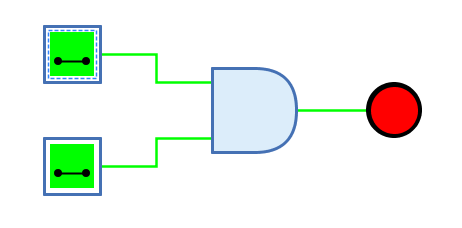
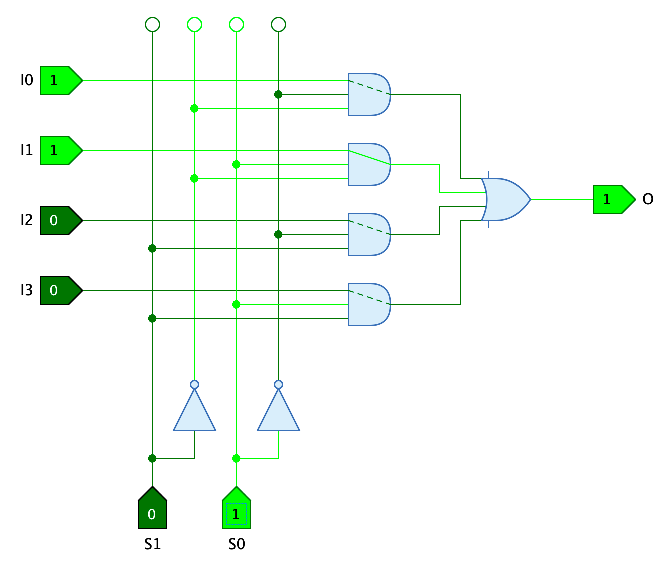
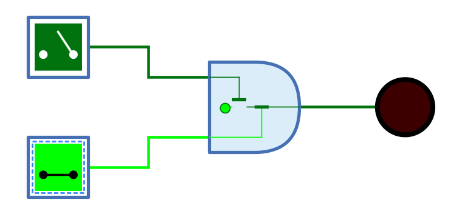

===  Und-Gatter

==== Aussehen

==== Verhalten

Das Und-Gatter gibt am Ausgang das Resultat der AND-Verknüpfung der 1-Bit-Signale am Eingang aus. Der Ausgang hat nur dann den Wert "1", wenn alle Eingänge den Wert "1" haben.

Unverbundene Eingänge haben immer den Wert "0".

.Wahrheitstabelle
[%header,cols=4*, width="40%"]
|===
||0|1|Z/X
|**0**|0|0|0
|**1**|0|1|X
|**Z/X**|0|X|X
|===

(Z: Undefiniert/hochohmig, X: Error)

==== Daten-Pfad

Und-Gatter werden häufig in Datenwegschaltungen verwendet, bei denen anhand von Steuereingängen einer von mehreren Datenpfaden ausgewählt wird. Dabei werden Und-Gatter mit n+1 Eingängen verwendet, wobei n die Anzahl Bits ist, die für die Auswahl des Datenpfades benötigt werden.

Das Und-Gatter bietet die Möglichkeit, den Datenpfad zu visualieren. Wenn das Attribut "Daten-Eingang" mit der Nummer des Eingangs gesetzt ist, an dem der Datenpfad ankommt, zeichnet das Und-Gatter den Pfad von diesem Eingang zum Ausgang. Wenn die Steuereingänge alle den Wert "1" haben, wird der Datenpfad durchgezogen gezeichnet. Hat einer der Steuereingänge den Wert "0", sperrt das Und-Gatter, und der Datenpfad wird gestrichelt gezeichnet.

Das folgende Beispiel zeigt die Verwendung von Daten-Pfäden in der Schaltung "4-1 Multiplexer" der Standard-Bibliothek von Antares.

=== Mnemonics

Die logischen Gatter von Antares können ihre Funktion mit sog. "Mnemonics" veranschaulichen. Siehe dazu das Kapitel <<../description/description.adoc, Beschreibungen und Erläuterungen>>. Unten ist das Mnemonic des Und-Gatters dargestellt.

==== Anschlüsse

Eingänge:: Die 1-Bit-Eingänge des Und-Gatters. Ihre Anzahl wird durch das Attribut "Anzahl Eingänge" bestimmt.

Ausgang:: Der 1-Bit-Ausgang des Und-Gatters. Gibt den Wert der berechneten Und-Funktion aus.

==== Attribute

Ausrichtung:: Die Himmelsrichtung, in die der Ausgang zeigt.

Anzahl Eingänge:: Bestimmt, wieviele Eingänge das Und-Gatter hat. Zur Verfügung stehen 2 bis max. 8 Eingänge. Wenn das Und-Gatter bereits mit Leitungen verbunden ist, kann dieses Attribut nicht geändert werden.

Name des Ausgangs:: Der optionale Name, der neben dem Ausgang dargestellt wird. Dies kann nützlich sein, wenn sich das Und-Gatter das Ende einer komplexen kombinatorischen Schaltung bildet und der logische Ausdruck angegeben werden soll, der durch das Und-Gatter produziert wird.

Daten-Eingang:: In diesem Attribut kann die Nummer des Eingangs gewählt werden, der den Datenpfad enthält, wenn das Feature "Daten-Pfad" (siehe oben) verwendet werden soll. In Richting des Datenflusses durch das Und-Gatter bezeichnet die Nummer "1" den Ausgang ganz oben.