## Bibliothek-Referenz

In diesem Kapitel werden alle elementaren Bibliothek-Komponenten beschrieben, die fest in Antares eingebaut und ausprogrammiert sind. Diese Komponenten sind sowohl in der Bibliothek "Basis" als auch der Biblothek "Standard" enthalten.

Im Vergleich mit anderen Tools mag es so erscheinen, als ob das eher wenig Komponenten sind. Die Philosopie von Antares unterscheidet sich diesbezüglich aber von derjenigen anderer Tools: Bei Antares soll der Benützer bei möglichst vielen Komponenten deren Innenleben erforschen können. Aus diesem Grund enthält Antares z.B. keine ausprogrammierten Flipflops, Volladdierer oder Multiplexer; diese sind in Antares als modellierte Teilschaltungen in der Standard-Bibliothek enthalten und können vom Benützer jederzeit als Teilschaltung geöffnet und während der Simulation in ihrer Funktionsweise beobachtet werden.

### Gemeinsame Attribute

Attribute, die nur für eine bestimmte Komponente gelten, oder die je nach Komponente eine unterschiedliche Bedeutung haben, werden in der Beschreibung der jeweiligen Komponente erläutert. In diesem Kapitel werden Attribute genannt, die für alle Komponenten gleichermassen gelten.

ID:: Die Identifikationsnummer der Komponente, die innerhalb der Schaltung eindeutig ist, in der sich die Komponente befindet. Sie wird vor allem für Scripting-Anwendungen benutzt.

Beschreibung:: In diesem Feld kann eine mehrsprachige Beschreibung eingegeben werden, die den Zweck dieser Komponenten innerhalb der Schaltung beschreibt. Falls vorhanden, wird sie im Beschreibungs-Popup statt der Standardbeschreibung der Komponente angezeigt. Siehe das Kapitel <<../description/description.adoc#, Beschreibungen und Erläuterungen>> für mehr Details.

Laufzeit:: Die Zeit in ns, die bei der Simulation verstreicht, bis ein geändertes Signal am Eingang einer Komponente verarbeitet worden ist, z.B. durch Erzeugen eines geänderten Signals an einem Ausgang der Komponente, oder wie im Fall der LED durch eine andere Darstellung der Komponente.

Schatten:: Mit diesem Attribute wird gesteuert, ob diese bestimmte Komponente mit einem Schatten dargestellt werden soll. Schatten werden grundsätzlich nur dann dargestellt, wenn sie in den Einstellungen von Antares aktiviert worden sind. Falls Schatten in den Einstellungen aktiviert sind, kann die Darstellung für diese Komponente verhindert werden.

Farbe:: Normalerweise wird die Farbe, in der eine Komponente gezeichnet wird, von ihrem Stil bestimmt. Mit dem Attribut "Farbe" kann die Farbe für eine bestimmte Komponente übersteuert werden. Dies kann z.B. eingesetzt werden, um alle Komponenten einer Schaltung, die eine ähnliche Funktion wahrnehmen, durch dieselbe Farbe zu kennzeichnen. Siehe das Kapitel <<../styles/styles.adoc#, Stile und Themen>> für mehr Details.

### Komponenten

#### Netz

* 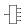 <<splitter.adoc#, Verteiler>>
* 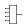 <<concentrator.adoc#, Konzentrierer>>
* 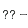 <<probe.adoc#, Sonde>>
* 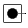 <<tunnel.adoc#, Tunnel>>
* 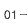 <<constant.adoc#, Konstante>>

#### Logische Gatter

* image:../../img/base-library/and.png[Und] <<and.adoc#, Und>>
* 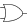 <<or.adoc#, Oder>>
* image:../../img/base-library/nor.png[Nicht] <<not.adoc#, Nicht>>
* 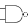 <<nand.adoc#, Nicht-Und>>
* image:../../img/base-library/nor.png[Nicht-Oder] <<nor.adoc#, Nicht-Oder>>
* image:../../img/base-library/xor.png[Antivalenz (XOR)] <<xor.adoc#, XOR>>
* image:../../img/base-library/xor.png[Äquivalenz (XNOR)] <<xnor.adoc#, XNOR>>
* 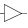 <<buffer.adoc#, Puffer>>
* image:../../img/base-library/tristate-buffer.png[Tri-State Puffer] <<tristate-buffer.adoc#, Tri-State Puffer>>
* 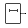 <<delay.adoc#, Verzögerungsglied>>

#### Eingabe

*  <<port.adoc#, Eingang>>
* image:../../img/base-library/switch.png[Schalter] <<switch.adoc#, Schalter>>
* 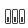 <<dip-switch.adoc#, DIP-Schalter>>
* 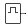 <<clock.adoc#, Taktgeber>>
*  <<keyboard.adoc#, Tastatur>>

#### Ausgabe

* 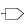 <<port.adoc#, Ausgang>>
* 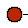 <<led.adoc#, LED>>
* 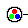 <<rgb-led.adoc#, RGB-LED>>
*  <<7segment.adoc#, 7-Segment-Anzeige>>
* image:../../img/base-library/led-matrix.png[LED-Matrix] <<led-matrix.adoc#, LED-Matrix>>
* image:../../img/base-library/terminal.png[Terminal] <<terminal.adoc#, Terminal>>

#### Speicher

* 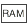 <<ram.adoc#, RAM>>
* image:../../img/base-library/rom.png[ROM] <<rom.adoc#, ROM>>

#### Arithmetik

* 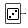 <<random.adoc#, Zufallsgenerator>>