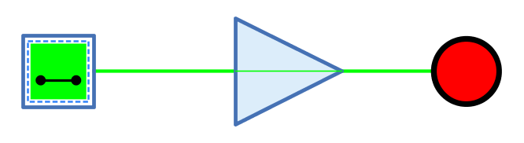

=== image:../../img/base-library/buffer.png[Puffer] Puffer

==== Aussehen

image:../../img/base-library/not-sample.png[Beispiel Puffer, 300]

==== Verhalten

Der Puffer gibt das Signal des Eingangs unverändert am Ausgang aus.

Unverbundene Eingänge haben immer den Wert 0.

.Wahrheitstabelle
[%header,cols=2*, width="40%"]
|===
|In|Out
|**0**|0
|**1**|1
|**Z**|Z
|**X**|X
|===

(Z: Undefiniert/hochohmig, X: Error)

=== Mnemonics

Die logischen Gatter von Antares können ihre Funktion mit sog. "Mnemonics" veranschaulichen. Siehe dazu das Kapitel <<../description/description.adoc, Beschreibungen und Erläuterungen>>. Unten ist das Mnemonic des Puffers dargestellt.

==== Anschlüsse

Eingang:: Der Eingang des Puffers.
Ausgang:: Der Ausgang des Puffers, der das unveränderte Signal des Eingangs ausgibt.

==== Attribute

Ausrichtung:: Die Himmelsrichtung, in die der Ausgang zeigt.

Anzahl Bits:: Die Bitbreite des Signals, das durch den Puffer weitergegeben werden kann.
