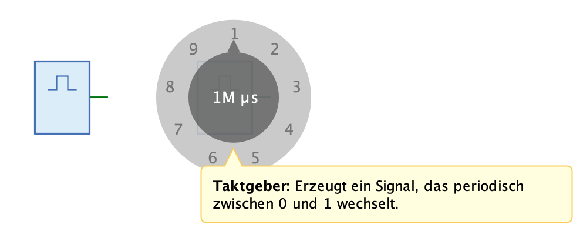

=== image:../../img/base-library/clock.png[Taktgeber] Taktgeber

==== Aussehen

==== Verhalten

TODO

==== Anschlüsse

TODO

==== Attribute

Ausrichtung:: TODO

Periode:: TODO

Aktiv:: TODO

Periode während Simulation ändern:: TODO
