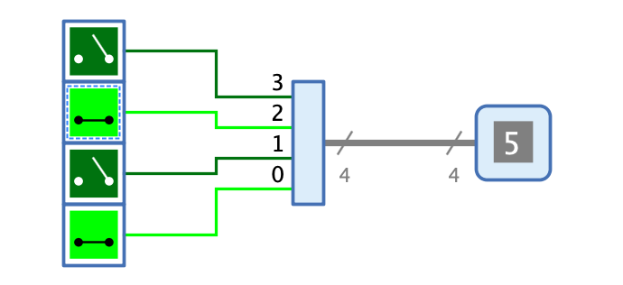

=== image:../../img/base-library/concentrator.png[Konzentrierer] Konzentrierer

==== Aussehen

==== Verhalten

Mit dem Konzentrierer können die Signale mehrerer Leitungsbündel (oder Einzelleitungen) auf ein Leitungsbündel konzentriert werden, das mehr Bits als die eingehenden Leitungsbündel enthält.

Der Grad der Konzentrierung ist insofern eingeschränkt, als nur ganzzahlige Teiler der Anzahl Bits der Ausgangsleitungen möglich sind. So kann z.B. eine 8-Bit-Leitung nur folgendermassen konzentriert werden:

* 2: Der Konzentrierer hat 2 Eingangs-Leitungsbündel à je 4 Bits
* 4: Der Konzentrierer hat 4 Eingangs-Leitungsbündel à je 2 Bits
* 8: Der Konzentrierer hat 8 Eingangs-Leitungen à je 1 Bit

In der aktuellen Version von Antares unterstützt der Konzentrierer keine bidirektionalen Anschlüsse. Für das Verteilen von Leitungsbündeln auf schmalere Bündel (oder Einzelleitungen) muss deshalb die <<splitter.adoc#, Verteiler-Komponente>> verwendet werden.

Weiter besteht in der aktuellen Version von Antares aus technischen Gründen die Einschränkung, dass  die Attribute "Anzahl Bits", "Auffächerung" und "Position Bit 0" nicht mehr geändert werden können, wenn die Anschlüsse bereits mit Leitungen verbunden sind. Vielleicht wird eine zukünftige Version zumindest erlauben, die Anzahl Bits zu erhöhen, ohne dass vorhandene Leitungsanschlüsse vorgängig getrennt werden müssen.

==== Anschlüsse

Ausgang:: Der Konzentrierer hat einen einzigen Ausgang, dessen Bitbreite durch das Attribut "Anzahl Bits" bestimmt wird.

Eingänge:: Die Anzahl Eingänge des Konzentrierers wird durch das Attribut "Auffächerung" bestimmt. Jeder Eingang hat die Bitbreite "Anzahl Bits" / "Auffächerung" und führt während der Simulation diejenigen Bits des Eingangssignal, die dem Index des Eingangs entspricht. Bei einem Konzentrierer mit 8-Bit-Ausgang und einer Auffächerung von 2 führt der Eingang 0 die Bits 0..3 und der Eingang 1 die Bits 4..7.

==== Attribute

Ausrichtung:: Die Himmelsrichtung, in die der Ausgang zeigen.

Anzahl Bits:: Bestimmt die Bit-Breite des Ausgangs.

Auffächerung:: Bestimmt die Anzahl der Eingänge. Die Bit-Breite jedes Eingangs wird durch die Formel "Anzahl Bits" / "Auffächerung" definiert.

Position Bit 0:: Mit Hilfe dieses Attributs kann die Position der Eingänge innerhalb des Verteilers bestimmt werden.

* **Rechts**: Der Eingang, der das Bit 0 führt, liegt aus Sicht des am Ausgang ausgehenden Signals auf der rechten Seite des Konzentrierers.
* **Links**: Der Eingang, der das Bit 0 führt, liegt aus Sicht des am Ausgang ausgehenden Signals auf der linken Seite des Verteilers.

Repräsentation:: Die Art, in der der Wert des Ausgangssignals repräsentiert wird, die z.B. bei der Signalflussanimation verwendet wird. Zur Verfügung stehen binäre und hexadezimale Repräsentation.