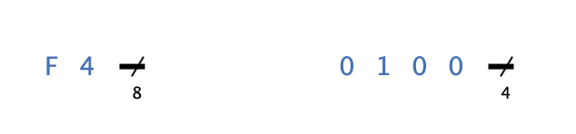

=== image:../../img/base-library/constant.png[Konstante] Konstante

==== Aussehen

==== Verhalten

Die Konstante gibt an ihrem Ausgang konstant den konfigurierten Wert aus.

==== Anschlüsse

Die Konstante hat nur einen Ausgang, dessen Bitbreite im Attribut "Anzahl Bits" konfiguriert werden kann.

==== Attribute

Ausrichtung:: Die Himmelsrichtung, in die der Anschluss zeigt.

Anzahl Bits:: Die Anzahl Bits, aus denen das ausgegebene Signal besteht. Wenn dieses Attribut so verändert wird, dass die Anzahl Bits nicht mehr ausreichen, um den eingestellten Wert im Attribut "Wert (dezimal)" darzustellen, wird der Wert entsprechend abgeschnitten.

Repräsentation:: Die Art, in der der Wert des Ausgangssignals bei der Darstellung repräsentiert wird.

Wert (dezimal):: Der Wert (in dezimaler Schreibweise), der am Ausgang der Konstante ausgegeben wird.