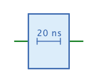

=== image:../../img/base-library/delay.png[Verzögerungsglied] Verzögerungsglied

==== Aussehen

==== Verhalten

Das Verzögerungsglied gibt das Signal, das am Eingang anliegt, nach einer einstellbaren Verzögerungszeit am Ausgang aus.

==== Anschlüsse

Eingang:: Ein 1-Bit-Eingang, der das zu verzögernde Signal aufnimmt.

Ausgang:: Ein 1-Bit-Ausgang, der das verzögerte Signal ausgibt.

==== Attribute

Ausrichtung:: Die Himmelsrichtung, in die der Ausgang zeigt.

Verzögerung:: Die Verzögerungszeit in Nanosekunden.