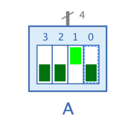

=== image:../../img/base-library/dip-switch.png[DIP-Schalter] DIP-Schalter

==== Aussehen

==== Verhalten

TODO

==== Anschlüsse

TODO

==== Attribute

Ausrichtung:: TODO

Name:: TODO

Anzahl Bits:: TODO

Initialer Wert:: TODO

