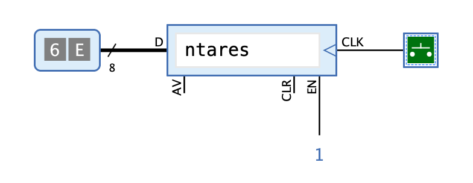

=== image:../../img/base-library/keyboard.png[Tastuatur] Tastatur

==== Aussehen

==== Verhalten

Dieser Komponente ermöglicht es der Schaltung, Zeichen zu übernehmen, die du über deine Computer-Tastatur eingibst (solange sie als 7-bit ASCII-Code interpretiert werden können).

Klicke während der Simulation mit der Maus auf die Komponente, damit sie den Eingabefokus erhält, der wie üblich mit einem dünnen blauen Rechteck dargestellt wird. Wenn du danach über deine Computer-Tastatur Zeichen eingibst, werden sie im Puffer dieser Komponente von links nach rechts gesammelt. Zu jedem Zeitpunkt gibt die Komponente den ASCII-Code des Zeichen ganz links im Puffer über den Ausgang "D" aus. Bei einer steigenden Flanke des Takteingangs "CLK" wird das Zeichen ganz links aus dem Puffer entfernt, und das vormals zweite Zeichen, das nun an die Stelle ganz links rückt, wird am Ausgang "D" ausgegeben.

Die unterstützen Zeichen beinhalten alle darstellbaren Zeichen im Bereich zwischen 20 (Leerzeichen) und 126 (Tilde) sowie die Steuerzeichen 8 (Backspace), 9 (Tab), und 10 (Linefeed). Die Steuerzeichen werden als "\b" (Backspace), "\t" (Tab) und "\n" (Linefeed) dargestellt. Alle anderen Zeichen ignoriert Antares.

Die Komponente ist insofern asynchron, als das erste eingegebene Zeichen sofort am Ausgang "D" ausgegeben wird, ohne das dazu auf das Clock-Signal gewartet wird.

Wenn der Puffer voll ist, zeigt dies Antares durch ein rotes Rechteck um das Eingabefeld an; weitere eingegebene Zeichen ignoriert Antares dann.

==== Anschlüsse

CLK:: Eingang "Clock" - Bei steigender Flanke wird das nächste Zeichen am Ausgang D ausgegeben, falls EN gesetzt ist.

EN:: Eingang "Enable" - Mit 1 wird die Ausgabe des nächsten Zeichens am Ausgang D ermöglicht, wenn CLK auf 1 geht.

CLR:: Eingang "Clear" - Mit 1 wird der Puffer gelöscht.

D:: Ausgang "Data" - An diesem 8-Bit-Ausgang wird das erste Zeichen des Puffers ausgegeben.

AV:: Ausgang "Available" - Zeigt mit 1 an, dass mindestens 1 Zeichen im Puffer enthalten ist. Geht auf 0, wenn der Puffer leer ist.

==== Attribute

Puffergrösse:: Die Anzahl Zeichen, die der Puffer speichern kann.