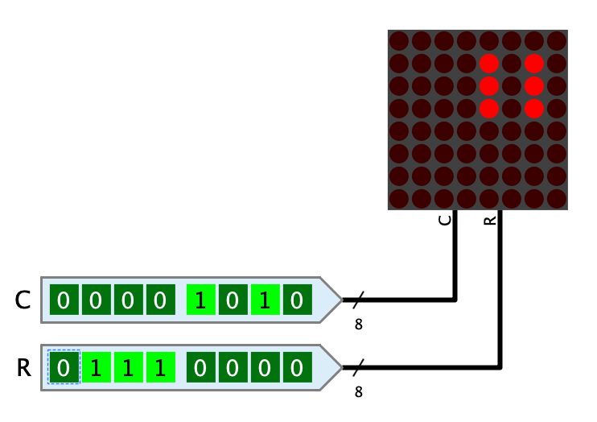
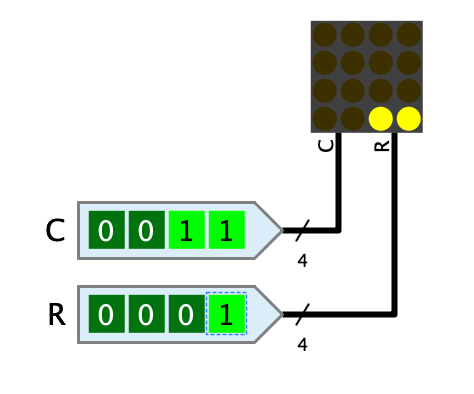
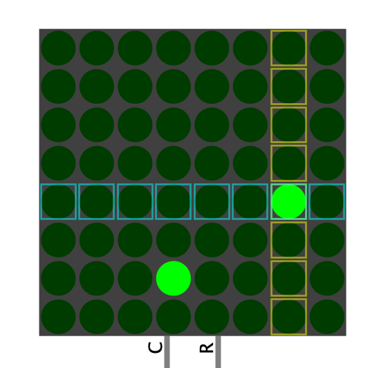

===  LED-Matrix

==== Aussehen

==== Verhalten

Stellt eine Matrix von LEDs dar, die in Abhängigkeit der Signale an den Eingängen leuchten oder nicht. Die Matrix kann bis zu 32 Zeilen und Spalten haben.

Um alle Leuchtpunkte einer 32x32-Matrix einzeln adressieren zu können, müsse die LED-Matrix extrem viele Anschlüsse haben. Aus diesem Grund wird ein Adressierungsmodus verwenden, bei dem lediglich die Zeilen und Spalten adressiert werden. An den Kreuzungspunkten, an denen beide Signale eine 1 enthalten, leuchtet der Leuchtpunkt.

Beispiel: Bei einer 4x4-LED-Matrix, deren C-Anschluss den Wert 0011 und deren R-Anschluss den Wert 0001 hat, leuchten die beiden linken Punkte in der untersten Zeile.

Dieses Beispiel zeigt, dass mit diesem Adressierungsmodus natürlich nicht ohne weiteres alle Punkte einzeln adressiert werden können. Um dies trotzdem zu ermöglichen, wird die LED-Matrix zusammen mit einer Multiplexing-Schaltung betrieben, bei der die Nachleuchtdauer von LEDs ausgenutzt wird. Die Standard-Bibliothek von Antares enthält im Verzeichnis "Ausgabe" die Schaltung "8x8 LED-Matrix mit Ctrl", die zeigt, wie eine solche Multiplexing-Schaltung funktioniert.

==== Anschlüsse

C:: Der Wert, der die Spalten (Columns) der LED-Matrix adressiert. Das niedrigwertigse Bit addressiert die Spalte ganz links. Die Bit-Breite des Anschlusses wird durch den Wert des Attributs "Anzahl Spalten" definiert.

R:: Der Wert, der die Zeilen (Rows) der LED-Matrix adressiert. Das niedrigwertigse Bit addressiert die Zeile ganz unten. Die Bit-Breite des Anschlusses wird durch den Wert des Attributs "Anzahl Zeilen" definiert.

==== Attribute

LED-Farbe:: Die Farbe der LEDs. Das Menü bietet alle in Antares implementieren Licht-Farben zur Auswahl an.

Grösse:: Die LED-Matrix kann in den drei Grössen "gross", "mittel" und "klein" angezeigt werden.

Anzahl Spalten:: Bestimmt die Anzahl Spalten der LED-Matrix. Das Attribut kann einen Wert zwischen 1 und 32. Dieser Wert bestimmt gleichzeit die Bit-Breite des Anschluss "C".

Anzahl Zeilen:: Bestimmt die Anzahl Zeilen der LED-Matrix. Das Attribut kann einen Wert zwischen 1 und 32. Dieser Wert bestimmt gleichzeit die Bit-Breite des Anschluss "R".

Nachleuchtdauer (ms):: Die Dauer in Millisekunden, die ein Leuchtpunkt noch nachleuchtet, nachdem die entsprechenden Werte an den Eingängen auf 0 gesetzt worden sind. Wenn die LED-Matrix im Multiplexing-Modus betrieben wird, muss dieser Wert mit Frequenz abgestimmt sein, mit der die Eingangswerte ändern.

Leuchtpunkt als Kreis:: Normalerweise zeichnet Antares die Leuchtpunkte als kleine Rechtecke ohne Zwischenraum zwischen den einzelnen Punkten. Wenn dieses Attribut gesetzt ist, werden stattdessen kleine Kreise gezeichnet.

Debug:: Wenn dieses Attribut gesetzt ist, zeigt die LED-Matrix während der Simulation an, welche Zeile und Spalten an den Eingängen gerade den Wert 1 haben, was bei der Fehlersuche hilfreich sein kann, aber auch zu Ausbildungszwecken, wenn z.B. eine Multiplexing-Schaltung entwickelt wird.

