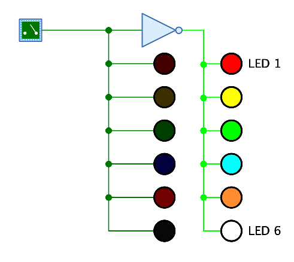

=== image:../../img/base-library/led.png[LED] LED

==== Aussehen

==== Verhalten

Zeigt den Wert am Eingang an, indem der Leuchtkörper der LED in Abhängigkeit der Farbe der LED entsprechend dargestellt wird. Bei einer "1" am Eingang wird die LED hell gezeichnet, bei einer "0" dunkel.

==== Anschlüsse

Eine LED hat nur einen einzigen Eingang der Bit-Breite 1.

==== Attribute

Ausrichtung:: Die Himmelsrichtung, in die der Leuchtkörper zeigt.

Name:: Der Name der LED, der als Text neben dem Leuchtkörper (auf der dem Anschluss gegenüberliegenden Seite) angezeigt wird.

LED-Farbe:: Die Farbe des Leuchtkörpers. Das Menü bietet alle in Antares implementieren Licht-Farben zur Auswahl an.