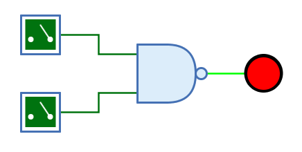
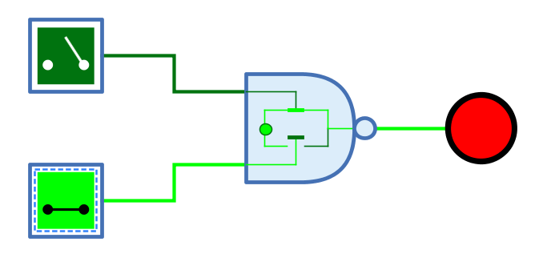

=== image:../../img/base-library/nand.png[Nicht-Und] Nicht-Und-Gatter

==== Aussehen

==== Verhalten

Das Nicht-Und-Gatter gibt am Ausgang das Resultat der NAND-Verknüpfung der 1-Bit-Signale am Eingang aus. Der Ausgang hat nur dann den Wert 0, wenn alle Eingänge den Wert 1 haben.

Unverbundene Eingänge haben immer den Wert 0.

.Wahrheitstabelle
[%header,cols=5*, width="40%"]
|===
||0|1|Z|X
|**0**|1|1|1|1
|**1**|1|0|1|X
|**Z**|1|1|1|X
|**X**|1|X|X|X
|===

(Z: Undefiniert/hochohmig, X: Error)

=== Mnemonics

Die logischen Gatter von Antares können ihre Funktion mit sog. "Mnemonics" veranschaulichen. Siehe dazu das Kapitel <<../description/description.adoc, Beschreibungen und Erläuterungen>>. Unten ist das Mnemonic des Nicht-Und-Gatters dargestellt.

==== Anschlüsse

Eingänge:: Die 1-Bit-Eingänge des Nicht-Und-Gatters. Ihre Anzahl wird durch das Attribut "Anzahl Eingänge" bestimmt.

Ausgang:: Der 1-Bit-Ausgang des Nicht-Und-Gatters. Gibt den Wert der berechneten NAND-Funktion aus.

==== Attribute

Ausrichtung:: Die Himmelsrichtung, in die der Ausgang zeigt.

Anzahl Eingänge:: Bestimmt, wieviele Eingänge das Nicht-Und-Gatter hat. Zur Verfügung stehen 2 bis max. 8 Eingänge. Wenn das Nicht-Und-Gatter bereits mit Leitungen verbunden ist, kann dieses Attribut nicht geändert werden.

Name des Ausgangs:: Der optionale Name, der neben dem Ausgang dargestellt wird. Dies kann nützlich sein, wenn sich das Nicht-Und-Gatter das Ende einer komplexen kombinatorischen Schaltung bildet und der logische Ausdruck angegeben werden soll, der durch das Nicht-Und-Gatter produziert wird.