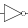
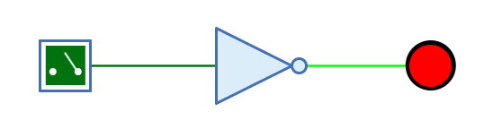
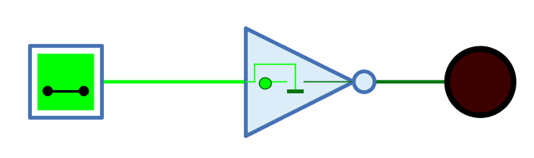

===  Nicht-Gatter

==== Aussehen

==== Verhalten

Das Nicht-Gatter invertiert das 1-Bit-Signal am Eingang und gibt es am Ausgang aus.

Unverbundene Eingänge haben immer den Wert 0.

.Wahrheitstabelle
[%header,cols=2*, width="40%"]
|===
|In|Out
|**0**|1
|**1**|0
|**Z**|Z
|**X**|X
|===

(Z: Undefiniert/hochohmig, X: Error)

=== Mnemonics

Die logischen Gatter von Antares können ihre Funktion mit sog. "Mnemonics" veranschaulichen. Siehe dazu das Kapitel <<../description/description.adoc, Beschreibungen und Erläuterungen>>. Unten ist das Mnemonic des Nicht-Gatters dargestellt.

==== Anschlüsse

Eingang:: Der Eingang des Nicht-Gatters.
Ausgang:: Der Ausgang des Nicht-Gatters, der das invertierte Signal des Eingangs ausgibt.

==== Attribute

Ausrichtung:: Die Himmelsrichtung, in die der Ausgang zeigt.
