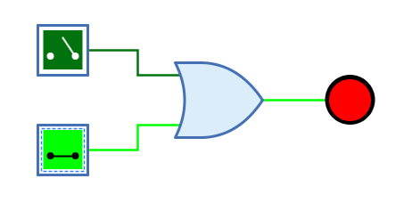
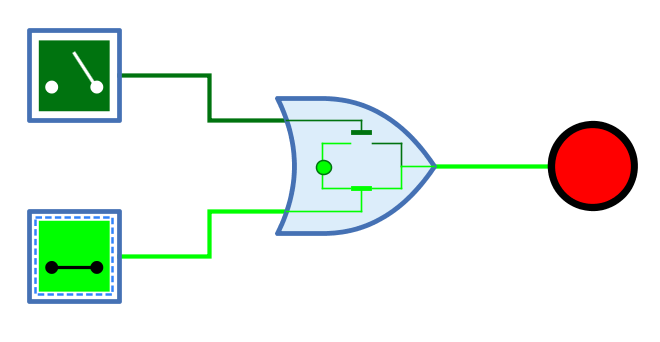

=== image:../../img/base-library/or.png[Oder] Oder-Gatter

==== Aussehen

==== Verhalten

Das Oder-Gatter gibt am Ausgang das Resultat der OR-Verknüpfung der 1-Bit-Signale am Eingang aus. Der Ausgang hat nur dann den Wert 1, wenn mindestens einer der Eingänge den Wert 1 hat.

Unverbundene Eingänge haben immer den Wert 0.

.Wahrheitstabelle
[%header,cols=5*, width="40%"]
|===
||0|1|Z|X
|**0**|0|1|0|X
|**1**|1|1|1|1
|**Z**|0|1|0|X
|**X**|X|1|X|X
|===

(Z: Undefiniert/hochohmig, X: Error)

=== Mnemonics

Die logischen Gatter von Antares können ihre Funktion mit sog. "Mnemonics" veranschaulichen. Siehe dazu das Kapitel <<../description/description.adoc, Beschreibungen und Erläuterungen>>. Unten ist das Mnemonic des Oder-Gatters dargestellt.

==== Anschlüsse

Eingänge:: Die 1-Bit-Eingänge des Oder-Gatters. Ihre Anzahl wird durch das Attribut "Anzahl Eingänge" bestimmt.

Ausgang:: Der 1-Bit-Ausgang des Oder-Gatters. Gibt den Wert der berechneten Oder-Funktion aus.

==== Attribute

Ausrichtung:: Die Himmelsrichtung, in die der Ausgang zeigt.

Anzahl Eingänge:: Bestimmt, wieviele Eingänge das Oder-Gatter hat. Zur Verfügung stehen 2 bis max. 8 Eingänge. Wenn das Oder-Gatter bereits mit Leitungen verbunden ist, kann dieses Attribut nicht geändert werden.

Name des Ausgangs:: Der optionale Name, der neben dem Ausgang dargestellt wird. Dies kann nützlich sein, wenn sich das Oder-Gatter das Ende einer komplexen kombinatorischen Schaltung bildet und der logische Ausdruck angegeben werden soll, der durch das Oder-Gatter produziert wird.
