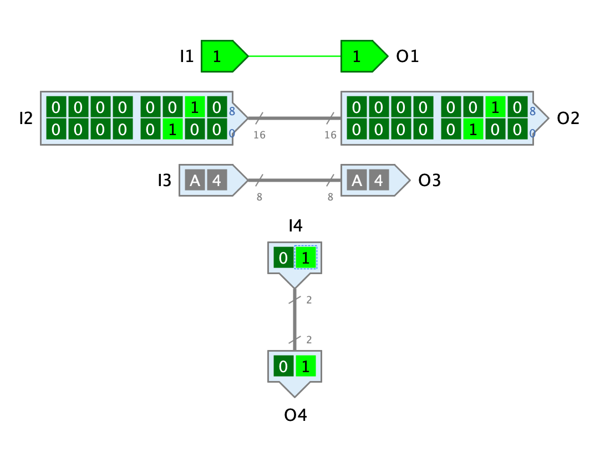

=== image:../../img/base-library/input.png[Input] image:../../img/base-library/output.png[Output] Anschluss

==== Aussehen

==== Verhalten

Ein Anschluss ist entweder ein Eingang, ein Ausgang, oder Eingang/Ausgang, je nach Wert des Attributs "Anschluss-Typ". Anschlüsse werden grafisch als Pfeile dargestellt, wobei die Lage der Pfeilspitze in Bezug auf den Anschluss der Anschluss-Komponente anzeigt, ob es sich um einen Eingang oder einen Ausgang handelt. Bei einem Eingang befindet die Pfeilspitze beim Anschluss, bei einem Ausgang befindet sie sich an der gegenüberliegenden Seite des Anschlusses.

Anschlüsse zeigen während der Simulation das aktuelle Signal an. Je nach Wert der Attribute "Anzahl Bits" und "Repräsentation" sind dazu unterschiedlich viele Ziffern nötig. Antares ordnet die Ziffern in Blöcken zu 4 Ziffern übereinander an, wobei niederwertige Ziffern unten/links und höherwertige Ziffern oben/rechts stehen.

Während der Simulation können Eingänge wie ein Schalter benützt werden, allerdings nur dann, wenn sie Teil der Hauptschaltungen sind, d.h. der äusserten Schaltung. Würde Antares erlauben, dass der Benutzer das Signal eines Eingangs einer Teilschaltung ändert, käme es zu einem Konflikt mit dem Signal, das von der umgebenden Schaltung an den Eingang übergeben wird.

==== Anschlüsse

Eine Anschluss-Komponente hat nur einen Anschluss, dessen Bit-Breite durch das Attribut "Anzahl Bits" bestimmt wird.

==== Attribute

Name:: TODO

Anschluss-Typ:: TODO

Anzahl Bits:: TODO

Repräsentation:: TODO

Umschalten:: TODO