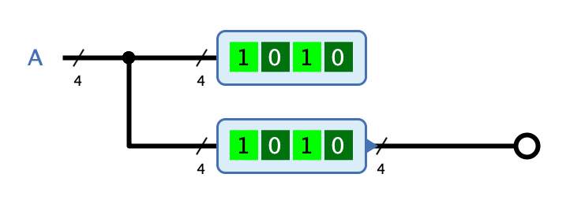

=== image:../../img/base-library/probe.png[Sonde] Sonde

==== Aussehen

==== Verhalten

Die Sonde wird verwendet, um einen Signalwert an einem bestimmten Punkt in der Schaltung darzustellen. Wenn das Attribut "Loggin" gesetzt ist, werden die Signalwerte zusätzlich im Fenster "Log" von Antares gesammelt und zusammen mit dem Zeitpunkt, an dem das Signal aufgetreten ist, dargestellt. Dies kann z.B. bei der Fehlersuche hilfreich sein.

==== Anschlüsse

Eingang:: Die Sonde hat einen einzigen Eingang, der das darzustellende Signal übernimmt. Die Bitbreite wird durch das Attribut "Anzahl Bits" bestimmt.

Ausgang:: Wenn das Attribut "Hat Ausgang" gesetzt ist, hat die Sonde am entgegengesetzten Ende einen Ausgang, an dem das gelesene Signal unverändert ausgegeben wird. Damit können Sonden direkt in eine Leitung integriert werden, ohne dass eine Abzweigung benötigt wird.

==== Attribute

Name:: Der Name der Sonde, der am entgegengesetzten Ort des Einganges (resp. oberhalb der Sonde, falls "Hat Ausgang" gesetzt ist) dargestellt wird. Der Name wird auch für das Logging-Feature verwendet, damit die geloggten Signale der Sonde mit dem entsprechenden Namen zugeordnet werden können.

Ausrichtung:: Die Himmelsrichtung, in die die Sonde zeigt.

Anzahl Bits:: Die Bitbreite des Eingangs.

Repräsentation:: Die Art, in der Signalwert repräsentiert wird. Zur Verfügung stehen binäre und hexadezimale Repräsentation.

Hat Ausgang:: Wenn dieses Attribut gesetzt ist, hat die Sonde gegenüber des Eingangs zusätzlich einen Ausgang.

Logging:: Wenn dieses Attribut gesetzt ist, werden geänderte Signalwerte im Fenster "Log" von Antares gesammelt und dargestellt.
