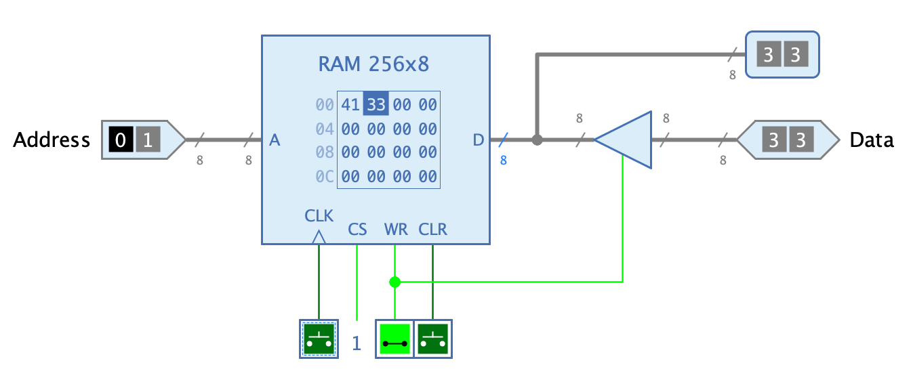

=== image:../../img/base-library/ram.png[RAM] RAM

==== Aussehen

==== Verhalten

Das RAM ist eine <<memory.adoc#, Speicher>>-Komponente, deren Daten durch die verwendende Schaltung während der Simulation gelesen und geschrieben werden können.

Die Inhalte der Speicherzellen der RAM-Komponente können über einen bidirektionalen Datenanschluss synchron gelesen und geschrieben werden.

Die RAM-Komponente stellt zwei verschiedene Schnittstellen zur Verfügung, die über den Wert des Attributs "Takteingang" ausgewählt werden können.

Synchron:: Bei dieser Schnittstelle enthält das RAM den Takteingang "CLK". Wenn der Eingang "WR" den Wert 1 hat, werden die am Eingang "D" anliegenden Daten bei ansteigender Flanke des Takteingangs übernommen.

Asynchron:: Bei dieser Schnittstelle enthält das RAM keinen Takteingang. Wenn der Eingang "WR" den Wert 1 hat, werden die am Eingang "D" anliegenden Daten jedesmal übernommen, wenn sie sich ändern.

==== Anschlüsse

A:: Eingang "Address": Bestimmt die Adresse der Speicherzelle, deren Daten gelesen oder geschrieben werden sollen.

CS:: Eingang "Chip Select": Die RAM-Komponente liest oder schreibt nur dann Daten, wenn dieser Eingang den Wert 1 hat.

D:: Eingang/Ausgang "Data": Gibt die Daten aus, die gelesen werden, oder übernimmt die Daten, die geschrieben werden, je nach Wert der Eingänge "WR" und "CLK".

CLK:: Eingang "Clock": Wird nur angezeigt, wenn das Attribut "Takteingang" gesetzt ist. Bei steigender Flanke des CLK-Signals werden Daten gelesen oder geschrieben, je nach Wert von "WR".

WR:: Eingang "Write": Mit dem Wert 1 können Daten in das RAM geschrieben werden.

CLR:: Eingang "Clear": Asynchroner Eingang, an dem ein Wert 1 dazu führt, dass alle Speicherzellen auf den Wert 0 zurückgesetzt werden, unabhängig von den anderen Eingängen.

==== Attribute

Siehe das Kapitel <<memory.adoc#, Speicher>> für eine Beschreibung der allgemeinen Speicher-Attribute. In diesem Abschnitt werden nur die spezielle Attribute der RAM-Komponente beschrieben.

Takteingang:: Wenn dieses Attribut gesetzt wird, enthält das RAM den Anschluss "CLK".
