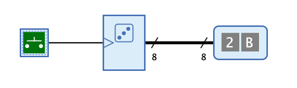

=== image:../../img/base-library/random.png[Zufallsgenerator] Zufallsgenerator

==== Aussehen

==== Verhalten

Der Zufallsgenerator generiert mit jeder steigenden Flanke des Takteingangs eine neue Zufallszahl.

==== Anschlüsse

Eingang:: Der Takteingang. Mit steigender Flanke wird eine neue Zufallszahl generiert.

Ausgang:: Ein n-Bit-Ausgang, der die zuletzt generierte Zufallszahl ausgibt.

==== Attribute

Ausrichtung:: Die Himmelsrichtung, in die der Ausgang zeigt.

Anzahl Bits:: Die Anzahl Bits, aus denen die generierte Zufallszahl besteht.