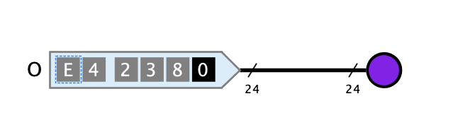

=== image:../../img/base-library/rgb-led.png[RGB-LED] RGB-LED

==== Aussehen

==== Verhalten

Die Farbe, in der die RGB-LED leuchtet, wird vom 24-Bit-Wert bestimmt, der am Eingang der LED anliegt.

==== Anschlüsse

Eine LED hat nur einen einzigen Eingang der Bit-Breite 24. Die höchstwertigen 8 Bits enthalten den Wert des roten Farbkanals, die mittleren 8 Bit enthalten den Wert des grünen Farbkanals, und die tiefstwertigen 8 Bits enthalten den Wert des blauen Farbkanals.

==== Attribute

Ausrichtung:: Die Himmelsrichtung, in die der Leuchtkörper zeigt.

Name:: Der Name der LED, der als Text neben dem Leuchtkörper (auf der dem Anschluss gegenüberliegenden Seite) angezeigt wird.

