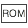
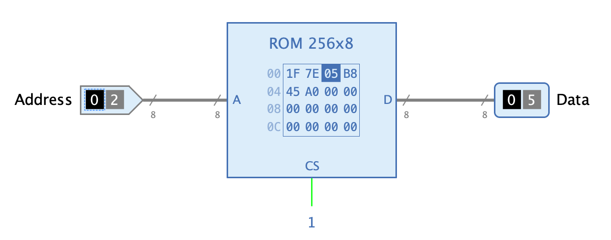
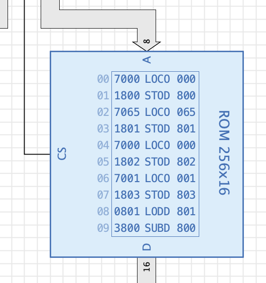

===  ROM

==== Aussehen

==== Verhalten

Das ROM ist eine <<memory.adoc#, Speicher>>-Komponente, deren Daten durch den Autor der Schaltung aus einem File geladen werden können und die danach Bestandteil der gespeicherten Schaltung sind, die das ROM enthält. Während der Ausführung der Simulation können die gespeicherten Daten nicht geändert werden.

Wenn der CS-Eingang des ROM während der Simulation den Wert 1 hat, können die Daten an einer bestimmten Speicheradresse durch Anlegen der Adresse am Eingang "A" ausgelesen werden. Die an dieser Adresse gespeicherten Daten stehen nach Ablauf der Laufzeit (Propagation Delay) am Ausgang D zur Verfügung.

==== Disassembler

Die ROM-Komponente bietet die Möglichkeit, die Werte von Speicherzellen bei der Anzeige in eine lesbare Form zu übersetzen. Ein typisches Beispiel ist Maschinencode eines Mikrocomputers, dessen einzelne Maschinenbefehle in die entsprechenden Assembler-Befehle übersetzt werden sollen, ein Vorgang, den man "Disassemblieren" nennt.

Die ROM-Komponete verwendet dafür eine Liste von https://de.wikipedia.org/wiki/Regulärer_Ausdruck[regulären Ausdrücke], die der Autor der Schaltung als Attribut der ROM-Komponente speichern kann. Wenn der Wert einer Speicherzelle angezeigt werden soll, sucht Antares nach dem ersten regulären Ausdruck, der vom Wert der Speicherzelle erfüllt wird, und stellt das Ergebnis des regulären Ausdrucks dar. Das Ergebnis kann Referenzen auf sog. "Capture groups" beinhalten, um auf Teile des Speicherzellen-Inhalts zuzugreifen.

.Syntax
----
regularExpression = result
----

Das folgende Beispiel stammt aus dem Beispiel-Projekt "Mikrocomputer (Tannenbaum)".

.Beispiel
----
0([A-F0-9]{3})=LODD $1
1([A-F0-9]{3})=STOD $1
2([A-F0-9]{3})=ADDD $1
3([A-F0-9]{3})=SUBD $1
4([A-F0-9]{3})=JPOS $1
5([A-F0-9]{3})=JZER $1
6([A-F0-9]{3})=JUMP $1
7([A-F0-9]{3})=LOCO $1
8([A-F0-9]{3})=LODL $1
9([A-F0-9]{3})=STOL $1
A([A-F0-9]{3})=ADDL $1
B([A-F0-9]{3})=SUBL $1
C([A-F0-9]{3})=JNEG $1
D([A-F0-9]{3})=JNZE $1
E([A-F0-9]{3})=CALL $1
F0([A-F0-9]{2})=PSHI
F2([A-F0-9]{2})=POPI
F4([A-F0-9]{2})=PUSH
F6([A-F0-9]{2})=POP
F8([A-F0-9]{2})=RETN
FA([A-F0-9]{2})=SWAP
FC([A-F0-9]{2})=INSP $1
FE([A-F0-9]{2})=DESP $1
FF([A-F0-9]{2})=HALT

----

Die Konfiguration mit obenstehendem Beispiels führt zu folgender Anzeige im Symbol der ROM-Komponente, die ein Maschinenprogramm für die Tannenbaum-CPU enthält, das alle Zahlen zwischen 1 und 100 addiert (nur Ausschnitt dargestellt).

==== Anschlüsse

A:: Eingang "Address": Bestimmt die Adresse der Speicherzelle, deren Daten ausgelesen werden sollen.

CS:: Eingang "Chip Select": Die ROM-Komponente gibt nur dann Daten am Ausgang "D" aus, wenn dieser Eingang den Wert 1 hat. Mit Wert 0 ist der Ausgang "D" undefiniert.

D:: Ausgang "Data": Gibt die Daten der Speicherzelle aus, die mit Eingang "A" adressiert wird.

==== Attribute

Siehe das Kapitel <<memory.adoc#, Speicher>> für eine Beschreibung der allgemeinen Speicher-Attribute. In diesem Abschnitt werden nur die spezielle Attribute der ROM-Komponente beschrieben.

Disassembler anzeigen:: Wird nur angezeigt, wenn das Attribut "Inhalt anzeigen" ausgewählt ist. Wenn das Attribut "Disassembler anzeigen" gesetzt ist, werden die Speicherwerte gemäss der "Disassembler-Konfiguration" disassembliert und das Resultat zusätzlich dargestellt.

Disassembler-Konfiguration:: Eine Liste von Disassembler-Definitionen. Die Definitionen müssen durch Zeilenumbrüche getrennt sein.