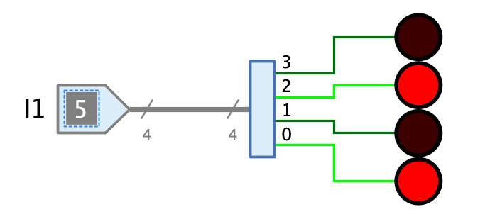

=== image:../../img/base-library/splitter.png[Verteiler] Verteiler

==== Aussehen

==== Verhalten

Mit dem Verteiler kann das Signal eines Leitungsbündel auf mehrere Leitungsbündel (oder Einzelleitungen) verteilt (oder "aufgefächert") werden, die weniger Bits als das eingehende Leitungsbündel enthalten.

Der Grad der Auffächerung ist insofern eingeschränkt, als nur ganzzahlige Teiler der Anzahl Bits der Eingangsleitung möglich sind. So kann z.B. eine 8-Bit-Leitung nur folgendermassen aufgefächtert werden:

* 2: Der Verteiler hat 2 Ausgangs-Leitungsbündel à je 4 Bits
* 4: Der Verteiler hat 4 Ausgangs-Leitungsbündel à je 2 Bits
* 8: Der Verteiler hat 8 Ausgangs-Leitungen à je 1 Bit

In der aktuellen Version von Antares unterstützt der Verteiler keine bidirektionalen Anschlüsse. Für das Zusammenfassen von Leitungen zu Leitungsbündeln muss deshalb die <<concentrator.adoc#, Konzentrierer-Komponente>> verwendet werden.

Weiter besteht in der aktuellen Version von Antares aus technischen Gründen die Einschränkung, dass  die Attribute "Anzahl Bits", "Auffächerung" und "Position Bit 0" nicht mehr geändert werden können, wenn die Anschlüsse bereits mit Leitungen verbunden sind. Vielleicht wird eine zukünftige Version zumindest erlauben, die Anzahl Bits zu erhöhen, ohne dass vorhandene Leitungsanschlüsse vorgängig getrennt werden müssen.

==== Anschlüsse

Eingang:: Der Verteiler hat einen einzigen Eingang, dessen Bitbreite durch das Attribut "Anzahl Bits" bestimmt wird.

Ausgänge:: Die Anzahl Ausgänge des Verteilers wird durch das Attribut "Auffächerung" bestimmt. Jeder Ausgang hat die Bitbreite "Anzahl Bits" / "Auffächerung" und führt während der Simulation diejenigen Bits des Eingangssignal, die dem Index des Ausgangs entspricht. Bei einem Verteiler mit 8-Bit-Eingang und einer Auffächerung von 2 führt der Ausgang 0 die Bits 0..3 und der Ausgang 1 die Bits 4..7.

==== Attribute

Ausrichtung:: Die Himmelsrichtung, in die die Ausgänge zeigen.

Anzahl Bits:: Bestimmt die Bit-Breite des Eingangs.

Auffächerung:: Bestimmt die Anzahl der Ausgänge. Die Bit-Breite jedes Eingangs wird durch die Formel "Anzahl Bits" / "Auffächerung" definiert.

Position Bit 0:: Mit Hilfe dieses Attributs kann die Position der Ausgänge innerhalb des Verteilers bestimmt werden.

* **Rechts**: Der Ausgang, der das Bit 0 führt, liegt aus Sicht des am Eingang eintreffenden Signals auf der rechten Seite des Verteilers.
* **Links**: Der Ausgang, der das Bit 0 führt, liegt aus Sicht des am Eingang eintreffenden Signals auf der linken Seite des Verteilers.

Repräsentation:: Die Art, in der die Werte der Ausgangssignale repräsentiert werden, die z.B. bei der Signalflussanimation verwendet wird. Zur Verfügung stehen binäre und hexadezimale Repräsentation.