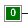
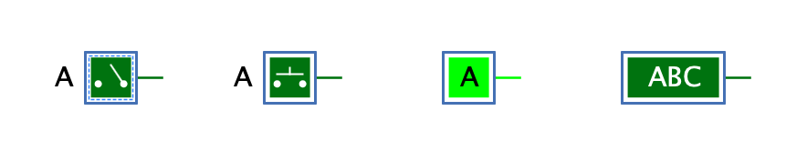

===  Schalter

==== Aussehen

==== Verhalten

Diese Komponente implementiert einen Schalter, den der Benutzer mit der linken Maustaste drücken kann. Ein gedrücker Schalter erzeugt am Ausgang den Wert "1", ansonsten ist der Wert "0". Je nach Wert des Attributs "Umschalten" bleibt der Schalter nach Loslassen der Maustaste eingeschaltet, oder er schaltet sich wieder aus.

Beim Drücken des Schalters mit der Maus erhält der Schalter den Tastatur-Fokus, der durch ein dünnes blaues gesticheltes Rechteck dargestellt wird. Wenn ein Schalter den Tastatur-Fokus besitzt, kann der auch mit der ENTER-Taste sowie mit den Tasten "0" und "1" betätigt werden.

Ein gedrückter Schalter erzeugt nicht sofort ein Signal am Ausgang, sondern erst nach Ablauf der eingestellten Laufzeit, die standardmässig auf 1'000 ns eingestellt ist. Bis diese Laufzeit abgelaufen ist, nimmt der Schalter keine weiteren Eingaben entgegen. Dies wird ersichtlich, wenn die Simulation im Einzelschritt-Modus ausgeführt wird: Der Schalter wird bis zum Ablauf der Verzögerungszeit als "inaktiv" (mit grauer Fläche überlagert) dargestellt.

==== Anschlüsse

Ein Schalter hat nur einen einzigen 1-Bit-Ausgang, der den Wert "1" hat, wenn der Schalter gedrückt ist.

==== Attribute

Ausrichtung:: Die Himmelsrichtung, in die der Anschluss zeigt.

Name:: Der optionale Name des Schalter, der je nach Wert des Attributs "Position Bezeichnung" dargestellt wird.

Position Bezeichnung:: Bestimmt, wo der "Name" des Schalters als Text dargestellt wird.

* *Ausblenden*: Der Name wird nicht dargestellt.
* *Ausserhalb*: Der Name wird gegenüber des Anschlusses dargestellt.
* *Innerhalb*: Der Name wird innerhalb des Schalters dargestellt. Umfasst der Name mehr als ein Zeichen, wird der Schalter entsprechend grösser.

Umschalten:: Wenn dieses Attribut gesetzt ist (Default), bleibt der Schalter in gedrücktem Zustand, nachdem der Benutzer die Maustaste losgelassen hat (resp. die Tastatur-Taste, die das Drücken des Schalters ausgelöst hat).

