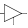
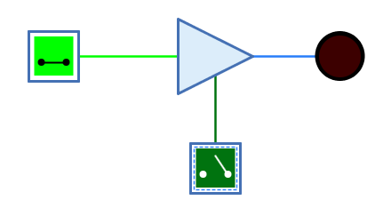
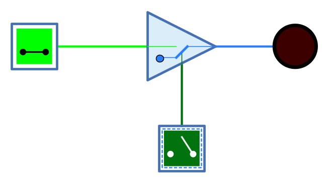

===  Tri-State Puffer

==== Aussehen

==== Verhalten

Der Tri-State Puffer ist ein Puffer, der zusätzlich zum Dateneingang einen Kontrolleingang hat. Wenn der Kontrolleingang aktiv ist, wird das Signal vom Eingang unverändert an den Ausgang weitergegeben. Ist der Kontrolleingang nicht aktiv, ist der Ausgang undefiniert/hochohmig.

Tri-State Puffer werden verwendet, wenn der Ausgang mehrerer Komponenten auf einer Leitung zusammengefasst werden soll. In diesem Fall wird der Ausgang dieser Komponenten über einen Tri-State Puffer geführt, wobei mittels Kontrolleingang nur derjenige Tri-State Puffer aktiv geschalten wird, dessen Leitung das gewünschte Signal führt.

Der Kontrolleingang des Tri-State Puffers kann mit dem Attribut "Logik" auf "Positiv" oder "Negativ" gesetzt werden.

Unverbundene Eingänge haben immer den Wert 0.

.Wahrheitstabelle "Positive Logik"
[%header,cols=5*, width="40%"]
|===
||EN=0|EN=1|EN=Z|EN=X
|**0**|Z|0|Z|X
|**1**|Z|1|Z|X
|**Z/X**|Z|Z/X|Z|X
|===

.Wahrheitstabelle "Negative Logik"
[%header,cols=5*, width="40%"]
|===
||EN=0|EN=1|EN=Z|EN=X
|**0**|0|Z|Z|X
|**1**|1|Z|Z|X
|**Z/X**|Z/X|Z|Z|X
|===

(Z: Undefiniert/hochohmig, X: Error)

=== Mnemonics

Die logischen Gatter von Antares können ihre Funktion mit sog. "Mnemonics" veranschaulichen. Siehe dazu das Kapitel <<../description/description.adoc, Beschreibungen und Erläuterungen>>. Unten ist das Mnemonic des Tri-State Puffers dargestellt.

==== Anschlüsse

Dateineingang:: Der Eingang des Puffers. Die Anzahl Bits wird durch das Attribut "Anzahl Bits" bestimmt.

EN:: "Enable" - 1-Bit-Kontrolleingang. Ein aktiver Wert führt dazu, dass alle Bits des Dateneingangs unverändert am Ausgang ausgegeben werden. Bei inaktivem Wert wird am Ausgang ein n-Bit-Wert ausgegeben, dessen n Bits alle undefiniert sind. Was als aktiver Wert gilt, wird vom Attribut "Logik" bestimmt.

Ausgang:: Der Ausgang des Puffers. Die Anzahl Bits wird durch das Attribut "Anzahl Bits" bestimmt.

==== Attribute

Ausrichtung:: Die Himmelsrichtung, in die der Ausgang zeigt.

Logik:: Bestimmt die Logik des Kontrolleingangs EN.
* **Positiv**: Der Eingang EN ist beim Wert 1 aktiv.
* **Negativ**: Der Eingang EN ist beim Wert 0 aktiv.

Anzahl Bits:: Die Anzahl Bits des Dateneingangs und des Ausgangs.

Ausrichtung Kontrolleingang:: Bestimmt, auf welcher Seite des Puffers der Kontrolleingang EN dargestellt wird.
* **Rechts**: Der Kontrolleingang wird von der Datenflussrichtung aus gesehen rechts dargestellt.
* **Links**: Der Kontrolleingang wird von der Datenflussrichtung aus gesehen links dargestellt.

