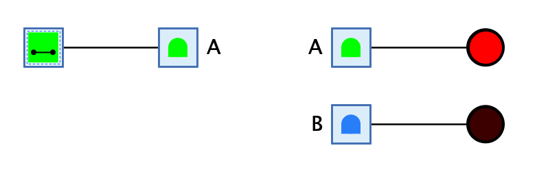

=== image:../../img/base-library/tunnel.png[Tunnel] Tunnel

==== Aussehen

==== Verhalten

Die Tunnel-Komponente ist ein Leitungs-Element, das dazu dient, weit entfernte Punkte einer Schaltung miteinander zu verbinden, ohne dass eine Leitung gezeichnet werden muss.

Eine Schaltung kann mehrere Tunnel-Verbindungen enthalten, die durch den Namen des Tunnels unterschieden werden. Im obenstehenden Beispiel gibt es die beiden Tunnel-Namen "A" und "B". Das Signal des Schalters ganz links führt in den Tunnel-Eingang "A" und wird automatisch an den Tunnel-Ausgang mit demselben Namen weitergegeben. Beachte, dass der Tunnel mit Namen "B" das Signal nicht erhält, da er einen anderen Namen hat.

Der Geltungsbereich eines Tunnel-Namens beschränkt sich auf die aktuelle Schaltung. Wenn eine Schaltung eine Teilschaltung enthält, die ihrerseits einen Tunnel mit demselben Namen "A" enthält, wird das Signal im Tunnel "A" der Hauptschaltung *nicht* an den Tunnel "A" in der Teilschaltung weitergegeben.

==== Anschlüsse

Eingang:: Der Eingang der Tunnel-Komponente ist bidirektional, d.h. er ist gleichzeitig Eingang und Ausgang. Dies ermöglicht es, für das Senden eines Signals in einen Tunnel und für das Empfanges des Signals aus diesem Tunnel denselben Komponenten-Typ zu verwenden.

==== Attribute

Ausrichtung:: Die Himmelsrichtung, in die das Symbol der Komponente zeigt.

Name:: Der Name des Tunnels, in den diese Komponete ihr Signal schickt. Der Name wird auf der gegenüberliegenden Seite des Anschlusses angezeigt.

Anzahl Bits:: Die Anzahl Bits, die über diesen Tunnel gleichzeitig übertragen werden können.
