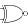
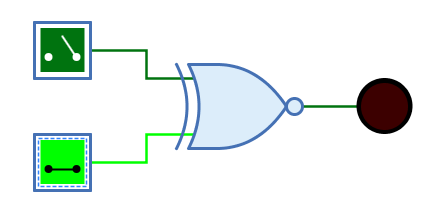

===  XNOR-Gatter (Äquivalenz)

==== Aussehen

==== Verhalten

Das XNOR (Nicht-Exklusiv-Oder) gibt am Ausgang das Resultat der XNOR-Verknüpfung der 1-Bit-Signale am Eingang aus. Der Ausgang hat nur dann den Wert "1", wenn nicht genau ein Eingang den Wert "1" hat. Bei einem XNOR-Gatter mit zwei Eingängen bedeutet das, dass der Ausgang "1" ist, wenn die beiden Eingänge denselben Wert haben.

Unverbundene Eingänge haben immer den Wert "0".

.Wahrheitstabelle
[%header,cols=4*, width="40%"]
|===
||1|0|Z/X
|**0**|1|0|X
|**1**|1|0|X
|**Z/X**|X|X|X
|===

(Z: Undefiniert/hochohmig, X: Error)

=== Mnemonics

Die logischen Gatter von Antares können ihre Funktion mit sog. "Mnemonics" veranschaulichen. Siehe dazu das Kapitel <<../description/description.adoc, Beschreibungen und Erläuterungen>>. Unten ist das Mnemonic des XNOR-Gatters dargestellt.

image:../../img/base-library/xor-mnemonic.png[Beispiel Mnemonic, 50%]

==== Anschlüsse

Eingänge:: Die 1-Bit-Eingänge des XNOR-Gatters. Ihre Anzahl wird durch das Attribut "Anzahl Eingänge" bestimmt.

Ausgang:: Der 1-Bit-Ausgang des XNOR-Gatters. Gibt den Wert der berechneten XNOR-Funktion aus.

==== Attribute

Ausrichtung:: Die Himmelsrichtung, in die der Ausgang zeigt.

Anzahl Eingänge:: Bestimmt, wieviele Eingänge das XNOR-Gatter hat. Zur Verfügung stehen 2 bis max. 8 Eingänge. Wenn das XNOR-Gatter bereits mit Leitungen verbunden ist, kann dieses Attribut nicht geändert werden.

Name des Ausgangs:: Der optionale Name, der neben dem Ausgang dargestellt wird. Dies kann nützlich sein, wenn sich das XNOR-Gatter das Ende einer komplexen kombinatorischen Schaltung bildet und der logische Ausdruck angegeben werden soll, der durch das XNOR-Gatter produziert wird.
