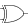
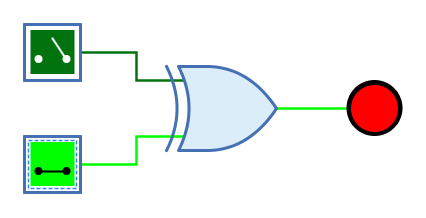
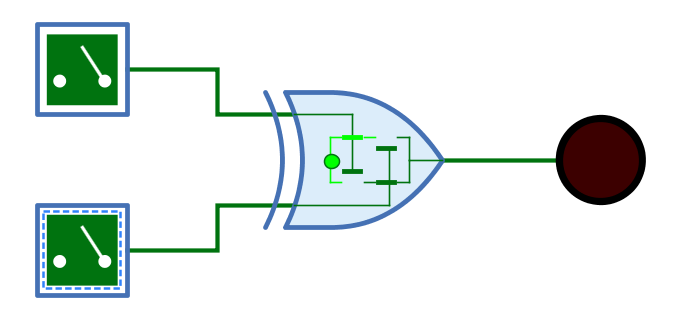

===  XOR-Gatter (Antivalenz)

==== Aussehen

==== Verhalten

Das XOR-Gatter (Exklusiv-Oder) gibt am Ausgang das Resultat der XOR-Verknüpfung der 1-Bit-Signale am Eingang aus. Der Ausgang hat nur dann den Wert 1, wenn genau ein Eingang den Wert 1 hat. Bei einem XOR-Gatter mit zwei Eingängen bedeutet das, dass der Ausgang 1 ist, wenn die beiden Eingänge einen unterschiedlichen Wert haben.

Unverbundene Eingänge haben immer den Wert 0.

.Wahrheitstabelle
[%header,cols=5*, width="40%"]
|===
||0|1|Z|X
|**0**|0|1|0|X
|**1**|1|0|0|X
|**Z**|0|0|0|X
|**X**|X|X|X|X
|===

(Z: Undefiniert/hochohmig, X: Error)

=== Mnemonics

Die logischen Gatter von Antares können ihre Funktion mit sog. "Mnemonics" veranschaulichen. Siehe dazu das Kapitel <<../description/description.adoc, Beschreibungen und Erläuterungen>>. Unten ist das Mnemonic des XOR-Gatters dargestellt.

==== Anschlüsse

Eingänge:: Die 1-Bit-Eingänge des XOR-Gatters. Ihre Anzahl wird durch das Attribut "Anzahl Eingänge" bestimmt.

Ausgang:: Der 1-Bit-Ausgang des XOR-Gatters. Gibt den Wert der berechneten XOR-Funktion aus.

==== Attribute

Ausrichtung:: Die Himmelsrichtung, in die der Ausgang zeigt.

Anzahl Eingänge:: Bestimmt, wieviele Eingänge das XOR-Gatter hat. Zur Verfügung stehen 2 bis max. 8 Eingänge. Wenn das XOR-Gatter bereits mit Leitungen verbunden ist, kann dieses Attribut nicht geändert werden.

Name des Ausgangs:: Der optionale Name, der neben dem Ausgang dargestellt wird. Dies kann nützlich sein, wenn sich das XOR-Gatter das Ende einer komplexen kombinatorischen Schaltung bildet und der logische Ausdruck angegeben werden soll, der durch das XOR-Gatter produziert wird.
