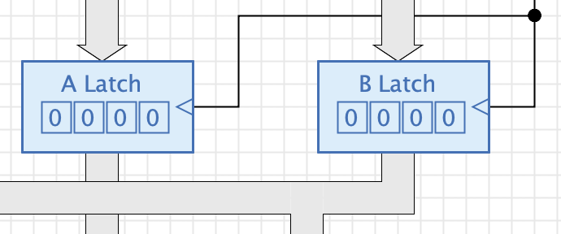
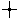
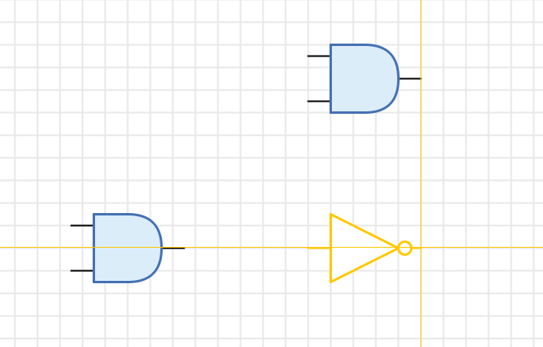

== Schaltungen
:experimental:

Schaltungen sind das zentrale Gliederungselement von Antares.

Im einführenden Kapitel <<../first-steps/first-steps.adoc#, Erste Schritte>> hast du bereits erste Erfahrungen mit eigenen Schaltungen gemacht. Im Kapitel <<../projects-libraries/projects-libraries.adoc#, Projekte und Bibliotheken>> wird beschrieben, wie du Schaltungen in deine eigenen Projekte zusammenfasst oder wie du Schaltungen in Bibliotheken organisierst, damit sie in mehreren Projekten verwendet werden können. Im Kapitel <<../projects-libraries/workbench.adoc#, Werkbank>> lernst Du, wie du neue Schaltungen erzeugst oder bestehende Schaltungen zur Bearbeitung öffnest.

Dieses Kapitel beschreibt, wie du eine einzelne Schaltung bearbeitest.

=== Orientierung

Du öffnest eine Schaltung, indem du einen Doppelklick auf dem Projekt-Eement oder dem Bibliothek-Element im Baum der Werkbank ausführst. Der Name der geöffneten Schaltung wird an mehreren Stellen im Antares-Fenster angezeigt:

* **Titelzeile**: Die Titelzeile des Antares-Fensters nennt den Namen der Schaltung sowie, ob die Schaltung Bestandteil des geöffneten Projektes oder der Bibliothek ist. Beispiel: __Antares - Projekt-Element "4-Bit Carry-Ripple-Addierer"__.
* **Navigationsleiste**: Das erste Element der Navigationsleiste nennt den Namen der geöffneten Schaltung.
* **Eigenschaftenfenster**: Wenn du im Zeichnungsbereich auf den Hintergrund der aktuellen Schaltung klickst, werden im Eigenschaftenfenster die Attribute der Schaltung dargestellt. Der Titel des Eigenschaftenfensters nennt den Namen der geöffneten Schaltung.
* **Werkbank-Baum**: Der Knoten im Baum der Werkbank, welcher der geöffneten Schaltung entspricht, enthält den Namen der Schaltung. Das Icon des Knotens ist für die geöffnente Schaltung orange hinterlegt.

Eine Schaltung besteht immer aus der Schaltung selber sowie ihren Symbol, das verwendet wird, wenn die Schaltung als Teilschaltung zu anderen Schaltungen hinzugefügt wird. Beide Teile können einzeln editiert werden. Verwende die Ansichtswerkzeuge (die beiden ersten Knöpfe in der Werkzeugleiste), um zwischen den beiden Ansichten hin- und her zu wechseln.

Sämtliche Änderungen - sei es in der Schaltung selber, in der Symbolansicht, oder an Attributen der Schaltung - werden immer zusammen gespeichert. Die Schaltung bildet also sozusagen die "Speichereinheit" von Antares. Während Änderungen an Projekt- oder Bibliothek-Strukturen immer automatisch gespeichert werden, musst du Änderungen an der Schaltung selber speichern. Verwende dazu das Menü menu:Datei[Speichern] oder die Tastenkombination kbd:[Cmd +S].

=== Ansicht wählen

Bei grösseren Schaltung entsteht schnell das Bedürfniss, Grösse und Ausschnitt der Darstellung der Schaltung im Hauptfenster zu wählen. Die Grösse der Fläche, in der die Schaltung enthalten ist, ist grundsätzlich unbeschränkt. Das ist auch der Grund, weshalb die Hauptansicht keine Scrollbars enthält; Antares bietet stattdessen verschiedene andere Möglichkeiten, Grösse und Ausschnitt der Darstellung zu wählen.

TIP: Wenn die Maus in der Hauptansicht umherbewegt wird, zeigt Antares in der Statuszeile unten rechts die aktuellen Koordinaten der Mausposition an.

Manuelles Zoomen:: Manuelles Zoomen kann mit derselben Aktion ausgelöst werden, die in Fenstern mit Scrollbars für das vertikale Scrollen verwendet wird. Bei einer Maus mit Mausrad ist dies das Bewegen des Mausrades. Bei Verwendung eines Trackpads kann die entsprechende Scroll-Geste verwendet werden.

Ausschnitt wählen (Pan):: Der aktuell dargestellte Ausschnitt des Hauptfensters kann durch Verschieben der Maus bei gedrückter mittlerer Maustaste verschoben werden. Bei Verwendung eines Trackpads kann die Scroll-Geste mit gleichzeitig gedrückter kbd:[Alt]-Taste verwendet werden.

menu:Ansicht[Vergrössern]:: Vergrössert den Ausschnitt des Hauptfensters um eine Zoom-Stufe.

menu:Ansicht[Originalgrösse]:: Zentriert die Darstellung und setzt den Zoom-Faktor auf 100%.

menu:Ansicht[Verkleinern]:: Verkleinert den Ausschnitt des Hauptfensters um eine Zoom-Stufe.

menu:Ansicht[Zentrieren]:: Zentriert die Darstellung, ohne den Zoom-Faktor zu verändern.

menu:Ansicht[Anpassen]:: Zentriert die Darstellung und setzt den Zoom-Faktor so, dass die Schaltung die gesamte Hauptansicht vollständig ausfüllt.

=== Schaltungseigenschaften

Wenn du im Hauptfenster mit der Maus auf den Hintergrund der Schaltung klickst, werden im Eigenschaftenfenster die Attribute der Schaltung zur Bearbeitung angeboten.

Name:: In diesem Attribut kann ein kurzer Name der Schaltung in allen unterstützten Sprachen eingegeben werden. Beachte, dass du den Namen einer Schaltung selbst dann noch verändern kannst, wenn die Schaltung Bestandteil einer Bibliothek ist und bereits in Projekten als Teilschaltung verwendet wird. Dies ist so, weil Antares für die Referenzierung von Teilschaltungen in Bibliotheken nicht den Namen der Schaltung verwendet, sondern eine interne, eindeutige Identifikation (eine sog. UUID).

Beschreibung:: Dieses Attribut dient dazu, eine längere Beschreibung der Schaltung zu erfassen, die in der Vorschau des Explorers sowie bei Verwendung als Teilschaltung in anderen Schaltungen im Beschreibungs-Popup dargestellt wird.

Laufzeit:: In diesem optionalen Attribut kann die Zeitdauer angegeben werden, die bei der Verarbeitung eines Eingangssignals bis zum Erscheinen eines geänderten Ausgangssignals verstreicht. Sie wird verwendet, um die Darstellung des Verarbeitungszustandes einer Teilschaltung während der <<../simulation/simulation.adoc#, Simulation>> zu steuern.

Funktion:: In diesem Attribut kann das Script angegeben werden, das Antares für diese Komponente während der Simulation ausführt, falls die Simulation im Modus <<../simulation/simulation.adoc#, "Flache Simulation">> betrieben wird. Dies ist eine fortgeschrittene Technik; für Details zu Scripting siehe das Kapitel <<circuit-scripting.adoc#, "Scripting in Schaltungen">>.

Default-Lichtfarbe:: Die Lichtfarbe, die in dieser Schaltung alle Komponenten per Default erhalten sollen, die leuchten können (LED, 7-Segment-Anzeige, Terminal). Wenn du den Wert dieses Attributs änderst, während die Schaltung bereits leuchtende Komponenten enthält, fragt dich Antares, ob die neue Lichtfarbe bei diesen Komponenten angewendet werden soll. Mit dieser Option können z.B. alle roten LED's und 7-Segment-Anzeigen mit einer einzigen Aktion auf die Farbe Gelb umgestellt werden.

=== Komponenten hinzufügen

Du fügst Komponenten zu einer Schaltung hinzu, indem du die hinzuzufügende Komponeten im Baum der Werkbank auswählst und in die Schaltung ziehst (Drag & Drop). Dabei erhält die neue Komponente die von der Programmierung vorgegebenen Standard-Attribute.

Es kommt häufig vor, dass du mehrere Komponenten mit denselben, veränderten Attributen in einer Schaltung benötigst, z.B. Oder-Gatter mit drei Eingängen statt nur zwei wie beim Default-Wert. In diesen Fällen kann es sinnvoll sein, Copy/Paste zu verwenden: Ziehe das erste Exemplare der Komponente in die Schaltung, stelle die gewünschten Attribute ein, kopiere die Komponente mittels menu:Bearbeiten[Kopieren] in die Zwischenablage, und füge dann die benötigte Anzahl weiterer Komponenten mittels menu:Bearbeiten[Einsetzen] in die Schaltung ein.

Beim ersten Einsetzen einer Komponente platziert Antares die eingesetzte Komponente mit einem kleinen Abstand vom Original. Wenn du dann die eingesetzte Komponente an einen neuen Ort verschiebst und anschliessend weitere Komponenten aus der Zwischenablage einsetzt, verwendet Antares den Abstand zwischen Original und dem von dir definierten Ort der zuerst eingesetzten Komponente als Vorlage. Dadurch können auf einfache Weise gleichmässige Anordnungen von gleichartigen Komponenten erzeugt werden, z.B bei Flipflops in Schieberegister-Schaltungen.

=== Komponenten verbinden

Das Verbinden von Komponenten mittels Leitungen ist ein eigenes, grosses Thema, das im separaten Kapitel <<wired.adoc#, "Leitungen">> behandelt wird.

=== Attribute von Teilschaltungen

Die Eigenschaften der eingebauten Basiskomponenten werden im Kapitel <<../base-library/base-library.adoc#, "Basis-Bibliothek">> erläutert. Dieser Abschnitt beschreibt die Attribute von Teilschaltungen, die in eine Schaltung eingefügt werden.

Ausrichtung:: Die Himmelsrichtung, in die das Symbol der Teilschaltung zeigt. Wie Basiskomponenten können Symbole von Teilschaltungen auch mit kbd:[Cmd + R] rotiert werden.

Horizontal Spiegeln:: Spiegelt das Symbol in horizontaler Richtung (resp. an der vertikalen Achse durch den Ursprung des Symbols). Dies ist z.B. dann nützlich, wenn in der verwendenden Schaltung Leitungen mit Eingangssignalen von der rechten Seite eintreffen, die Eingänge im Symbol sich aber an der linken Seite des Symbols befinden.

Vertikal Spiegeln:: Spiegelt das Symbol in vertikaler Richtung (resp. an der horizontalen Achse durch den Ursprung des Symbols). Dies ist z.B. dann nützlich, wenn in der verwendenden Schaltung Leitungen mit Steuersignalen von oben eintreffen, die Steuereingänge im Symbol sich aber am der unteren Seite des Symbols befinden.

Beschreibung:: In diesem Attribut kann eine Beschreibung der Teilschaltung eingegeben werden, die nur für diese eine Verwendung der Teilschaltung gilt. Diese Beschreibung ersetzt diejenige, die der Autor der Teilschaltung vorgegeben hat.

Bezeichnung:: Dieses Attribut steht nur dann zur Verfügung, wenn das Symbol der Teilschaltung mindestens ein Bezeichnungs-Element enthält, d.h. einen Text resp. ein Label. Mit diesem Attribut kann der Text dieser von Symbol vorgegebenen Bezeichnung geändert werden. +
 +
Beispiel: Das Beispiel-Projekt "Mikrocomputer (Tannenbaum)" enthält zwei 16-Bit-Register, die als Latches in den beiden Datenpfaden A und B der CPU dienen. Das Symbol des 16-Bit-Registers enthält das Bezeichnungs-Element "REG" (für Register). In der Anwendung der Register innerhalb der CPU kann man nun mit diesem Attribut den Text "REG" durch "A Latch" resp. "B Latch" ersetzen. +
 +
Der Wert des Attributs "Bezeichnung" kann auch gelöscht werden, um zu erreichen, dass die vom Symbol vorgegebene Bezeichnung nicht angezeigt wird.

=== Symbol editieren

Die bisher vorgestellten Möglichkeiten, durch Spiegeln oder Änderung der Bezeichnung das Symbol einer Teilschaltung anzupassen, genügen häufig bereits, um eine Teilschaltung optimal in eine Schaltung zu integrieren. Manchmal jedoch möchte man das Symbol einer Teilschaltung noch weiter anpassen.

Das untenstehende Bild zeigt die bereits beschriebenen Anwendung von 16-Bit-Registern als Datenpfad-Latches in einer CPU. Zusätzlich zur Anpassung der Standard-Beschreibung des Registern möchte man in diesem Fall z.B. den aktuell gespeicherten Wert des Registers direkt im Symbol anzeigen, etwas, was vom 16-Bit-Register in der Standard-Bibliothek nicht vorgesehen ist.

Für solche und ähnliche Anwendungen bietet Antares die Möglichkeit, das Symbol einer einzelnen Teilschaltung vollständig frei zu bearbeiten. Mit menu:Kontext[Symbol editieren] öffnet Antares denselben Symboleditor, der auch für das Bearbeitungen des Symbols von Schaltungen verwendet wird. Damit stehen alle Möglichkeiten des Editors wie Eingänge verschieben, grafische Elemente wie Rechtecke bearbeiten oder Kontrollelemente hinzufügen zur Verfügung. Im obenstehenden Beispiel wurde das Kontrollelement "Ausgang" des 16-Bit-Registers zum Symbol hinzugefügt.

Mit btn:[OK] wird der Symboleditor geschlossen und das geänderte Symbol als Symbol der Teilschaltung in der aktuellen Schaltung gespeichert.

NOTE: Das geänderte Symbol gilt nur für die ausgewählte Teilschaltung in der aktuellen Schaltung. Andere Teilschaltungen derselben Schaltung behalten ihr Symbol, und insbesondere die Bibliothek oder das Projekt, in dem die Teilschaltung enthalten ist, wird dadurch ebenfalls nicht verändert.

Mit menu:Kontext[Symbol zurücksetzen] kann das ursprüngliche Symbol wieder hergestellt werden.

=== Zeichnungswerkzeuge

Eine Schaltung in Antares kann nicht nur aus digitalen Komponenten und den verbindenen Leitungen bestehen, sondern auch aus rein grafischen Elementen wie Rechtecken oder Texten. Verwende die Zeichnungswerkzeuge in der Werkzeugleiste des Antares-Fensters, um solche Elemente zur Schaltung hinzuzufügen.

Wähle das Zeichnungswerkzeug aus und bewege anschliessend die Maus über die Zeichnungsfläche. Das geänderte Mauszeiger-Icon zeigt an, dass du mit dem Zeichnen beginnen kannst.

 **Selektion** Mit dem Selektionswerkzeug können einzelne oder mehrere Komponenten ausgewählt werden. Verwende zusätzlich zum Klick mit der linken Maustaste kbd:[Shift], um die aktuelle Selektion zu erweitern oder zu reduzieren. Klicke mit der Maus auf dem Hintergrund, um bei gerückter Maustaste einen Selektionsbereich aufzuziehen.

 **Rechteck** Klicke die linke Maustaste und ziehe mit gedrückter Maustaste das Rechteck auf. Mit kbd:[Shift] kann ein Quadrat erzeugt werden.

 **Ellipse** Klicke die linke Maustaste und ziehe mit gedrückter Maustaste die Ellipse auf. Mit kbd:[Shift] kann ein Kreis erzeugt werden.

 **Polylinie** Klicke die linke Maustaste, um die Punkte einer Polylinie zu setzen. Ein Doppelklick beendet die Erzeugung der Polylinie. Um nachträglich weitere Punkte hinzuzufügen, kannst du die Polylinie selektieren und einen Doppelklick auf einem Segment der Polylinie ausführen. Wenn du einen Zwischenpunkt auf einen anderen Zwischenpunkt verschiebst, werden die beiden Punkte zu einem einzigen Punkt zusammengelegt.

 **Kurve** Klicke an drei Stellen mit der Maus, um die drei Punkte einer Kurve zu definieren. Die drei Punkte sind die Stützpunkte einer quadratischen Bézier-Kurve.

 **Text** Ein Klick mit der linken Maustaste erzeugt eine Textkomponente mit einem Standard-Text. Doppelklicke auf dem Text, um den Text zu ändern, oder benütze das Attribut "Text" im Eigenschaftenfenster von Antares. Der Text kann mehrerere Zeilen umfassen. In der aktuellen Version von Antares wird der Text linksbündig ausgerichtet. Ändere die Grösse der Text-Box, indem du  sie wie ein Rechteck editierst.

Der Selektionszustand der grafischen Objekte wird wie bei den digitalen Komponenten durch Zeichnen in der Selektionsfarbe dargestellt, also nicht wie bei anderen Applikation durch Anzeige der kleinen Bearbeitungs-Rechktecke (Handles). Diese werden erst angezeigt, wenn du  die Maus über eine selektierte grafische Komponente bewegst.

Selektiere eine grafische Komponente und ändere ihre Attribute wie "Ausgefüllt", "Rand", "Schatten", "Stil", "Farbe", "Linienstil", um das Aussehen der Komponente nach deinen Wünschen zu gestalten. Im Kapitel <<../styles/styles.adoc#, "Stile und Themen">> findest du  weitere Angaben zu Stilen, Farben und anderen grafischen Eigenschaften.

=== Ausrichtung

Antares bietet zwei Werkzeuge an, mit denen die gegenseitige Ausrichtung von Komponenten erleichtert wird.

 **Raster** Mit diesem Werkzeug wird der Nullpunkt einer Komponente immer auf einen Rasterpunkt gesetzt. Der Abstand der Rasterpunkte kann in den Einstellungen von Antares verändert werden; beachte aber, dass die meisten vorgegebenen Komponenten so dimensioniert sind, dass ihre Anschlüsse auf den Standard-Rasterabstand abgestimmt sind.

 **Komponenten** Mit diesem Werkzeug versucht Antares, die Komponente, die du platzierst, im Bezug auf bereits vorhandene Komponenten auszurichten. Je nach Typ der Komponente wird dabei der Nullpunkt der Komponente oder ihre Ein- und Ausgänge verwendet. Antares zeigt mittels dünner oranger Hilfslinien an, wo es eine mögliche Ausrichtung zu anderen gefunden hat.

