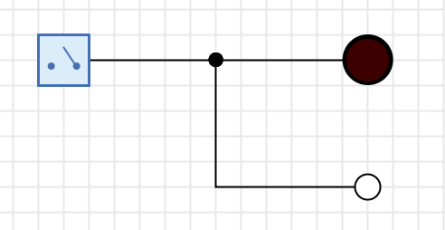
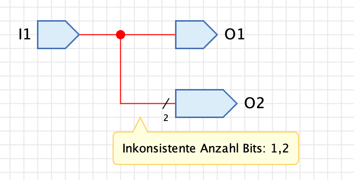
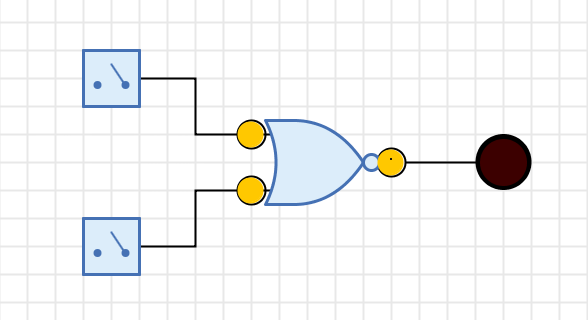
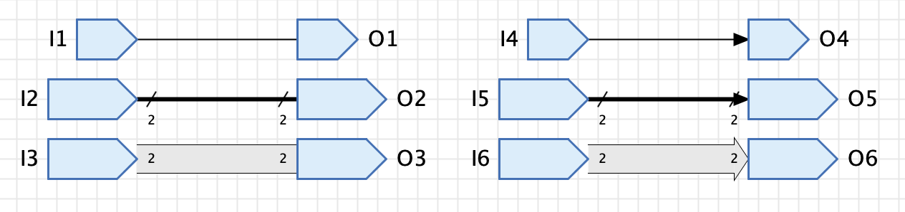
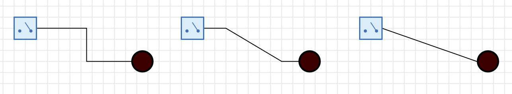

=== Leitungen
:experimental:

Leitungen sind Schaltungselemente, mit denen Anschlüsse von Komponenten verbunden werden können, damit während der
Simulation der Schaltung Signale zwischen den Komponenten fliessen können.

Anders als vergleichbare Tools erzeugt Antares nicht selbstständig einen Kontakt zwischen einer Leitung und einem Anschluss, wenn sie sich an der gleichen Stelle befinden; ein Kontakt muss immer explizit durch den Benutzer hergestellt werden. Damit du unverbundene Leitungen auf den ersten Blick erkennst, stellt Antares unverbundene Leitungsenden mit einem kleinen Kreis dar.

==== Leitungen erzeugen

Um das Erzeugen einer neuen Leitung zu beginnen, bewegst du die Maus über einen Anschluss einer Komponente oder eine bereits vorhandene Leitung. Antares zeigt dir dann mit einem kleinen orangen Kreis an, dass du an dieser Stelle eine neue Leitung beginnen kannst.

Drücke dann die linke Maustaste und halte sie gedrückt, während du die Maus zum gewünschten Ziel der Leitung bewegst. Antares erzeugt dabei automatisch ein rechtwinkliges Layout der entstehenden Leitung.

Je nach Typ des Anschlusses, an dem du die Leitung beginnst, sind die folgenden Ziele von Leitungen möglich:

Ausgang zu Eingang:: Bewege die Maus mit gedrückter linker Maustaste zum Eingang einer Komponente.

Eingang zu Ausgang oder Leitung:: Bewege die Maus mit gedrückter Maustaste zum Eingang einer Komponete oder zu einer bereits vorhandenen Leitung.

Leitung zu Eingang:: Um eine neue Leitung auf einer bereits bestehenden Leitung zu beginnen (Abzweigung), bewegst du die Maus über die bestehende Leitung und drückst die kbd:[Alt]-Taste. Halte die kbd:[Alt]-Taste während dem Ziehen gedrückt.

TIP: Bidirektionale Anschlüsse sind gleichzeitig Eingang als auch Ausgang und können entsprechend auf beide Arten verbunden werden.

Zusätzlich zu diesen Möglichkeiten kannst du in allen Fällen eine Leitung mit unverbundenem Ende erzeugen, indem du die Maustaste über dem Hintergrund der Schaltung loslässt.

Standardmässig erzeugt Antares während der Erzeugung der Leitung selbstständig ein rechtwinkliges Layout. Um das Layout der entstehenden Leitung zu beeinflussen, drückst du bei der Bestimmung des Startortes die kbd:[Alt]-Taste. Antares zeigt dann statt des orangen Kreises ein oranges Quadrat an. Danach kannst du die Zwischenpunkte der entstehenden Leitung durch Klicks mit der linken Maustaste bestimmen. Dabei muss beim Bewegen der Maus die Maustaste nicht mehr gedrückt gehalten werden. Mit der kbd:[ESC]-Taste kann der zuletzt gesetzte Zwischenpunkt wieder gelöscht werden. Mit Einfachklick auf einem Eingang oder mit einem Doppelklick auf dem Hintergrund wird die Erzeugung der Leitung abgeschlossen.

==== Leitungsbündel

Leitungsbündel sind Leitungen, die gleichzeitig mehrere Bits übertragen können. Dabei muss die Anzahl Bits einer Leitung nicht explizit angegeben werden, sondern sie wird von den Anschlüssen übernommen, mit denen die Leitung verbunden ist. Da Anschlüsse von Komponenten unterschiedliche Bitbreiten haben können, kann es dabei zu einer Inkonsistenz kommen, denn Antares verlangt, dass ein Netz von Leitungen ausschliesslich mit Anschlüssen derselben Bitbreite verbunden ist.

Dies ist ein Fehler im Design der Schaltung, den Antares dadurch anzeigt, dass die betreffende Leitung rot gezeichnet wird; wenn du in diesem Zustand die Maus über die rote Leitung bewegst, zeigt ein Popup die Ursache des Fehlers an.

Schaltungen mit Design-Fehlern können nicht simuliert werden; bevor die Simulation gestartet werden kann, muss der Design-Fehler behoben werden. Im obenstehenden Beispiel muss Ausgang "O2" die Bitbreite 1 haben.

==== Leitungen umhängen

Manchmal kommt es vor, dass man eine Leitung mit der falschen Komponente verbunden hat. Um dies zu ändern, ist es nicht nötig, die Leitung zu löschen und danach eine neue Leitung zu erzeugen. Antares bietet die Möglichkeit, bestehende Leitungen an andere Anschlüsse umzuhängen.

Bewege dazu die Maus über den Anschluss, mit dem die Leitung verbunden ist. Antares zeigt einen kleinen orangen Kreis an. Drücke die linke Maustaste und verschiebe die Maus mit gedrückter Maustaste zum neuen Anschluss.

==== Automatisches Verbinden

Antares bietet die Möglichkeit, die Anschlüsse von Komponenten automatisch mit offenen Enden von bestehenden Leitungen zu verbinden. Dies ist z.B. dann nützlich, wenn man die Anschlüsse eines logischen Gatters bereits verbunden hat, bevor man merkt, dass man einen anderen Typ von Gatter benötigt.

In diesem Fall kann man das alte Gatter löschen, wodurch drei Leitungen mit jeweils einem offenen Ende entstehen (siehe Beispiel oben). Nun kann man ein anderes Gatter in die Schaltung ziehen und über die Stelle bewegen, an der sich das alte Gatter zuvor befunden hat. Antares stellt diese Situation fest und zeigt mit orangen Kreisen an, dass die Anschlüsse der Komponente automatisch verbunden werden, wenn man die Maus an dieser Position loslässt.

==== Darstellung von Leitungen

Standardmässig wird die Darstellung von Leitungen nur durch die Bitbreite der verbundenen Anschlüsse beeinflusst. Leitungen, die Anschlüsse der Bitbreite 1 verbinden, werden mit einer schmalen Linie dargestellt, während Leitungsbündel mit einer breiteren Linie dargestellt werden.

Antares stellt mehrere Möglichkeiten zur Verfügung, mit denen du die Darstellung von Leitungen zusätzlich beeinflussen kannst. Selektiere dazu die Leitung und wähle die entsprechenden Eigenschaften im Eigenschaften-Fenster aus.

Pfeil:: Wähle diese Eigenschaft, wenn am Ende der Leitung eine Pfeilspitze dargestellt werden soll, falls die Leitung an einem Eingang oder einem bidirektionalen Anschluss endet.

Stil:: Bei gewissen Schaltungen kann die Verständlichkeit erhöht werden, indem wichtige Leitungen speziell hervorgehoben werden, wie z.B. der Daten- oder Adressbus in einer Mikroprozessor-Schaltung. Für diesen Zweck kann der Stil "Block" verwendet werden. Die Leitung wird dann nicht als Linie, sondern als "Block" mit einem Rand und einem Hintergrund in anderer Farbe dargestellt.

==== Layout

Antares enthält Layout-Algorithmen, die dafür sorgen, dass die Geometrie einer Leitung angepasst wird, wenn die Komponenten verschoben werden, mit denen die Leitung verbunden ist.

Selektiere die Leitung und setzte im Eigenschaften-Fenster die Eigenschaft "Layout" auf einen der folgenden Werte:

Rechtwinklig:: Bei diesem Layout wird die Leitung aus rechtwinkligen Segmenten aufgebaut. Obwohl der dafür implementierte Algorithmus bereits jetzt alles andere als trivial ist, erzeugt er Layouts, die mancher Benutzer vielleicht als suboptimal bezeichnen würde; so verhindert er z.B. nicht, dass Leitungen durch Komponenten hindurchführen. Der aktuell implementierte Algorithmus stellt ein pragmatisches Verhältnis zwischen Implementationsaufwand und Funktionalität dar; es ist noch offen, ob zukünftige Versionen von Antares einen deutlich intelligenteren Algorithmus beinhalten werden. +
 +
Bei diesem Layout können einzelne Segmente parallel verschoben werden. Klicke dazu auf ein Segment und verschiebe es mit gedrückter Maustause rechtwinklig zur Richtung, in die das Segment zeigt.

Keines:: Bei diesem Layout führt Antares aussen an den beiden Enden keine Anpassungen am Layout durch, wenn die Komponenten verschoben werden, mit denen die Leitung verbunden ist. Dieses Layout wird typischerweise verwendet, um nicht-orthogonale Leitungen zu zeichnen, wie es z.B. häufig bei Flipflop-Schaltungen benötigt wird. +
 +
Bei diesem Layout können die einzelnen Zwischenpunkte verschoben werden. Selektiere dazu die Leitung, woraufhin Antares kleine leere Rechtecke an den Zwischenpunkten anzeigt. Verschiebe diese Zwischenpunkte mit gedrückt gehaltener linker Maustaste.

Gerade:: Bei diesem Layout wird eine gerade Verbindung zwischen Anfangs- und Endpunkt der Leitung gezeichnet. Dieses Layout aus Gründen der Vollständigkeit vorhanden, wird aber in digitalen Schaltungen eher nicht verwendet. +
 +
Bei diesem Layout kann die Geometrie der Leitung nicht beinflusst werden.
