== Erste Schritte
:experimental:

In diesem Kapitel lernst du die wichtigsten Bereiche des Antares-Fensters und die grundlegenden Funktionen von Antares kennen.

=== Orientierung

Wenn Antares zum ersten Mal gestartet wird, siehst du ein Fenster ähnlich dem in der untenstehenden Abbildung. Dein Fenster sieht vielleicht leicht anders aus, weil du eine anderer Version von Antares verwendest, aber in den Grundzügen wird es so aussehen.

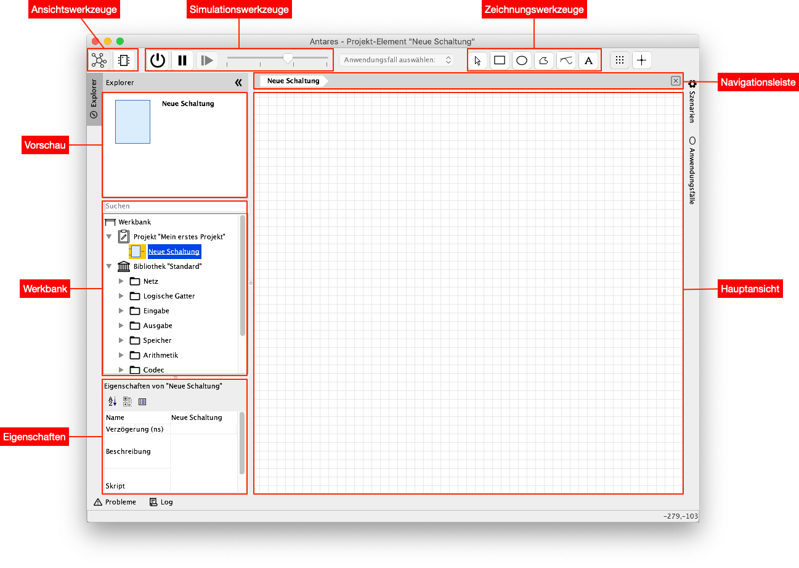

Im folgenden werden die wichtigsten Bereiche des Antares-Fensters kurz erklärt. Die anderen Bereiche dienen fortgeschrittenen Anwendungen und werden später in diesem Handbuch erklärt.

Werkbank:: Die Werkbank enthält das aktuell geöffnete Projekt sowie die Bibliothek der Komponenten, die in das Projekt übernommen werden können. Es kann gleichzeitig nur ein Projekt und eine Bibliothek offen sein. Wenn du Antares zum ersten Mal öffnest, wird automatisch ein Projekt mit dem Namen "Mein erstes Projekt" angelegt und geöffnet, und in diesem Projekt eine leere Schaltung mit dem Namen "Neue Schaltung" erzeugt.

Vorschau:: Die Vorschau zeigt das Symbol, den Namen und eine kurze Beschreibung der Komponente an, die in der Werkbank selektiert wird. Öffne als Beispiel das Verzeichnis "Logische Gatter" in der Bibliothek "Standard" und wähle die Komponente "Und" aus: Die Vorschau zeigt das Schaltungssymbol des Und-Gatters und die Beschreibung "Der Ausgang ist nur dann 1, wenn alle Eingänge 1 sind". Dies hilft dir, beim Erstellen von Schaltungen die richtigen Komponenten zu finden. Du kannst auch durch Eingabe eines Suchbegriffs im Feld "Suchen" am oberen Ende der Werkbank nach Komponenten suchen.

Hauptansicht:: Die Hauptansicht ist der Bereich, in der die Schaltung erstellt wird. Antares kann auch Unteransichten von Teilen der Schaltung anzeigen, doch die Hauptansicht enthält die Schaltung, die geändert, gespeichert und als Simulation gestartet werden kann.

Navigationsleiste:: In der Navigationsleiste wird angezeigt, wo du dich gerade befindest. Das ist wichtig, wenn du später Schaltungen mit Teilschaltungen entwirfst und in eine Teilschaltung abtauchst. Die Navigationsleiste zeigt dir den Pfad von der Hauptschaltung bis zur momentan angezeigten Teilschaltung. Du kannst auf jedes Element des Navigationspfads klicken, um zu dieser Stelle zurückzukehren.

Eigenschaften:: Der Eigenschaften-Bereich zeigt die Eigenschaften der Komponente, die gerade im Hauptfenster ausgewählt ist. Je nach Art der Komponente können gewisse Eigenschaften geändert werden, während andere nur angezeigt werden. So hat z.B. das Und-Gatter die Eigenschaft "Anzahl Eingänge", mit der ein Und-Gatter mit mehr als zwei Eingängen hergestellt werden kann.

Ansichtswerkzeuge:: Mit den Ansichts-Werkzeugen kann zwischen der Schaltungs- und der Symbolansicht hin und her gewechselt werden. In der Schaltungsansicht, die standardmässig geöffnet wird, kann die eigentliche Schaltung entworfen werden, während in der Symbolansicht das Symbol dieser Schaltung gestaltet wird, das zur Anwendung kommt, wenn diese Schaltung in einer anderen Schaltung wiederverwendet wird.

Simulationswerkzeuge:: Mit den Simulationswerkzeugen kann die Simulation der aktuell in der Hauptansicht angezeigten Schaltung gestartet, pausiert und im Einzelschrittmodus weitergeführt werden. Der Schieberegler ermöglicht es, die Simulationsgeschwindigkeit zu ändern.

Zeichnungswerkzeuge:: Die Zeichnungswerkzeuge dienen dazu, zusätzlich zu Schaltungselementen auch rein grafische Elemente wie Rechtecke, Linienzüge oder Text zur Schaltung hinzuzufügen.

=== Schaltung zeichnen

Als erstes Übungsbeispiel bauen wir eine Schaltung, die die XOR-Funktion zweier Variablen darstellt. Eigentlich wäre das nicht nötig, denn die Standardbibliothek von Antares enthält bereits eine vorgefertigte XOR-Komponente. Wir bauen trotzdem eine eigene XOR-Komponente, weil sie sich gut als einführendes Beispiel eignet.

Die Wahrheitstabelle der XOR-Funktion sieht folgendermassen aus:

[%header,cols=3*, width="40%"]
|===
|A|B|A xor B

|0|0|0
|0|1|1
|1|0|1
|1|1|0
|===

Aus der Literatur wissen wir, dass die XOR-Funktion folgendermassen aus Und-Gattern, Oder-Gattern und Invertern aufgebaut werden kann.

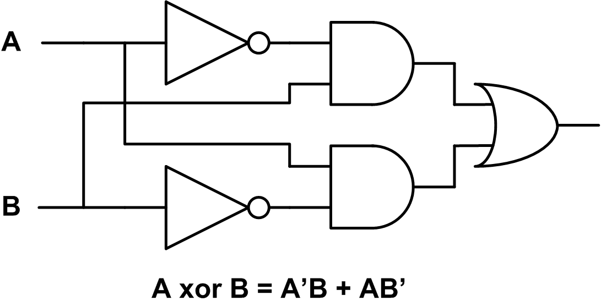

Als erstes fügst du die logischen Gatter zur Schaltung hinzu. Dazu öffnest du in der Werkbank das Verzeichnis "Logische Gatter" in der Bibliotek "Standard", klickst mit der Maus auf das Und-Gatter, und ziehst das Und-Gatter in den Zeichnungsbereich der Hauptansicht (Drag&Drop). Auf dieselbe Weise fügst du das Oder-Gatter und die Inverter hinzu, die du ebenfalls im Verzeichnis "Logische Gatter" findest.

Sobald du eine Komponente zur Schaltung hinzugefügt hast, wird das Selektionswerkzeug aktiv, mit dem du Komponenten auswählen und mit gedrückt gehaltener linker Maustaste verschieben kannst. Platziere die Komponenten so, dass zwischen ihnen etwas Platz für Leitungen vorhanden ist, die du anschliessend hinzufügen wirst.

TIP: Antares unterstützt Copy/Paste. Statt wie beim Inverter dieselbe Komponente mehrfach von der Bibliothek in die Schaltung zu ziehen, kannst du den zuerst hinzugefügten Inverter auch auswählen und mit kbd:[Cmd+C] / kbd:[Cmd+V] (macOS) oder kbd:[Ctrl+C] / kbd:[Ctrl+V] (Windows) kopieren.

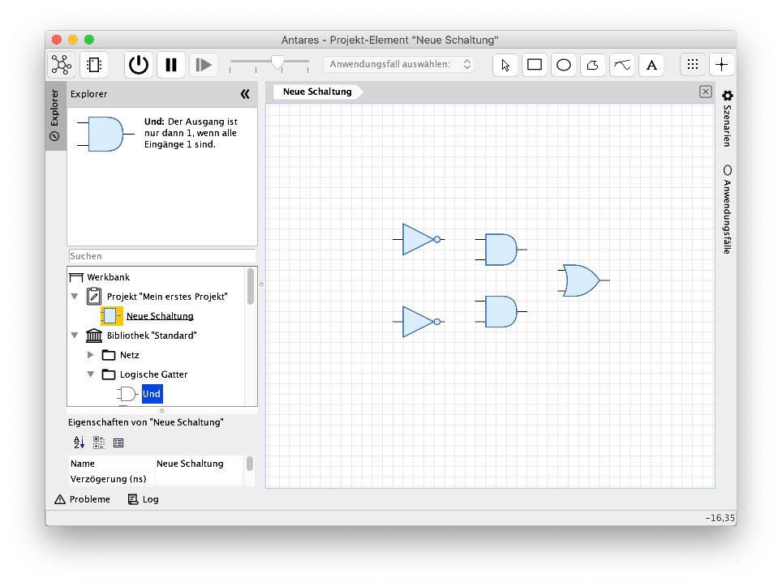

Als nächstes fügt du die Eingänge und den Ausgang hinzu. Den Eingang findest du in der Bibliothek im Verzeichnis "Eingabe", den Ausgang im Verzeichnis "Ausgabe". Ziehe sie wie vorher bei den logischen Gattern per Drag&Drop in die Schaltung.

Antares vergibt für neu hinzugefügte Eingänge und Ausgänge automatisch einen fortlaufenden Namen der Form "I1", "I2" usw. Um den Namen zu ändern, wählst du den Ausgang aus, gibst im Eigenschaftenfenster im Feld "Name" den neuen Namen "O" ein und schliesst die Eingabe mit kbd:[Enter] ab. Auf die gleiche Weise änderst du die Namen der Eingänge zu "A" und "B".

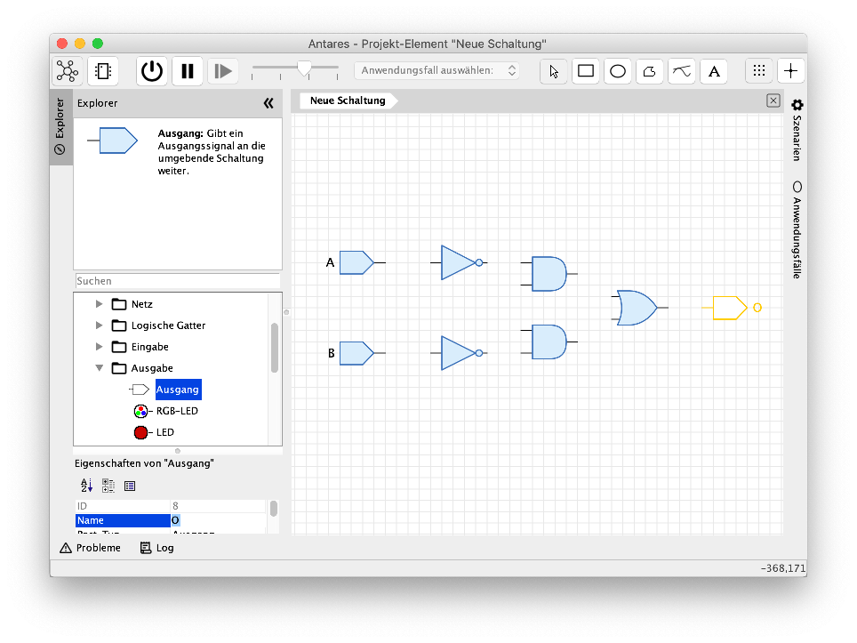

NOTE: Du fragst Dich vielleicht, warum wir statt den Eingängen und dem Ausgang nicht Schalter und eine LED verwenden. Wir wollen aber ein XOR-Gatter bauen, das als Komponente in anderen Schaltungen wiederverwendet werden kann. Um dabei Signale von der umgebenden Schaltung übernehmen und Resultate an sie zurückgeben zu können, müssen Eingangs- und Ausgangs-Komponenten verwendet werden. Du wirst aber im Abschnitt "Schaltung simulieren" sehen, dass auch Eingänge wie Schalter benützt werden können, und dass Ausgänge ebenso wie LEDs während der Simulation das aktuelle Signal anzeigen können.

Nachdem du alle Komponenten zur Schaltung hinzugefügt hast, kannst du sie mit Leitungen verbinden. Wenn du die Maus über den Ausgangs-Pin einer Komponente bewegst, zeigt Antares mit einem kleinen orangen Kreis an, dass an dieser Stelle eine Leitung hinzugefügt werden kann. Klicke mit der linken Maustaste und ziehe die Maus mit gedrückter Maustaste bis zum Eingang der nächsten Komponente, zu der die Leitung führen soll, und lasse dort die Maustaste los. Am Eingang der Ziel-Komponente zeigt Antares wieder durch einen kleinen orangen Kreis an, dass die Leitung hier beendet werden kann.

Von den Eingängen A und B führen jeweils zwei Leitungen zu unterschiedlichen Komponenten. Um eine Abzweigung einer Leitung von einer vorhandenen Leitung zu erzeugen, bewegst du die Maus über die vorhandene Leitung und drückst die kbd:[Alt]-Taste. Antares zeigt dann wiederum mit einem kleinen orangen Kreis an, dass hier eine neue Leitung begonnen werden kann.

Während du beim Erstellen einer Leitung die Maus ziehst, erzeugt Antares automatisch ein Layout der entstehenden Leitung. Nach dem Erstellen der Leitung kannst du das Layout anpassen, indem du auf ein Leitungssegment klickst und es mit gedrückt gehaltener Maustaste verschiebst.

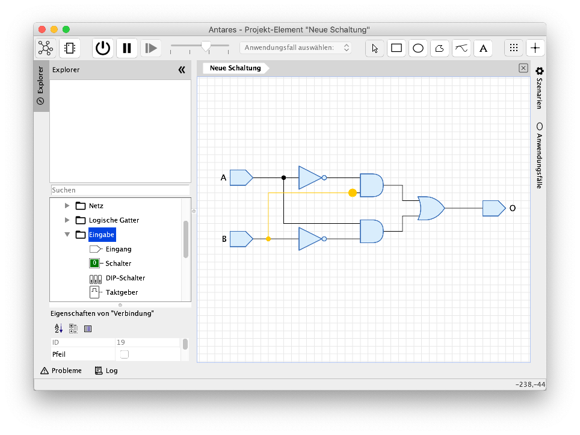

NOTE: Antares erlaubt es auch, nicht-orthogonale Leitungen zu erstellen oder das Layout während dem Erstellen der Leitung durch Klicks mit der Maus selber zu gestalten. Diese Features werden in späteren Kapiteln erklärt.

Herzliche Gratulation! Du hast deine erste eigene Antares-Schaltung erstellt. Speichere sie nun durch Drücken von kbd:[Cmd+S] (macOS) resp. kbd:[Ctrl+S] (Windows) oder durch Auswählen des Menüs menu:Datei[Speichern]. Deine XOR-Schaltung ist nun im Projekt "Mein erstes Projekt" in der Schaltung "Neue Schaltung" gespeichert.

Als letztes passt du nun noch den Namen der Schaltung im Eigenschaften-Fenster an. Stelle sicher, dass keine Komponente in der Schaltung ausgewählt ist, damit die Eigenschaften der ganzen Schaltung und nicht diejenigen der ausgewählten Komponente angezeigt werden. Klicke dazu auf den Hintergrund der Schaltung. Das Eigenschaften-Fenster zeigt nun den Titel "Eigenschaften von 'Neue Schaltung'" an. Trage im Feld "Namen" den Wert "XOR" ein und schliesse die Eingabe mit kbd:[Enter] ab. Speichere die Schaltung erneut. In der Werkbank wird nun der neue Name der Schaltung angezeigt.

NOTE: Vielleicht ist dir im Feld "Namen" das Weltkugel-Symbol aufgefallen. Es deutet auf das Internationalisierungs-Feature von Antares hin, mit dem sämtliche Namen und Texte in allen unterstützen Sprachen eingegeben werden können. Dieses Feature wird in späteren Kapiteln erklärt.

=== Navigation innerhalb der Schaltung

Antares bietet vielfältige Möglichkeiten, um die Grösse der Schaltung sowie den angezeigten Ausschnitt auszuwählen. Wenn sich die Maus im Hauptfenster über der Schaltung befindet, kann die Grösse der Schaltung (Zoom) durch Betätigen des Mausrades beinflusst werden. Der angezeigte Ausschnitt (Pan) wird durch Verschieben der Maus bei gedrückt gehaltener mittlerer Maustaste verändert.

Grösse und Ausschnitt der Anzeige kann auch über das Menu und die Tastatus gesteuert werden. Verwende dazu die Optionen im Menü menu:Anzeige[], um z.B. mit menu:Anzeige[Anpassen] oder dem dazugehörigen Tastaturkürzel die Grösse so zu steuern, dass die Schaltung den gesamten zur Verfügung stehenden Platz in der Hauptansicht einnimmt.

=== Schaltung ausführen

Mit Antares können digitale Schaltungen nicht nur gezeichnet, sondern auch ausgeführt werden. Drücke in den Simulationswerkzeugen auf den Knopf mit dem unterbrochenen Kreissymbol, um die Simulation zu starten.

Du stellst fest, dass sich die Farben der Eingänge, der Leitungen und des Ausgangs verändert haben. Mit den Standardeinstellungen verwendet Antares eine dunkelgrüne Farbe, um das Signal 0 darzustellen, und eine hellgrüne Farbe für das Signal 1. Zudem zeigen Eingänge und Ausgänge das aktuelle Signal auch als Text an.

Klicke nun mit der linken Maustaste auf einen Eingang und beobachte, wie sich die Schaltung verhält. Probiere alle möglichen Wertkombinationen der beiden Eingänge aus und überprüfe, ob der Ausgang wirklich nur genau dann den Wert 1 hat, wenn die beiden Eingänge unterschiedliche Werte haben.

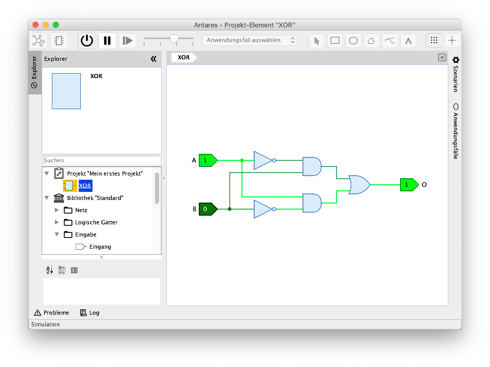

Eine Spezialität von Antares ist die Möglichkeit, den Signalfluss in einer Schaltung als Animation darzustellen. Verschiebe im Schieberegler der Simulationswerkzeuge den Knopf in den linken der drei Bereiche. Der Tooltip des Schiebereglers zeigt danach den Text "Simulationsgeschwindigkeit: Erforschen" an.

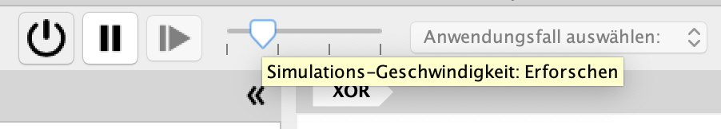

Wenn du nun wieder durch Klicken mit der Maus den Wert eines Eingangs veränderst, siehst du, wie Antares den Fluss von Signalen durch die Schaltung hindurch animiert.

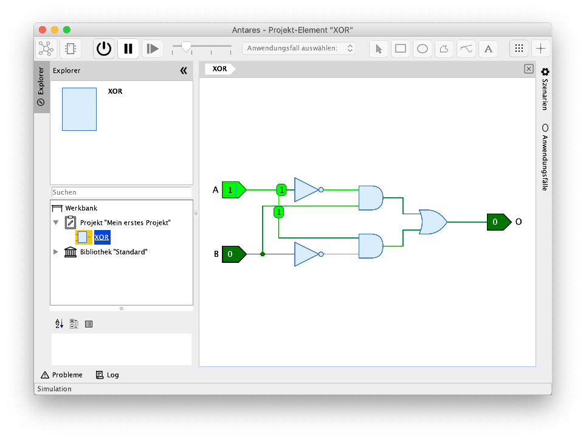

Mit dem Schieberegler in den Simulationswerkzeugen können drei verschiedene Geschwindigkeits-Kategorien ausgewählt werden:

Erforschen:: In dieser Kategorie wird die Simulations am langsamsten ausgeführt. Die Leitungen stellen das Signal anhand ihrer Farbe dar, und der Signalfluss in der Schaltung wird animiert dargestellt. Bei der Verwendung von Teilschaltungen wird das Symbol selber ebenfalls animiert, solange die Teilschaltung am Arbeiten ist.

Beobachten:: Diese Kategorie ist per Default aktiv. In ihr stellen die Leitungen das Signal anhand der Farbe dar, aber es werden keine Animationen ausgeführt.

Verwenden:: In dieser Kategorie wird die Simulation am schnellsten ausgeführt. Die Leitungen stellen das Signal nicht dar, und es werden auch keine Animationen ausgeführt. Diese Kategorie wird typischerweise eingesetzt, um komplexe Schaltungen wie z.B. ganze Mikroprozessoren, die gerade ein Maschinenprogramm ausführen, möglichst schnell zu simulieren.

Im Simulationsmodus kann die Schaltung nicht bearbeitet werden. Drücke in den Simulationswerkzeugen auf den Knopf mit dem unterbrochenen Kreissymbol, um zurück in den Bearbeitungsmodus zu gelangen.

=== Symbol erstellen

Jede Schaltung, die du in Antares baust, kann in anderen, höherwertigen Schaltungen als Komponente wiederverwendet werden. Nachdem du in den vorangegangenen Abschnitten die Schaltung bereits aufgebaut hast, musst du nun noch das Symbol definieren, das bei der Verwendung Deiner XOR-Schaltung als Komponente verwendet wird.

Symbole werden im Symboleditor erstellt. Verwende die beiden Knöpfe in den Ansichtswerkzeugen der Werkzeugleiste, um zwischen Schaltungseditor und Symboleditor hin und her zu wechseln.

Der Symboleditor enthält im linken Teil einen Baum, der die Elemente anbietet, die du zum Symbol hinzufügen kannst, und im rechten Teil die Zeichnungsfläche, in der das Symbol der Schaltung erstellt wird. Für diese Einführung verwendest du aus dem Baum lediglich die Elemente im Verzeichnis "Anschlüsse". Die Elemente in den Verzeichnissen "Steuerelemente" und "Teilschaltungen" repräsentieren fortgeschrittene Konzepte, die in späteren Kapiteln des Benutzerhandbuchs erklärt werden.

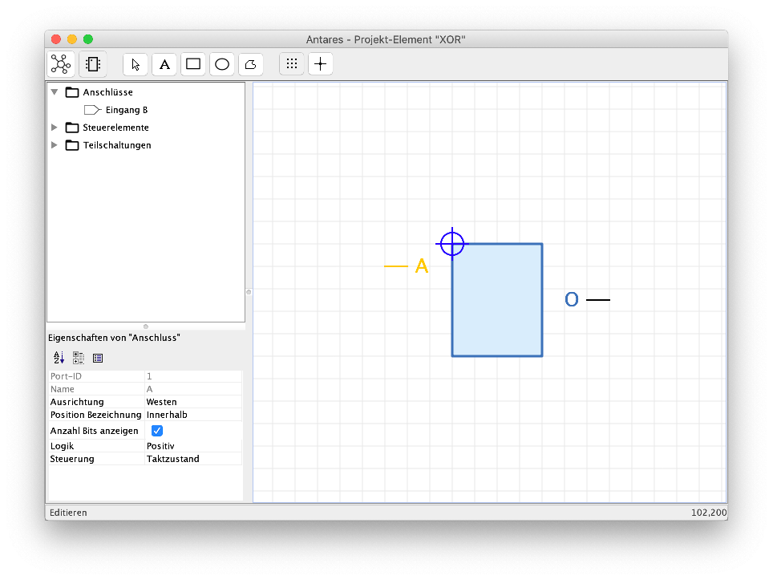

Um eine Schaltung als Teilschaltung in einer höherwertigen Schaltung zu verwenden, müssen mindestens die Eingänge und Ausgänge der Schaltung zum Symbol hinzugefügt werden. Das Verzeichnis "Anschlüsse" des Baums im linken Teil enthält die beiden Eingänge "A" und "B" sowie den Ausgang "O".

Ziehe die beiden Eingänge und den Ausgang per Drag&Drop in den Zeichnungsbereich. Eingänge sind standardmässig nach links (Westen) ausgerichtet, während Ausgänge nach rechts (Osten) zeigen. Um die Ausrichtung zu ändern, kannst du die Komponente im Zeichnungsbereich auswählen und im Feld "Ausrichtung" des Eigenschaften-Fensters unten links die gewünschte Ausrichtung einstellen.

Das Symbol jeder neuen Schaltung enthält standardmässig eine ausgefülltes Rechteck, das als "Körper" des Symbols verwendet werden kann. Verändere das Rechteck auf eine passende Grösse und platziere die Eingänge am linken Rand des Rechtecks und den Ausgang an seinem rechten Rand. Füge mit dem Textwerkzeug aus den Zeichnungswerkzeugen einen Text zur Symbolzeichnung hinzu, wähle den Text aus, und ändere den Text im Feld "Text" des Eigenschaftenfenster zu "XOR". Das dunkelblaue Fadenkreuz repräsentiert den zukünftigen Nullpunkt der Symbolgraphik. Verschiebe es so, dass es am Ende des Pins von Eingang "A" liegt.

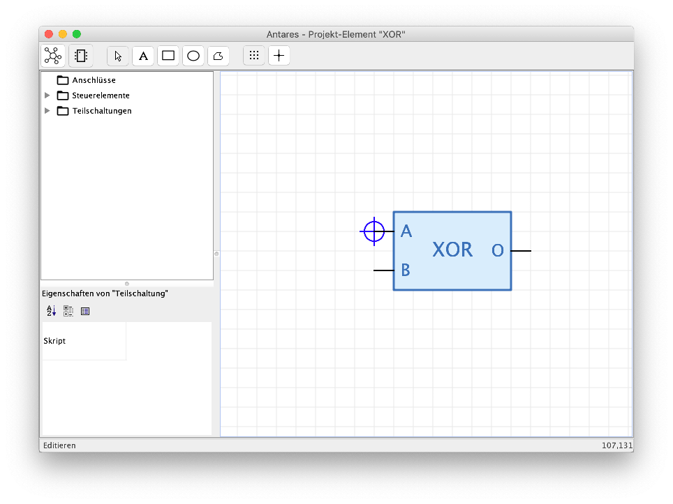

NOTE: Beachte, dass im Baum links das Verzeichnis "Anschlüsse" in der Zwischenzeit leer ist. Antares verschiebt die Elemente zwischen dem Baum und der Zeichnungsfläche hin und her. Wenn du einen Anschluss in der Zeichnungsfläche löschst, erscheint er wieder im Verzeichnis "Anschlüsse" des Baums. Dasselbe geschieht, wenn du im Schaltungseditor einen weiteren Anschluss hinzufügst oder einen Anschluss entfernst.

Damit ist die Erstellung des Symbols für deine XOR-Komponente abgeschlossen. Wechsle zurück in den Schaltungseditor und speichere die Schaltung. Wenn du nun in der Werkbank deine Schaltung "XOR" auswählst, siehst du in der Vorschau das neue Symbol.

=== Schaltung wiederverwenden

Als nächstes lernst du, wie du deine neue XOR-Komponente in einer umgebenden Schaltung wiederverwenden kannst.

Dazu erstellst du im Projekt "Mein erstes Projekt" eine weitere Schaltung. Wähle dazu in der Werkbank das Projekt aus, öffne mittels linker Maustaste das Kontext-Menü des Projektes und wähle die Menü-Option "Neue Schaltung". Antares fragt Dich nun nach dem Namen der neuen Schaltung. Gib z.B. "Verwendung der XOR-Komponente" ein und bestätige mit btn:[OK].

Im Projekt der Werkbank erscheint die neue, leere Schaltung "Verwendung der XOR-Komponente", die auch in der Hauptansicht geöffnet wird. Im Baum der Werkbank wird die aktuell geöffnete Schaltung mit einem orange hinterlegten Icon dargestellt. du kannst mittels Doppelklick auf dem Eintrag im Baum zwischen den beiden Schaltungen hin- und her wechseln. Zu jedem Zeitpunkt kann jedoch nur eine einzige Schaltung zur Bearbeitung geöffnet sein.

Öffne nun die Schaltung "Verwendung der XOR-Komponente" per Doppelklick und ziehe deine XOR-Komponente per Drag&Drop in die bisher noch leere Schaltung. Damit die Komponente getestet werden kann, fügst du nun Schalter und LED hinzu. Öffne in der Werkbank in der Bibliothek "Standard" das Verzeichnis "Eingabe" und ziehe per Drag&Drop zwei Schalter in die Schaltung. Füge auf dieselbe Weise eine LED aus dem Verzeichnis "Ausgabe" der Standardbibliothek zur Schaltung hinzu. Verbinde die Ausgänge der Schalter mit den Eingängen deiner XOR-Komponente, und verbinde ihren Ausgang mit der LED. Speichere anschliessend deine neue Schaltung.

Wenn du nun die Simulation startest und die Schalter betätigst, siehst du, wie Antares deine XOR-Komponente innerhalb einer umgebenden Schaltung simuliert.

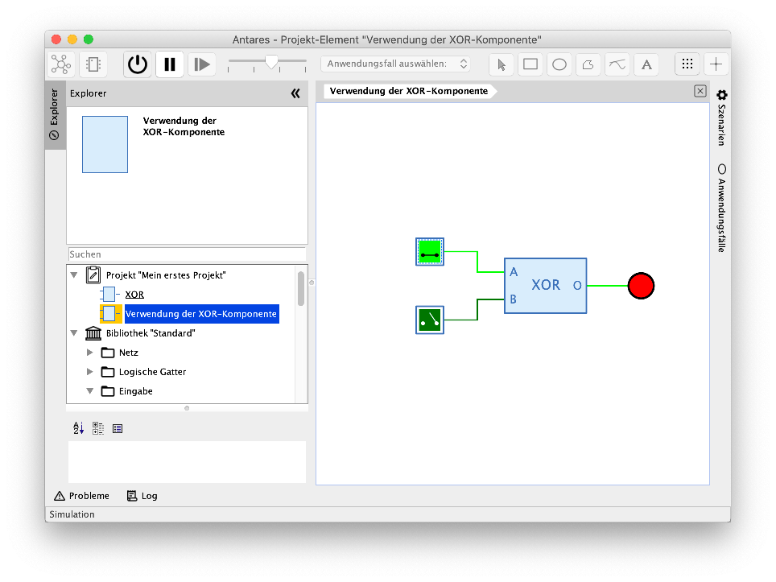

=== Navigation in Teilschaltungen

Im abschliessenden Schritt dieser Einführung erfährst du, wie du mit Antares innerhalb komplexer Schaltungen und ihren Teilschaltungen navigieren kannst, und wie Antares eine Schaltung und mehrere ihrer Teilschaltungen gleichzeitig darstellen kann.

Antares bietet die Möglichkeit, in jede Teilschaltung einer Schaltung "abzutauchen", um ihren Inhalt anzusehen. Dies funkioniert sowohl im Bearbeitungsmodus als auch im Simulationsmodus. Öffne dazu deine Schaltung "Verwendung der XOR-Komponente", starte die Simulation, und führe einen Doppelklick mit der linken Maustaste auf der Komponente "XOR" aus. Antares führt nun eine Animation aus, die den Inhalt der Hauptansicht durch die innere Schaltung ersetzt. Die aktuelle "Abtauch-Tiefe" wird in der Navigationsleiste dargestellt.

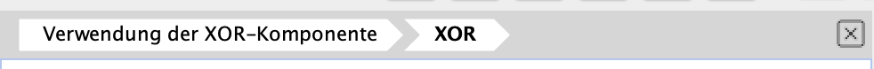

Die Navigationsleiste zeigt den Pfad beginnend mit der Hauptschaltung bis zur aktuell angezeigten Teilschaltung an. Um wieder zur Hauptschaltung zurückzukehren, klickst du mir der linken Maustaste auf das Pfad-Element "Verwendung der XOR-Komponente". Antares führt nun wieder eine Animation aus, die den Inhalt der Hauptansicht durch die äussere Schaltung ersetzt.

TIP: Manchmal muss es schnell gehen, und du willst auf die Animation verzichten. Drücke dazu gleichzeitig die kbd:[Cmd]-Taste, wenn du in eine Teilschaltung abtauchst oder wenn du auf ein Pfad-Element der Navigationsleiste klickst, um wieder aufzutauchen.

Statt in eine Teilschaltung abzutauchen, willst du manchmal die umgebende Schaltung und die Teilschaltung gleichzeitig sehen. Halte dazu  kbd:[Alt] gedrückt, wenn du auf das Symbol einer Teilschaltung doppelklickst. Antares öffnet die Teilschaltung dann in einer zusätzlichen Unteransicht.

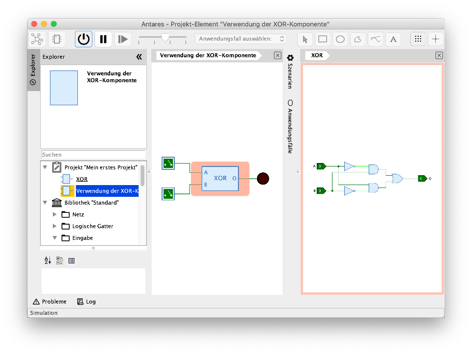

Antares platziert die Unteransichten automatisch auf der rechten Seite der Hauptansicht. Wenn du mehrere Unteransichten öffnest, ordnet sie Antares untereinander an.

Beachte, wie Antares das Symbol in der Hauptschaltung mit einer hellroten Farbe hinterlegt und die entsprechende geöffnete Teilschaltung mit einem Rahmen in derselben Farbe darstellt. Für jedes geöffnete Symbol wird eine andere Farbe verwendet. Dies ermöglicht es dir, bei mehreren geöffneten Teilschaltungen nicht den Überblick zu verlieren.

Die Unteransicht enthält gleich wie die Hauptansicht eine Navigationsleiste. Würde die Teilschaltung weitere Teilschaltungen enthalten, könntest du auch in diese Teilschaltungen abtauchen und mit Hilfe der Navigationsleiste wieder auftauchen.

Unteransichten können mit dem Schliessen-Knopf am oberen rechten Ende der Navigationsleiste oder mittels kbd:[Cmd+W] wieder geschlossen werden. Bei Verwendung der Tastatur wird diejenige Unteransicht geschlossen, die im Moment den Fokus hat. Der Fokus wird durch einen dünnen blauen Rand in der Unteransicht dargestellt.

=== Nächste Schritte

Damit ist diese erste Einführung abgeschlossen, und du solltest nun in der Lage sein, die grundlegenden Features von Antares einzusetzen, um deine eigenen ersten Schaltungen zu bauen.

Lies den Rest des Benutzerhandbuchs, um die weiteren, mächtigen Features von Antares kennenzulernen.
