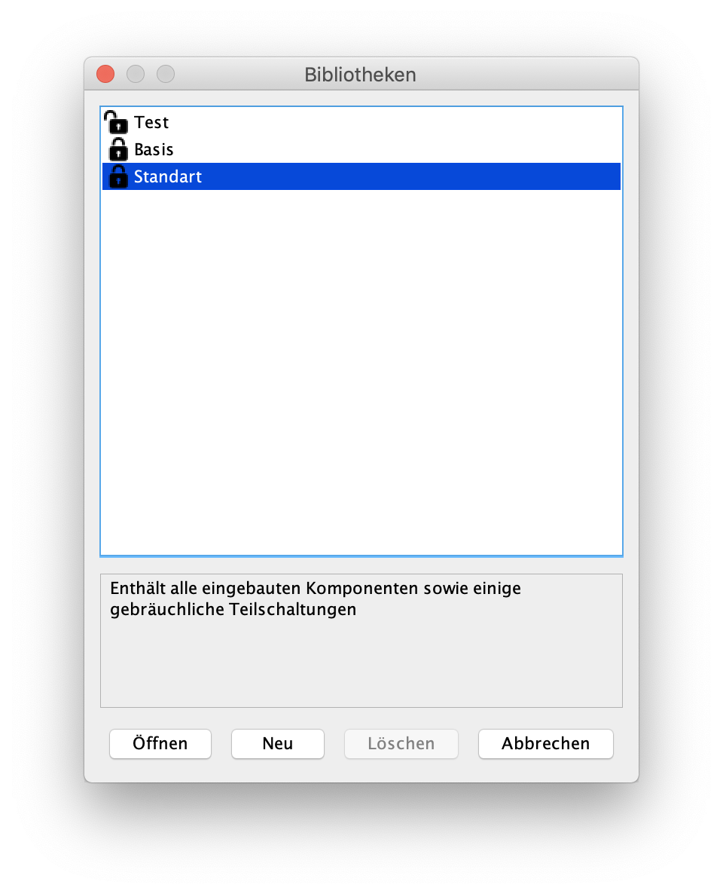
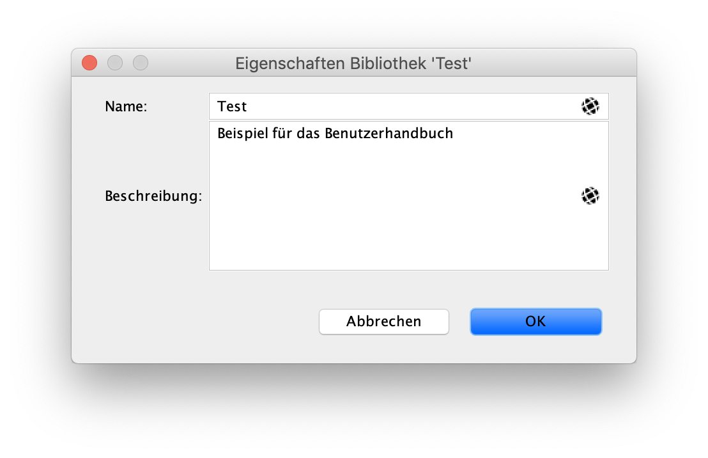
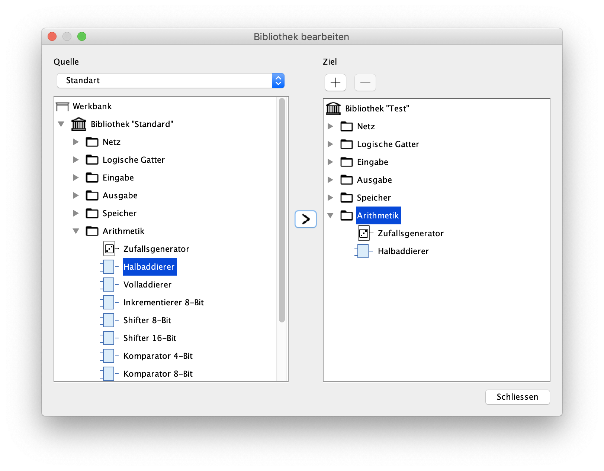

=== Bibliotheken

In diesem Kaptitel wird erklärt, wie Du eigene Bibliotheken anlegen kannst.

==== Bibliotheken verwalten

Über das Haupt-Menü "Datei -> Bibliotheken..." gelangst Du in die Bibliotheken-Verwaltung von Antares.

Die Tabelle zeigt alle auf Deinem Computer vorhandenen Bibliotheken an. Diese umfassen sowohl die von Antares vorgegebenen Bibliotheken "Basis" und "Standard" als auch Deine eigenen Benutzer-Bibliotheken. Das Schloss-Icon in der Tabelle zeigt den Unterschied an: Benutzer-Bibliotheken (im Beispiel "Test") zeigen ein offenes Schloss an, während die vorgegebenen Bibliotheken, die Du nicht verändern kannst, mit einem geschlossenen Schloss dargestellt werden.

Nach Selektion einer Bibliothek wird unterhalb der Tabelle die Beschreibung der Bibliothek angezeigt.

Öffnen:: TODO

Neu:: TODO

Löschen:: TODO

==== Eigenschaften ändern

TODO

==== Bibliothek bearbeiten

TODO

