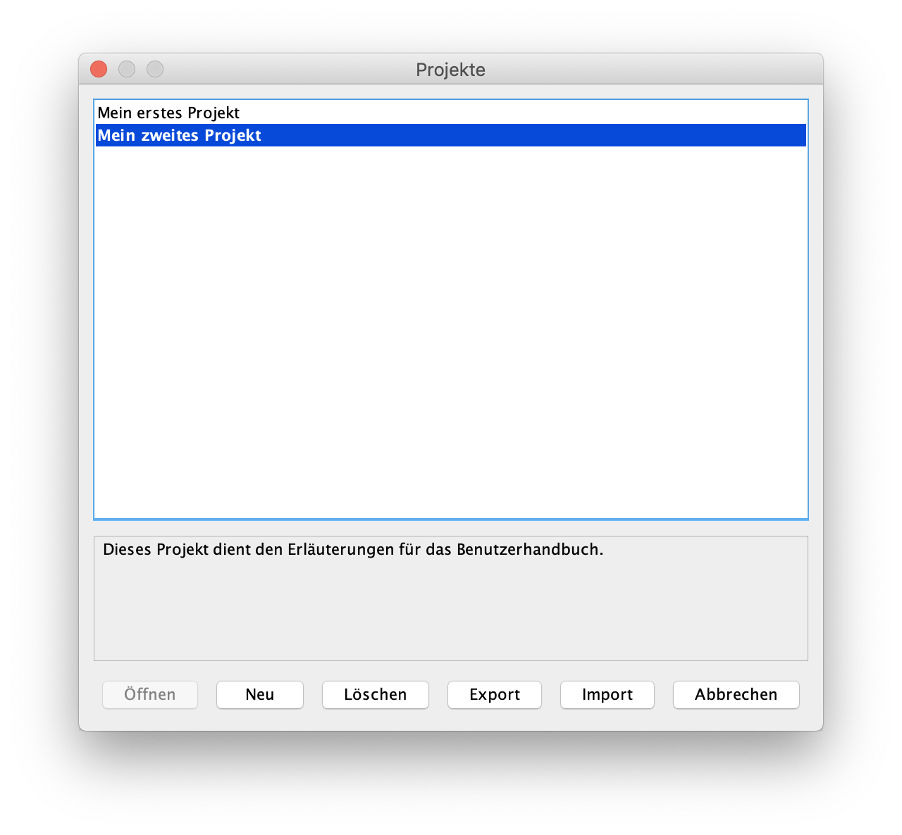
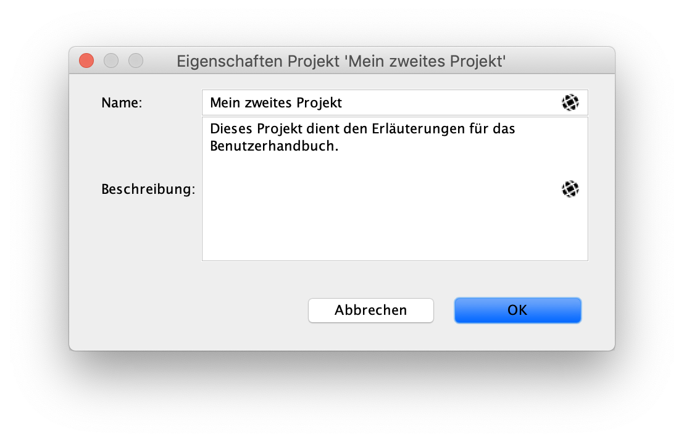

=== Projekte

In diesem Kapitel lernst Du, wie Du Deine eigenen Projekte verwalten kannst. Die Grundlagen von Projekten sind in <<projects-libraries.adoc#, "Projekte und Bibliotheken">> erklärt.

==== Projekte verwalten

Über das Haupt-Menü "Datei -> Projekte..." gelangst Du in die Projekt-Verwaltung von Antares.

Öffnen:: Öffnet das ausfgewählte Projekt. Falls eine der Schaltungen des Projektes mit "Beim Laden öffnen" gekennzeichnet ist, wird diese Schaltung automatisch geöffnet.

Neu:: Erzeugt ein neues Projekt und öffnet es. Das neue Projekt enthält per Default eine Schaltung mit dem Namen "Neue Schaltung". Das neue Projekt basiert auf der Bibliothek, die zu diesem Zeitpunkt der Werkbank geöffnet ist.
NOTE: In einer zukünftigen Version von Antares wird man beim Erzeugen des Projektes die Bibliothek auswählen können, auf der das neue Projekt basieren soll.

Löschen:: Löscht das ausgewählte Projekt. Diese Aktion kann nicht rückgängig gemcht werden.

Export:: TODO

Import:: TODO

==== Eigenschaften ändern

Mit dem Kontext-Menü "Eigenschaften" auf Projekt in der Werkbank kannst Du den Namen und die Beschreibung eines Projekts ändern.

Beide Eigenschaften sind internationalisiert, d.h. Du kannst Texte in allen von Antares unterstützten Sprachen erfassen. Die Beschreibung wird vor allem im Fenster "Projekte" verwendet.

