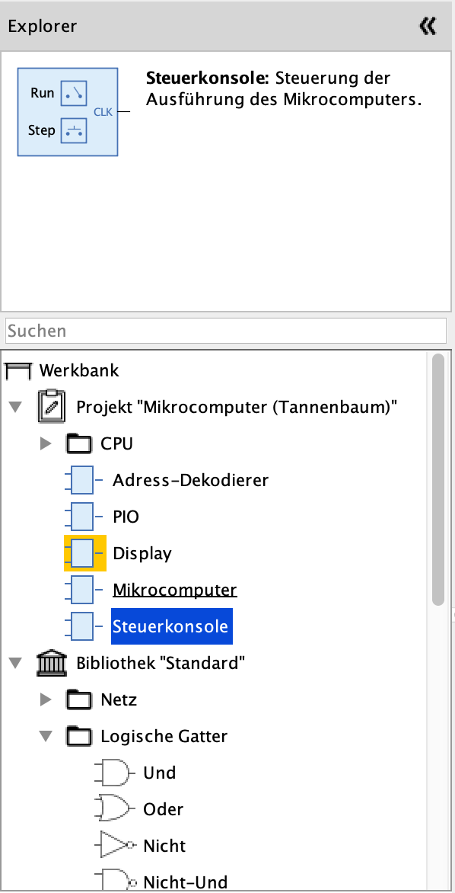

== Werkbank
:experimental:

Die Werkbank ist derjenige Teil der Antares-Oberfläche, der das geöffnete Projekt sowie die verwendete Bibliothek anzeigt und dir ermöglicht, deren Schaltungen zu benützen und neue Schaltungen zu erzeugen.

Das untenstehende Beispiel zeigt das geöffnete Projekt "Mikrocomputer (Tannenbaum)", das auf der Bibliothek "Standard" beruht.

In diesem Kapitel werden die Eigenschaften und Möglichkeiten der Werkbank beschrieben, die für darin geöffnete Projekte und Bibliotheken gleichermassen gelten. Die speziellen Eigenschaften von <<projects.adoc#, Projekten>> und <<libraries.adoc#, Bibliotheken>> werden in den entsprechenden Kapiteln erklärt.

=== Struktur

Der Inhalt der Werkbank wird als Baum dargestellt, dessen obersten Äste das Projekt (falls vorhanden) und die verwendete Bibliothek darstellen. Die Blätter des Baumes sind entweder Basiselemente, die in Antares ausprogrammiert sind, oder Schaltungen, die geöffnet werden können. Zudem kannst du Verzeichnisse anlegen, mit denen du Schaltungen gruppieren kannst.

Die einzelnen Werbank-Elemente bieten je nach Typ ein Menü mit Aktionen zur Verfügung, das mittels Selektion des Elements und anschliessendem Klick mit der rechten Maustaste aufgerufen werden kann. Wichtige Aktionen sind zusätzlich über das Hauptmenü von Antares erreichbar.

Auf jedem Werkbank-Element, das untergeordnete Elemente enthalten kann (Projekt, Bibliothek, Verzeichnis), kannst du das Popup-Menu menu:Neues Verzeichnis[] verwenden, um in diesem Element ein neues Verzeichnis anzulegen. Auf die gleiche Weise können Verzeichnisse gelöscht werden. Beachte, dass beim Löschen von Verzeichnissen alle darin enthaltenen Elemente ebenfalls gelöscht werden.

=== Öffnen eines Projektes/Bibliothek

Ein Projekt wird über das Hauptmenü menu:Datei[Projekte] und anschliessender Auswahl im angezeigten Dialog geöffnet. Dabei wird in der Werbank nicht nur das ausgewählte Projekt geöffnet, sondern gleichzeitig auch die Bibliothek, die das Projekt benützt.

Wenn ein Projekt aus mehreren Schaltungen besteht, ist häufig eine dieser Schaltungen die "Hauptschaltung" oder "oberste Schaltung", die die anderen Schaltungen als Teilschaltungen enthält. Damit Antares diese Hauptschaltung automatisch öffnet, wenn das Projekt geöffnet wird, kann diese Hauptschaltung durch das Popup-Menu menu:Beim Laden öffnen[] gekennzeichnet werden. Der Name dieser Schaltung wird im Werkbank-Baum [.underline]#unterstrichen# dargestellt.

Eine Bibliothek wird über das Hauptmenu menu:Datei[Bibliotheken] und anschliessender Auswahl im angezeigten Dialog geöffnet. Da Bibliotheken keine anderen Bibliotheken verwenden können, zeigt die Werkbank in diesem Fall lediglich die geöffnete Bibliothek an.

NOTE: Das manuelle Öffnen einer Bibliothek ist nur selten nötig. Wenn du an einem Projekt arbeitest, öffnet Antares die verwendete Bibliothek automatisch. Wenn du eine Bibliothek entwickelst, kann du die Bibliothek alleine öffnen. Du kannst aber auch ein Test-Projekt für die verwendete Bibliothek geöffnet haben und trotzdem Schaltungen der Bibliothek bearbeiten.

=== Öffnen einer Schaltung

Du kannst eine Schaltung eines Projektes oder einer Bibliothek öffnen, indem du auf dem Werkbank-Element doppelklickst oder sein Popup-Menü menu:Schaltung öffnen[] wählst. Die aktuell geöffnete Schaltung wird im Werkbank-Baum durch einen orangen Hintergrund des Icons gekennzeichnet.

Wenn du in der zuvor geöffneten Schaltung eine Änderung durchgeführt hast, die du noch nicht gespeichert hast, fragt dich Antares, ob du diese Änderungen speichern willst.

Antares merkt sich beim Schliessen der Applikation, welche Schaltung zuletzt geöffnet war, und öffnet diese Schaltung beim nächsten Start automatisch wieder.

=== Suchen nach Komponenten

Wenn dein Projekt oder die verwendete Bibliothek sehr viele Komponenten enthalten, die womöglich noch mit Verzeichnissen strukturiert sind, kann es schwierig sein, eine bestimmtes Komponente zu finden. Deshalb enthält die Werkbank ein Suchfeld, das für die Suche nach dem Namen von Komponenten verwendet werden kann. Nach jedem eingegebenen Zeichen reduziert Antares den Baum auf diejenigen Komponenten, die den eingegebenen Suchtext im Namen enthalten.

=== Auswahl einer Komponente

Wenn du eine elementare Komponente oder eine Teilschaltung im Werkbank-Baum selektierst, wird in der Vorschau oberhalb der Werkbank das Symbol der Komponente sowie deren Name und Kurzbeschreibung (sofern vorhanden) angezeigt. Diese Information dient dir dazu, die richtige Komponente zu identifizieren, bevor du sie zu deiner Schaltung hinzufügst. Du fügst die ausgewählte Komponente zu deiner Schaltung hinzu, indem du sie per Drag & Drop in deine Schaltung ziehst.

=== Baumstruktur auf- und zuklappen

Auf jedem Baumelement, das untergeordnete Elemente enthalten kann, bietet dir Antares die beiden Popup-Menüs menu:Alles aufklappen[]] und menu:Alles Zuklappen[] an, mit der dieses Element und alle darunterliegenden Elemente auf- resp. zugeklappt werden können.

=== Neue Schaltung erzeugen

In den Baumelementen "Projekt", "Bibliothek" und "Verzeichnis" kannst du mit dem Popup-Menu menu:Neue Schaltung[] eine neue Schaltung erzeugen. Die neu erzeugte Schaltung ist Bestandteil des aktuell geöffneten Projektes und basiert deshalb ebenfalls auf der Bibliothek, die das Projekt verwendet und die aktuell geöffnet ist.

Der im Dialog eingegebene Name wird als Name in der aktuell eingestellten Benutzersprache verwendet. Der Name der Schaltung kann in der Eigenschaften-Ansicht der Schaltung in andere Sprachen übersetzt werden. In der aktuellen Version stellt Antares nicht sicher, dass der Name innerhalb des Verzeichnisses eindeutig ist. Trotzdem ist es empfehlenswert, eindeutige Namen zu verwenden.

Die neu erzeugte, leere Schaltung wird von Antares automatisch geöffnet.

=== Komponenten verschieben

Du kannst eine Komponente mit Drag & Drop an eine andere Position innnerhalb des Verzeichnisses, in ein anderes Verzeichnis oder sogar von einem Projekt in die Bibliothek (und umgekehrt) verschieben. Dabei stellt Antares sicher, dass die folgenden Regeln eingehalten werden:

* Eine Schaltung kann nicht vom Projekt in die Bibliothek verschoben werden, wenn sie andere Schaltungen des Projektes referenziert.
* Die vorgegebenen Bibliotheken von Antares können nicht verändert werden.