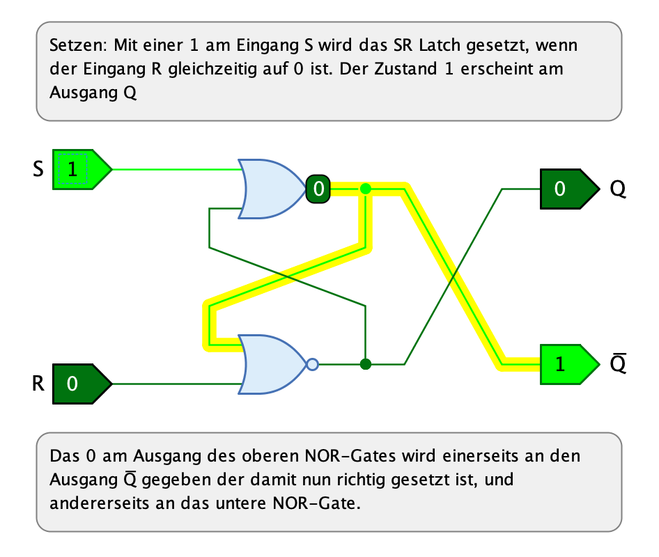
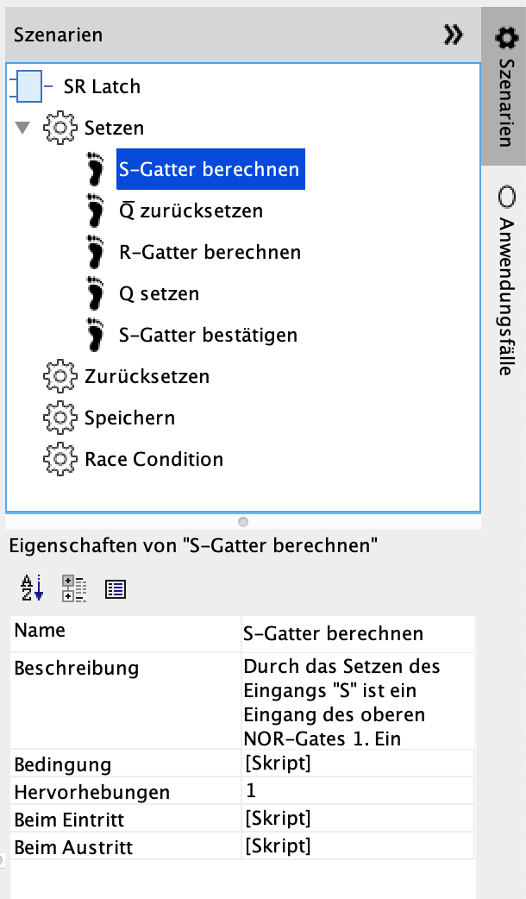

== Szenarien

=== Einführung

Szenarien sind ein Feature von Antares, das es ermöglicht, während der Simulation einer Schaltung zusätzliche Informationen einzublenden, die dazu dienen, die Funktionsweise der Schaltung besser zu verstehen.

Aktuell werden die folgenden Typen von zusätzlichen Informationen unterstützt:

* Einblenden von Text mit Erklärungen
* Hervorheben von Komponenten und Leitungen

Das folgende Beispiel zeigt die Schaltung "SR Latch" aus der Standard-Bibliothek während Ausführung der Simulation, nachdem der Benutzer auf den Eingang "S" geklickt hat, während das Latch zurückgesetzt war. Beachte die beiden Text-Boxen mit Erklärungen, die oberhalb und unterhalb der Schaltung eingeblendet werden, sowie die Hervorhebung der Leitungen, die vom oberen Oder-Gatter ausgehen.

=== Konzept

Als Autor einer Schaltung kannst Du selber Szenarien definieren, die wiederum aus Szenario-Schritten bestehen. Für Szenarien und Szenario-Schritte definierst Du die Bedingungen, bei denen sie aktiviert werden. Diese Bedingungen sind z.B. aktuelle Ausgangssignale von Komponenten der Schaltung. Antares überprüft während der Simulation ständig, ob eine dieser Bedingungen eingetreten ist, und aktiviert in diesem Fall das betreffende Szenario und/oder den Szenario-Schritt. Die Aktivierung führt dazu, dass die zusätzlichen Informationen, die Du für dieses Szenario oder diesen Szenario-Schritt definiert hat, eingeblendet werden.

Im obenstehenden Beispiel des "SR Latch" hat der Autor der Schaltung vier Szenarien definiert:

* **Setzen**: Die Bedingung dieses Szenarios ist, dass S den Wert 1 und R den Wert 0 hat. Das Latch wird also gesetzt.
* **Zurücksetzen**: Die Bedingung dieses Szenarios ist, dass S den Wert 0 und R den Wert 1 hat. Das Latch wird also zurückgesetzt.
* **Speichern**: Die Bedingung dieses Szenarios ist, dass sowohl S als auch R den Wert 0 haben. Dies ist der Speicherfall: Der aktuelle Ausgangswert soll erhalten bleiben, auch nachdem die Eingangssignale verschwunden sind.
* **Race Condition**: Die Bedingung dieses Szenarios ist, dass sowohl S als auch R den Wert 1 haben. Dies ist eine illegale Verwendung des "SR Latch".

Mit Szenario-Schritten kann ein einzelnes Szenario weiter verfeinert werden, um z.B. detailiert zu erklären, wie das Setzen des "SR Latch" abläuft. Bei Szenario-Schritten kann es nützlich sein, nicht nur Erklärungstexte anzuzeigen, sondern auch die Komponente hervorzuheben, die in diesem Szenario-Schritt eine wichtige Rolle spielt, oder Leitungung hervorzuheben, über die ein für diesen Szenario-Schritt wichtiges Signal übertragen wird.

Der Erklärungstext eines aktiven Szenarios wird in einer Textbox oberhalb der Schaltung angezeigt, während der Erklärungtext eines aktiven Szenario-Schrittes unterhalb der Schaltung eingeblendet wird.

Szenarien und ihre Szenario-Schritte werden immer zusammen mit der geöffneten Schaltung gespeichert.

=== Konfiguration

Szenarien der geöffneten Schaltung werden in der aufklappbaren Seitenleiste "Szenarien" am rechten Rand des Antares-Fensters konfiguriert.

Die Seitenleiste enhält einen Baum mit allen Szenarien (Zahnrad-Icon) und ihren Szenario-Schritten (Fussabdruck-Icon). Wenn Du einen Knoten im Baum auswählst, werden im Eigenschaftenfenster darunter die Attribute des Objektes angezeigt und zur Änderung angeboten.

Die Auswahl eines Szenarios oder eines Szenario-Schritts im Baum führt auch dazu, dass dessen Beschreibungen und Hervorhebungen auch im Bearbeitungsmodus in der geöffneten Schaltung eingeblendet werden. Das hilft Dir zu überprüfen, ob z.B. Du die IDs von Komponenten, die hervorgehoben werden sollen, richtig gesetzt sind.

TIP: Selektiere im Baum den obersten Knoten (im Beispiel "SR Latch"), um die Beschreibungen und Hervorhebungen verschwinden zu lassen.

=== Aktionen

Um Szenarien oder Szenario-Schritte hinzuzufügen oder zu löschen, wählst Du einen Knoten im Baum aus und führst eine Aktion des Hauptmenüs oder des Kontextmenüs (rechte Maustaste) aus.

Neues Szenario:: TODO

Szenario löschen:: TODO

Neuer Szenario-Schritt:: TODO

Szenario-Schritt löschen:: TODO

Szenario-Schritt verschieben:: TODO

==== Eigenschaften von Szenarien

Name:: TODO

Beschreibung:: TODO

Bedingung:: TODO

==== Eigenschaften von Szenario-Schritten

Name:: TODO

Beschreibung:: TODO

Bedingung:: TODO

Hervorhebungen:: TODO

Beim Eintritt:: TODO

Beim Austritt:: TODO