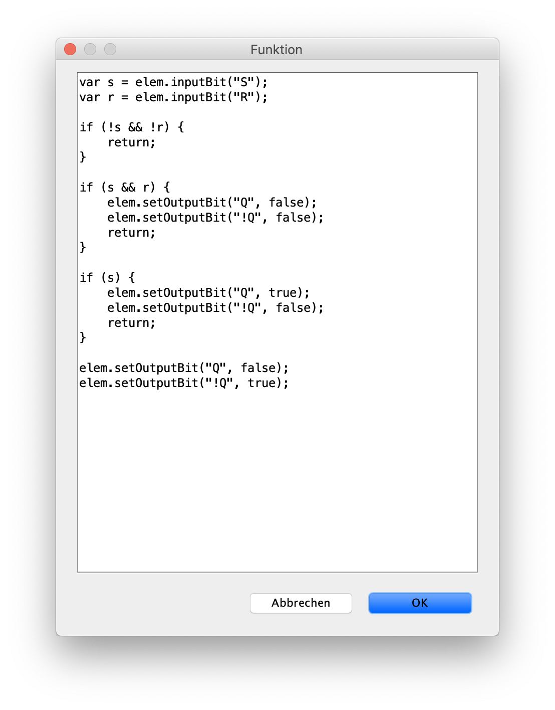
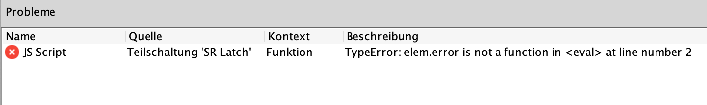

== Skripting
:experimental:
:icons: font

Skripting ist ein mächtiges Feature von Antares, das es dir ermöglicht, das Verhalten von Schaltungen während der Simulation auf unterschiedliche Arten zu beeinflussen. Dazu schreibst du kleine Skripts, also kleine Programmstücke, die an verschiedenen Stellen in einer Schaltung abgelegt werden, und die von Antares während der Simulation ausgeführt werden.

=== Grundlagen

Die Programmiersprache, in der die Skripts geschrieben werden, ist JavaScript. Da JavaScript nicht kompiliert werden muss, sondern während der Ausführung interpretiert wird, müssen die Skripts nicht separat erstellt und im Verzeichnis abgelegt werden, in dem Antares installiert ist, sondern können als reiner Text innerhalb der Schaltung gespeichert werden.

CAUTION: Antares wird irgendwann im Browser ausführbar sein und z.B. ermöglichen, dass du Webseiten erstellen kannst, die einzelne Schaltungen als aktive Komponenten enthalten. In dieser Umgebung kann JavaScript aus Sicherheitsgründen nicht mehr als Sprache verwendet werden, in der Benutzer selber Skripts erstellen können, die im Browser von anderen Benutzern laufen. In Zukunft wird also eine andere Skripting-Sprache zum Einsatz kommen, z.B. eine Antares-eigene DSL.

Skripts werden als Attribute von selektierten Objekten im Eigenschaften-Fenster erfasst.

Im obenstehenden Beispiel enthält die Eigenschaft "Funktion" ein Skript. Dies wird durch den Text "[Script]" angezeigt. Wäre kein Skript vorhanden, wäre der Text leer. Wenn Du in das Feld klickts, zeigt Antares eine Schaltfläche an, mit dem der Skript-Editor geöffnet werden kann. In der aktuellen Version von Antares ist der Skript-Editor ein einfaches mehrzeiliges Textfeld ohne besondere Eigenschaften wie Syntax-Highlighting oder ähnliches.

In diesem Fenster schreibst du dein Skript als JavaScript-Code. Mit der Schaltfläche btn:[OK] wird das aktuelle Skript im Attribut gespeichert, in dem du den Skript-Editor geöffnet hast.

Wenn du in einem Skript einen Programmierfehler gemacht hast (was vorkommen kann), wird Antares dies während der Simulation - je nach Art des Skripts früher oder später - feststellen und die Simulation abbrechen. In der Ansicht "Probleme", die am unteren Rand des Hauptfensters eingeblendet werden kann, wechselt die Farbe des Icons zu rot, und die Tabelle in der Ansicht enthält einen neuen Eintrag, der dir Informationen zum aufgetretenen Fehler gibt.

Die Einträge in der Tabelle haben die folgenden Attribute:

Name:: Der Name resp. der Typ des Problems. Bei Skripting-Fehlern ist der Name immer "JS Script". Es gibt andere Typen von Fehlern, wie z.B. "Design-Fehler", der auftritt, wenn deine Schaltung Leitungen enthält, die Anschlüsse unterschiedlicher Bit-Breiten verbinden.

Quelle:: Eine Identifikation des Objektes, an der der Fehler aufgetreten ist. Dies kann eine Teilschaltung, ein Anwendungsfall, ein Szenario oder in Zukunft auch eine andere Quelle sein. +

TIP: Es wäre wünschenswert, wenn Antares die Quelle des Problems in der Schaltung hervorheben würde, wenn du einen Eintrag in der Tabelle selektiert. Diese Funktion wird vielleicht in einer zukünftigen Version von Antares zur Verfügung stehen.

Kontext:: Eine zusätzliche Information, die den Ursprung des Fehlers noch genauer spezifiziert. Wenn ein Objekt mehrere Skripts enthält, bezeichnet der Kontext den Namen des Attribut der Quelle, dessen Skript den Fehler enthält. Im obenstehenden Beispiel ist dies das Attribut "Funktion" der Teilschaltung "SR Latch".

Beschreibung:: Beschreibt die Ursache des Fehlers. Bei JavaScript-Fehlern ist dies die Fehlermeldung, die von der JavaScript-Engine an Antares zurückgegeben worden ist. Im obenstehenden Beispiel wurde im Skript auf Linie 2 das Statement `var r = elem.inputBit("R");` durch das fehlerhafte Statement `var r = elem.error("R");` ersetzt, was den Fehler ausgelöst hat.

Der Inhalt der Tabelle wird bei jedem Start einer Simulation gelöscht. Du kannst den Inhalt der Tabelle mit Hilfe der Schaltfläche oben rechts in der Ansicht jederzeit selber löschen.

=== Schnittstellen

In den Skripts, die du schreibt, willst du häufig auf den Zustand der Schaltung zugreifen, um z.B. das aktuelle Signal an einem Ausgang einer Komponente zu ermitteln. Dazu verwendest du Schnittstellen-Objekte von Antares, die deinem Skript als "Kontext" zur Verfügung stehen.

Dein Skript-Code ist aus der Sicht von JavaScript der Inhalt einer JavaScript-Funktion. Die Funktionsdefinition selber stammt von Antares; du schreibst nur den Inhalt der Funktion.

[source,javascript]
----
function execVertice(elem) { // <1>
  // Dein Code // <2>
}
----
<1> Diesen Teil des Codes musst du nicht schreiben. Er wird von Antares automatisch um dein Skript herum dazugefügt. Er definiert die Funktions-Parameter (in diesem Fall `elem`), die du in deinem Skript verwenden kannst, um auf Eigenschaften der Schaltung zuzugreifen.
<2> Dein Skript umfasst lediglich den Inhalt dieser Funktion.

Je nach Skripting-Anwendungen verwendet Antares verschiedene Wrapper-Funktionen mit unterschiedlichen Parametern. Die Typen dieser Parameter und die Methoden, die sie zur Verfügung stellen, werden in folgenden Kapiteln erläutert.

=== Skripting-Anwendungen

Die verschiedenen Anwendungen von Skripting werden in eigenen Kapiteln beschrieben.

* <<../circuits/circuit-scripting.adoc#, Skriting in Schaltungen>>
* <<../scenarios/scenario-scripting.adoc#, Skripting in Szenarien>>