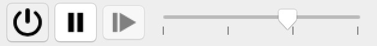
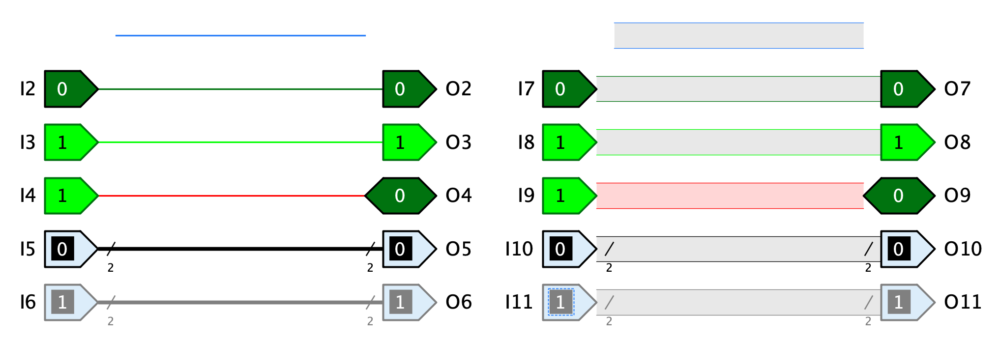
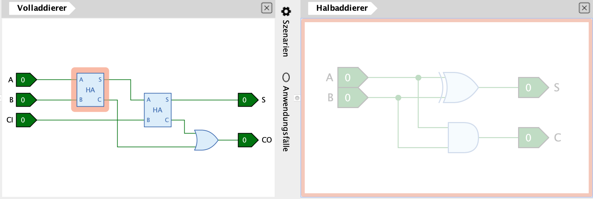
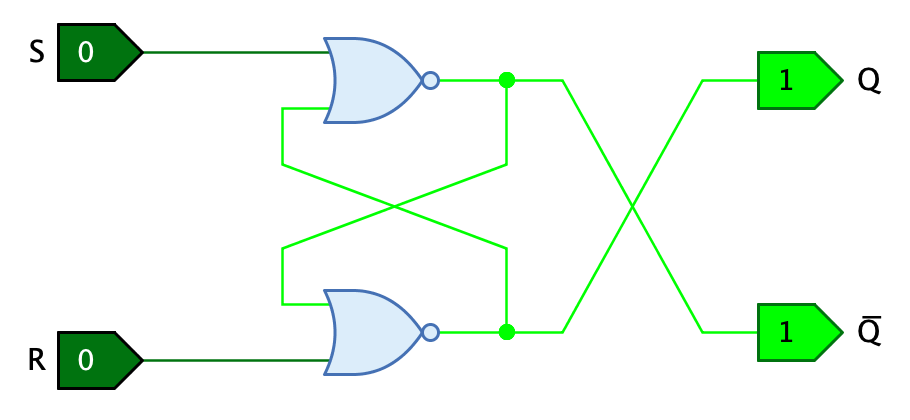

== Simulation
:experimental:
:icons: font

=== Simulations-Werkzeuge

Die Simulation von Antares wird über die Simulations-Werkzeuge in der Werkzeugleiste gesteuert. Die wichtigsten Aktionen können auch über die Tastatur oder über Menüs ausgeführt werden.

 Mit dieser Schaltfläche (kbd:[Ctrl + R]) kann die Simulation gestartet und gestoppt werden.

 Aktiviert den Einzelschrittmodus der Simulation.

 Führt den nächsten Einzelschritt aus (kbd:[Ctrl + Space]). Ist nur aktiv, wenn der Einzelschrittmodus aktiviert ist. Die Schaltfläche wird mit einem orangen Rahmen dargestellt, wenn ein Einzelschritt möglich ist.

Mit dem Schieberegler kann die Simulationsgeschwindigkeit gesteuert werden. Die Simulationsgeschwindigkeit ist in drei Bereiche aufgeteilt, deren Name als Tooltip angezeigt wird, wenn du  die Maus über den Regler bewegst. Je weiter links sich der Regler befindet, desto langsamer wird die Simulation ausgeführt, und desto mehr Unterstützunginformationen werden während der Simulation angezeigt.

Die Geschwindigkeitsbereiche haben die folgenden Namen:

Verwenden:: Dieser Bereich wird vor allem eingesetzt, um eine Schaltung zu vewenden, ohne weitere Details über die Funktionsweise angezeigt zu erhalten. Wenn du  z.B. eine Mikroprozessorschaltung fertig entwickelt hast und in ihr Maschinenprogramme ausführts, deren Ergebnisse zu sehen willst, wirst du  den Regler ganz nach rechts stellen, damit die Simulation so schnell wie möglich ausgeführt wird.

Beobachten:: In diesem Bereich werden Unterstützungsinformationen angezeigt, die während der Entwicklung einer Schaltung von Nutzen sein können, ohne dass die Simulation deshalb sehr viel langsamer ausgeführt wird.

Erforschen:: In diesem Bereich werden alle vorhandenen Unterstützunginformation angezeigt, sofern sie in den Einstellung aktiviert sind. Insbesondere die Signalflussanimationen (sofern aktiviert), die in diesem Bereich verwendet werden, verlangsamen die Simulation so sehr, dass du  diesem Bereich vor allem bei Demonstationen oder Schulungen benützen wirst.

Die folgende Tabelle zeigt, welche Unterstützungsinformationen in welchem Bereich zur Anwendung kommen.

[%header,cols=4*]
|===
|Information|Erforschen|Beobachten|Verwenden
|Aktive Komponenten|icon:check[]|icon:check[]|icon:check[]
|Ausführungs-Animation|(icon:check[])|(icon:check[])|(icon:check[])
|<<../scenarios/scenarios.adoc#, Szenarien>>|(icon:check[])|(icon:check[])|(icon:check[])
|Farbige Leitungen|icon:check[]|icon:check[]|
|<<../description/description.adoc#, Mnemonics>>|icon:check[]|icon:check[]|
|<<../base-library/memory.adoc#, ROM/RAM>>-Speicherinhalte|icon:check[]|icon:check[]|
|Anzeige Ausführungsverzögerung|(icon:check[])||
|Signalfluss-Animation|icon:check[]||
|===
(icon:check[]) Nur im Einzelschrittmodus

=== Signalfarben

Antares verwendet während der Simulation unterschiedliche Farben, um die verschiedenen Werte von Signalen oder die Zustände von Leitungen und Anschlüssen darzustellen. Die folgende Schaltung illustriert die verwendeten Farben, wobei die Leitungen links den Leitungsstil "Linie" und die Leitungen rechts den Leitungsstil "Block" haben.

* **Blau**: Die Leitung führt ein Signal mit Wert "undefiniert". Dies kommt vor, wenn keine Komponente ein Signal an die Leitung abgibt, weil sie entweder nicht an eine Komponete angeschlossen ist oder weil ein angeschlossener Tri-State-Puffer ein undefiniertes Signal ausgibt.
* **Dunkelgrün**: Die Leitung führt ein 1-Bit-Signal mit dem Wert 0.
* **Hellgrün**: Die Leitung führt ein 1-Bit-Signal mit dem Wert 1.
* **Rot**: Die Leitung ein Signal, in dem mind. ein Bit den Wert "Error" hat. Dies kann vorkommen, wenn mehrere Komponenten unterschiedliche Signale an dieselbe Leitung abgeben.
* **Schwarz**: Die Leitung führt ein Signal mit mehreren Bits, die alle den Wert 0 haben.
* **Grau**: Die Leitung führt ein Signal mit mehreren Bits, von denen mind. eines den Wert 1 hat.

NOTE: Farben werden in Antares von <<../styles/styles.adoc#, "Themen">> definiert. Die aktuell in Antares enthaltenen Themen verwenden alle die obenstehenden Farben. Es ist jedoch nicht ausgeschlossen, dass in Zukunft weitere Themen dazukommen (oder Benutzer eigene Themen definieren können), die andere Farben verwenden.

=== Simulationstiefe

Es ist eines der wichtigsten Ziele von Antares, dem Benützer zu ermöglichen, alle Bestandteile einer Schaltung zu erkunden, um ihre Funktionsweise möglichst tief und gründlich zu verstehen. Aus diesem Grund enthält die Basis-Bibliothek eher wenige ausprogrammierte Komponenten. Stattdessen sind Standardkomponenten wie Flipflops oder Register als vollständige Teilschaltungen in der Standardbibliothek verfügbar, die der Benützer während dem Schaltungsentwurf und der Simulation öffnen und in ihrem Verhalten beobachten kann.

Dieser Ansatz hat den Nachteil, dass grosse Schaltungen aus sehr vielen Basiskomponenten bestehen, wenn für die Simulation alle Teilschaltungen soweit expadiert werden, bis nur noch Basiskomponenten verwendet werden. So enthält z.B. der Mikrocomputer im Beispielprojekt "Mikrocomputer (Tannenbaum)" über 2'000 elementare Logik-Gatter und über 5'000 Leitungen.

Die Simulation solcher grossen Schaltungen benötigt viel Zeit. Nun besteht in Antares die Möglichkeit, für eine Teilschaltung ein <<../circuits/circuit-scripting.adoc#, Ausführungs-Skript>> zu definieren, das die Logik der Teilschaltung enthält und während der Simulation statt der inneren Schaltung ausgeführt wird.

Mit dem Menü menu:Simulation[Tiefe Simulation] kannst du  wählen, ob Antares die Ausführungsskripts von Teilschaltungen anwendet oder nicht. "Tiefe Simulation" bedeutet, dass die Ausführungsskripts nicht angewendet werden und Antares die volle Tiefe der Schaltung simuliert. Das Gegenteil wird "Flache Simulation" genannt: Teilschaltungen werden nur so tief simuliert, bis eine Teilschaltung ein Ausführungsskript enthält.

Eine flache Simulation bringt eine wichtige Einschränkung mit sich: Öffnest du  während einer flachen Simulation eine Teilschaltung, die ein Ausführungsskript enthält, kann Antares zwar den Inhalt der Teilschaltung anzeigen, aber überhaupt nichts über den Zustand der einzelnen Komponenten und Leitungen dieser Teilschaltung aussagen.

Antares stellt deshalb eine solche Teilschaltung in einem "verschleierten" Zustand dar. Im Bild oben wurde einer der Halbaddierer in einer eigenen Ansicht geöffnet. Antares stellt den geöffneten Halbaddierer mit einem grauen Schleier dar. Würde die Teilschaltung eine weitere Teilschaltung enthalten, könntest du  diese zwar ebenfalls öffnen oder in sie abtauchen, doch sie würde ebenfalls verschleiert dargestellt.

=== Simulations-Algorithmus

Der Algorithmus von Antares für die Simulation von Schaltungen ist normalerweise nicht etwas, das du  in allen Einzelheiten verstehen musst, um Antares zu verwenden. Deshalb werden in diesem Abschnitt lediglich die Grundlagen erklärt.

==== Signalwerte

Die Simulation von Antares verwendet Signale mit vier möglichen Werten 0, 1, "Undefiniert" (hochohmig)" und "Fehler".

Andere Simulationen verwenden weitere Signale wie z.B. "0/1 (ansteigende Flanke)" und "1/0 (absteigende Flanke)". Für solche erweiterten Modelle hat sich in Antares bis jetzt noch kein Bedarf gezeigt.

==== Laufzeit

Die Simulation verwendet die Laufzeit, die für jede Komponente und jede Leitung definiert ist. Dies ist die Zeit (in Nanosekunden), die eine Komponente braucht, um ein geändertes Eingangssignal zu verarbeiten und ein entsprechendes Signal an einem oder mehreren Ausgängen zu erzeugen.

Der Simulations-Algorithmus funktioniert ereignisbasiert. Immer wenn eine Komponente eine Änderung eines Eingangswertes feststellt, entsteht im Simulation ein neuer Eintrag in einer Ereignis-Liste (Event Queue), der zur Ausführung nach Ablauf der Laufzeit der Komponente vorgesehen ist. Nachdem diese Zeit verstrichen ist, fordert der Simulator die Komponente auf, den Wert ihrer Ausgägne neu zu berechnen. Für diese Berechnung verwendet die Komponente die Signale, die **zu diesem Zeitpunkt** an ihren Eingängen vorliegen.

==== Einschalt-Verhalten

Antares enthält noch keinen Mechanismus, mit dem das Einschaltverhalten vom Schaltungen und Komponenten beeinflusst werden kann. Beim Starten der Simulation wird jede Komponente aufgefordert, ihre Ausgänge neu zu berechnen. Dabei wird ebenfalls die Laufzeit berücksichtigt. Wenn zum Zeitpunkt der Berechnung noch kein Signal von anderen Komponenten an den Eingängen eingetroffen ist, ist es der Komponente überlassen, wie sie beim Start damit umgehen will. Die meisten Komponenten setzen dann die Eingänge initial auf den Wert 0, was dazu führt, dass ein unverbundenes Und-Gatter beim Start den Ausgangswert 0 und ein unverbundenes Nicht-Gatter den Ausgangswert 1 hat.

Dieses Verhalten muss beim Entwurf von sequentiellen Schaltungen berücksichtigt werden. Ohne weitere Massnahmen führt die Funktionsweise des Simulations-Algorithmus und das Einschalt-Verhalten von Antares dazu, dass ein SR-Latch mit Nicht-Oder-Gattern beim Einschalten einen illegalen Zustand einnimmt.

Reale Latches zeigen dieses Verhalten nicht, da geringfügige Laufzeit-Unterschiede der einzelnen Gatter dazu führen, dass die Schaltung beim Einschalten in einen stabilen und korrekten Zustand kippen.

In Antares gibt es zwei Ansätze, in der Simulation dasselbe Verhalten wie bei realen Schaltungen zu erreichen.

* **Unterschiedliche Laufzeiten**: Im obenstehenden Beispiel haben beide Nicht-Oder-Gatter dieselbe Lauzeit, z.B. 10 ns. Wenn für die beiden Gatter unterschiedliche Laufzeiten definiert werden (z.B. 8 ns für das obere Gatter und 11 ns für das untere Gatter), kippt die Schaltung beim Start in einen stabilen, korrekten Zustand. Die Latches und Flipflops der Standard-Bibliothek von Antares sind nach diesem Ansatz aufgebaut.
* **Rauschen**: Mit der Menü-Option menu:Simulation[Rauschen, Zufälliges Rauschen] kann der Simulator angewiesen werden, die Laufzeiten der Komponenten um einen zufälligen Wert zu verändern. Mit dieser Option nimmt obenstehendes SR-Latch beim Start der Simulation (evtl. nach einer kurzen Einschwing-Phase) einen korrekten Zustand ein, selbst wenn beide Gatter dieselbe Laufzeit konfiguriert haben.