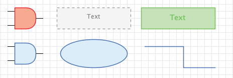
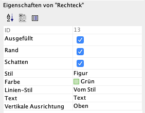
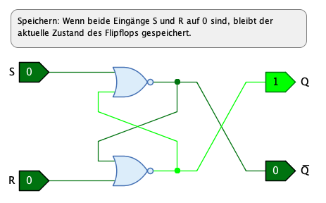
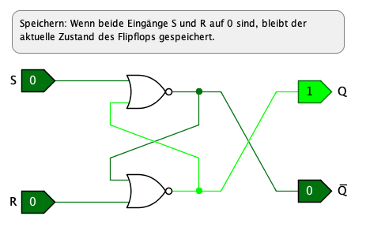
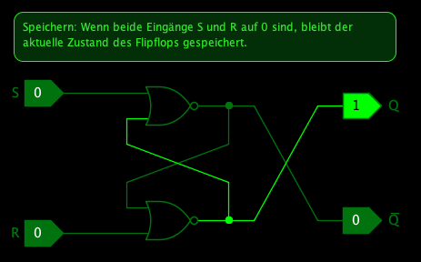

== Stile und Themen
:experimental:

Bei der Darstellung von grafischen Objekten verwendet Antares - wie jede andere grafische Applikation - einige grafische Eigenschaften, welche die Darstellung beeinflussen. Diese Eigenschaften sind im wesentlichen die folgenden:

* Farbe
* Zeichensatz (Font)
* Linientyp (Stroke)

Antares verfolgt das Ziel, Schaltungen ästhetisch ansprechend darzustellen. Um dieses Ziel zu erreichen, setzt Antares - unter anderem - die folgenden Mittel ein:

* Bündeln von grafischen Eigenschaften
* Stile
* Themen

=== Bündelung von grafischen Eigenschaften

Mit der Bündelung von grafischen Eigenschaften wird es einfacher, innerhalb einer einzelnen Schaltung und über mehrere Schaltungen hinweg eine gewisse grafische Konsistenz zu erreichen.

Das wichtigste Beispiel der Bündelung von grafischen Eigenschaften in Antares ist die **Farbe**. Die Farbe "Grün" ist in Antares nicht einfach nur ein bestimmter RGB-Wert wie z.B. "(0,255,0)", sondern sie besteht aus drei unterschiedlichen RRB-Werten für Vordergrundfarbe, Hintergrundfarbe und Textfarbe.  In Programmcode von Antares wird eine solche Farbe als "Zusammengesetzte Farbe (Composite Color)" bezeichnet.

Die Farbkomponenten einer zusammengesetzten Farbe sind aufeinander abgestimmt. Die Vordergrundfarbe, mit der z.B. der Rand eines grünen Rechtecks gezeichnet wird, ist immer noch grün, aber deutlich dunkler als der grüne Hintergrund. Das gleiche gilt für die Textfarbe, die ebenfalls grün ist, aber einen Ton hat, der sich genügend gut vom Hintergrund abhebt.

Wenn du in Antares also einem grafischen Objekt die Farbe "grün" gibst, setzt du gleichzeitig die Farbe des Vordergrundes, des Hintergrundes und des Textes.

Die zur Verfügung stehenden zusammengesetzten Farben sind von Antares vorgegeben. In der aktuellen Version von Antares besteht keine Möglichkeit, diese Farben zu ändern oder weitere Farben hinzuzufügen.

=== Stile

Ein Stil ist in Antares eine Menge von grafischen Eigenschaften, die zusammengefasst unter einem bestimmten Namen zur Verfügung stehen. Wenn ein solcher Stil auf ein grafisches Objekt "angewendet" wird, erhält das grafische Objekt automatisch alle grafischen Eigenschaften dieses Stils.

Grundsätzlich kann ein Stil Werte für die Basiseigenschaften Farbe, Zeichensatz und Linientypen haben. Zusätzlich kann ein Stil definieren, ob das grafische Objekt einen Schatten hat oder nicht. Intern verwendet Antares weitere Spezial-Stile z.B. für Leitungen, um unterschiedliche Linientypen für Bus-Leitungen oder für die Darstellung während der Simulation zu unterstützen.

Die Menge von Stilen ist von Antares vorgegeben. Es stehen die folgenden Stile zur Verfügung:

Figur:: Dieser Stil ist der grundlegende Stil in Antares. Er wird für vor allem für die "reinen" grafischen Objekte wir Rechteck, Ellipse, Line etc. verwendet.

Element:: Dieser Stil wird für die Knoten-Elemente des Graphen verwendet, aus denen die Schaltung besteht. Bei Antares sind das die Schaltungs-Komponenten wie logische Gatter oder Teilschaltungen.

Verbindung:: Dieser Stil wird in Antares für die Leitungen verwendet, mit denen die Schaltungs-Komponenten verbunden werden.

Annotation:: Annotationen sind kleine grafische Elemente oder Texte innerhalb von Elementen, also z.B. das kleine Dreieck, das in einem Flipflop einen Eingang bezeichnet, der mit steigender Signalflanke aktiv ist. Bezeichnungen von Anschlüssen sind ebenfalls Annotationen.

Erläuterung:: Erläuterungen sind Textboxen, die als grafische Elemente in die Schaltung aufgenommen werden.

Subsystem:: Subsysteme sind Rechtecke mit einem Text, die Teile einer Schaltung zusammenfassen, um grafisch auszudrücken, dass diese Teile zusammen ein Subsystem der Schaltung bilden.

TIP: Antares verwendet intern viele weitere Stile wie z.B. "Hintergrund", "Selektion", "Hervorhebung" etc., die aber in der Benutzerschnittstelle nicht für die Anwendung auf grafische Objekte zur Verfügung stehen.

=== Anwenden von Stilen

Wenn du im Schaltungseditor eine Komponente selektierst, kannst du anschliessend im Eigenschaftenfenster den Stil der Komponente bestimmten und zusätzlich gewisse grafische Eigenschaften beeinflussen.

TIP: Das Beispiel zeigt die Attribute eines Rechtecks. Bei anderen Komponenten kann das Eigenschaftenfenster anders aussehen.

Stil:: In diesem Attribut bestimmst du den Stil, den die Komponente hat.

Farbe:: In diesem Attribut kannst du die zusammengesetzte Farbe der Komponente setzen. Der Standardwert ist "Vom Stil", d.h. die Komponente übernimmt die Farbe, die der Stil vorgibt. Du kannst diese Farbe aber überschreiben, um z.B. ein Und-Gatter, das normalerweise in der Farbe des Stils gezeichnet wird, rot darzustellen, um auszudrücken, dass es eine besondere Bedeutung in der Schaltung hat.

Linien-Stil:: In diesem Attribut kannst du den Linien-Stil der Komponente setzen. Der Standardwert ist "Vom Stil", d.h. die Komponente übernimmt die Liniendarstellung des aktuellen Stils der Komponente. Aktuell stehen alle Kombinationen von drei Linientypen (ausgezogen, gestrichelt, gepunktet) und drei Strickdicken (schmal, mittel, breit) zur Verfügung.

Je nach Typ der selektierten Komponente können weitere grafische Eigenschaften wie "Ausgefüllt", "Rand" und "Schatten" eingestellt werden.

TIP: Das Attribut "Schatten" hat nur eine Wirkung, wenn die Darstellung von Schatten in den Einstellungen von Antares grundsätzlich aktivert ist.

=== Themen

Ein "Thema" ist in Antares eine Menge von Stilen mit bestimmten Werten, die alle unter einem bestimmten Namen zusammengefasst werden. Dabei werden nicht nur Stile berücksichtigt, die dir als Benützer zur Anwendung auf Komponenten zur Verfügung stehen, sondern auch "interne" Stile wie "Selektion" oder "Hintergrund".

Dies ermöglicht es, durch Wechseln des Themas die Art der Darstellung von Schaltungen grundsätzlich zu ändern. Das aktuelle Thema wird mit dem Menü menu:Ansicht[Thema] ausgewählt.

In der aktuellen Version von Antares stehen die folgenden drei Themen zur Auswahl.

Winter:: Dies ist das Standard-Thema von Antares. Es verwendet hauptsächlich blaue Figuren auf weissem Hintergrund.
+

Black & White:: Ein alternatives Thema, das ähnlich wie "Winter" aufgebaut ist, aber auf die blaue Farbe verzichtet.
+

CRT:: Ein experimentelles "Dark Theme", mit dem die Möglichkeiten und Grenzen von Themen ausgelotet werden sollen. Der Name "CRT" ist eine Reminiszenz an vergangene Zeiten, als Computer noch Monochrom-Terminals hatten.
+

