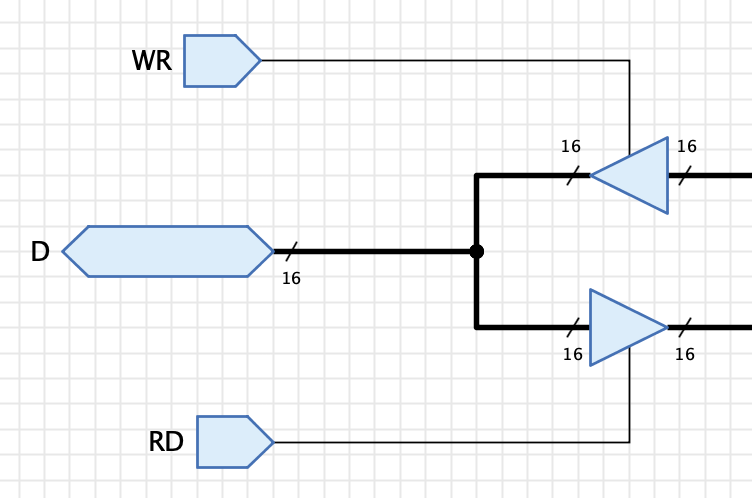
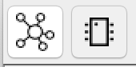
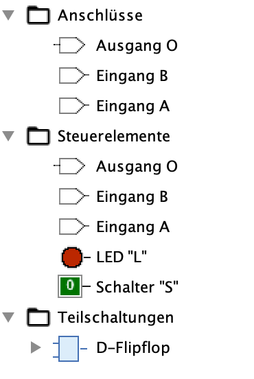
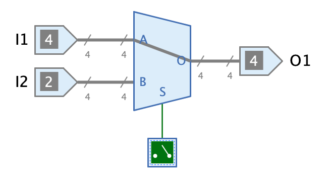
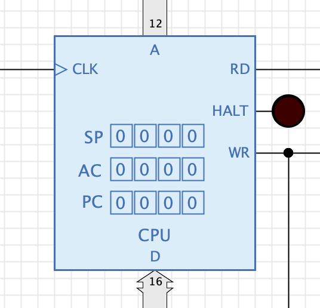
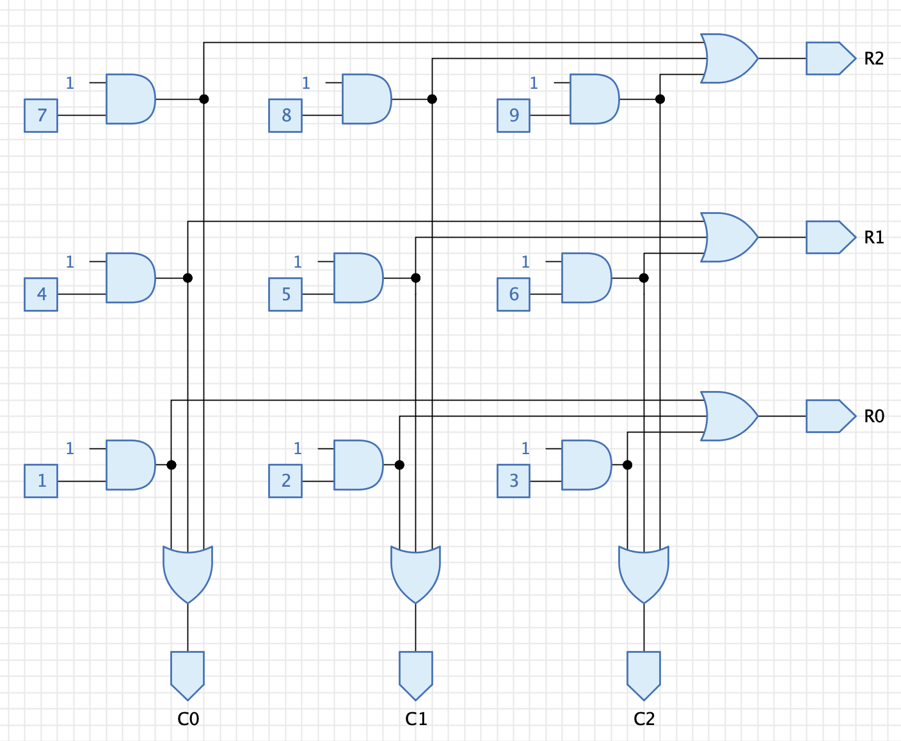
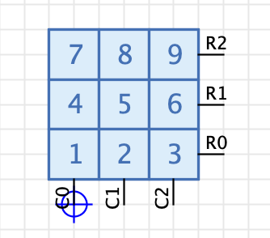
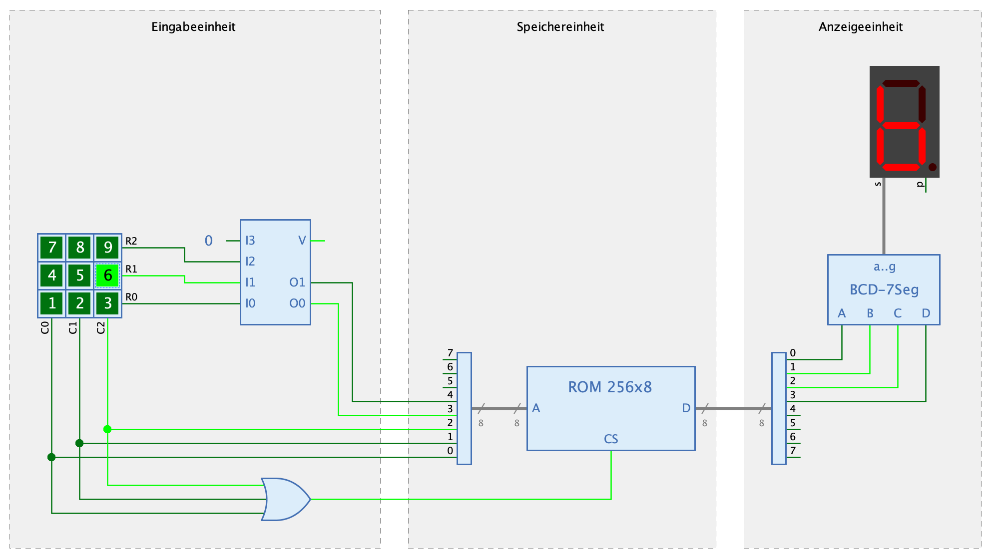

== Teilschaltungen

Wenn deine Schaltungen grösser und komplexer werden, wirst du bald an den Punkt gelangen, an dem du die Schaltung in einzelne, überschaubare Teile aufteilen und diese Teile mehrfach in Deinen Schaltungen wiederverwenden willst. In Antares werden diese Teile als "Teilschaltungen" bezeichnet.

Im Kapitel <<../first-steps/first-steps.adoc#, "Erste Schritte">> hast du bereits erste Erfahrungen mit der Erstellung und Wiederverwendung von Teilschaltungen gemacht. Das Kapitel <<../circuits/circuits.adoc#, "Schaltungen">> beschreibt detailiert, wie Schaltungen erstellt werden.

In diesem Kapitel wird beschrieben, wie du eine Schaltung baust, die als Teilschaltungen in anderen Schaltungen verwendet werden kann.

=== Anschlüsse

<<../base-library/port.adoc#, "Anschlüsse">> (Eingänge, Ausgänge) sind die wichtigsten Komponenten für den Aufbau von Teilschaltungen. Sie dienen dazu, Signale von der umgebenden Schaltung in die Teilschaltung zu übernehmen und Signale an die umgebende Schaltung zurückzugeben.

Es kommt häufig vor, dass du beim Beginn des Entwurfs einer neuen Schaltung noch nicht entschieden hast, ob die Schaltung später als Teilschaltung wiederverwendet werden soll. In dieser Entwicklungsphase verwendest du vielleicht eher Schalter und LEDs, um während der Simulation mit der Schaltung zu interagieren. Wenn du Dich dann entscheidest, die Schaltung als Teilschaltung zu verwenden, wirst du einige (oder alle) Schalter durch Eingänge und LEDs durch Ausgänge ersetzen. Da die Eingangs-Komponenten von Antares - zumindest in der äussersten Schaltung - während der Simulation auch als Schalter benutzt werden können, und Ausgangs-Komponenten den aktuellen Signalwert darstellen, kannst du in der Entwurfsphase gleich von Beginn weg Eingänge und Ausgänge statt Schalter und LEDs verwenden.

==== Namen von Anschlüssen

Anschlüsse müssen einen eindeutigen **Namen** haben, damit sie an verschiedenen Stellen durch den Benutzerer der Schaltung identifiziert werden können, z.B. im Symbol der Teilschaltung. Antares selber verwendet intern eine andere Identifikation von Anschlüssen. Wenn eine Schaltung eine Teilschaltung mit einem Eingang mit Namen "A" verwendet und eine Leitung zu diesem Eingang führt, merkt sich Antares nicht den Namen "A" als Referenz, sondern die interne Nummer des Anschlusses (siehe unten). Dies ermöglicht es, dass du die Namen von Anschlüssen in Teilschaltungen auch nachträglich noch ändern kannst, obwohl die Teilschaltung bereits in anderen Schaltungen verwendet wird.

In digitalen Schaltungen kommen häufig Ein- und Ausgänge vor, die ein invertiertes Signal übertragen und deren Namen mit einem Querbalken über dem Text ausgezeichnet wird. Ein Beispiel dafür sind Flipflops mit den Ausgängen Q und [overline]#Q#. Du kannst in Antares einen Querbalken erzeugen, indem du ein Ausrufezeichen vor den Buchstaben setzt, der einen Querbalken erhalten soll. Längere Text mit Querbalken können zusätzlich mit runden Klammern ausgezeichnet werden.

Beispiele:

 !Q
 !(ABC)

==== Bidirektionale Anschlüsse

Antares unterstützt bidirektionale Anschlüsse. Das Beispiel unten zeigt einen Ausschnitt des "Memory Buffer Registers" aus der Beispielschaltung "Mikroprozessor (Tannenbaum)". Der Anschluss "D" kann in Abhängigkeit der Eingänge "WR (Write)" und "RD (Read)" sowie der Hilfe der Tri-State-Puffer sowohl Daten übernehmen als auch Daten abgeben.

==== Signalfluss-Richtung

Die Basiskomponenten und die Teilschaltungen der Standard-Bibliothek von Antares gehen davon aus, dass Signale in einer Schaltung grundsätzlich von links nach rechts fliessen. Dies scheint ein Standard - zumindest im westlichen Kulturkreis - in der Digitaltechnik zu sein. Aus diesem Grund zeigen Anschlüsse per Default nach Osten.

Dieser Standard ist dann problematisch, wenn Signale mit mehreren Bits verwendet werden, da bei binären Repräsentationen dieser Signale das niedrigwertigste Bit rechts steht. Schieberegister- oder Addier-Schaltungen verlangen dann eher danach, Signale von rechts nach links fliessen zu lassen. Mir ist nicht bekannt, ob in der Branche eine verbreitete Lösung dieses Konflikts existiert; wenn du eigene Bibliotheken mit Antares entwickelst, solltest du dir zu Beginn ein paar Gedanken zu dieser Thematik machen.

=== Symboleditor

Der Symboleditor wird verwendet, um das Symbol einer Teilschaltung zu gestalten. Verwende die folgenden beiden Schaltflächen in der Werkzeugleiste von Antares, um zwischen Schaltungseditor und dem Symboleditor hin- und her zu wechseln.

Der Symboleditor besteht aus einem Baum, der die Elemente anzeigt, die in das Symbol hineingezogen werden können, und der grossen Zeichnungsfläche, in der das Symbol gezeichnet wird. Zusätzlich können die Zeichnungswerkzeuge verwendet werden, um grafische Elemente wie Rechtecke zum Symbol hinzuzufügen.

Die Elemente im Baum sind in drei Kategorien aufgeteilt.

Anschlüsse:: Die Eingänge und Ausgänge der Schaltung, die in das Symbol aufgenommen werden können. Sie werden im Symbol mit Anschluss-Strich (Pin) und dem Namen des Anschlusses dargestellt.

Steuerelemente:: Steuerelemente sind weitere Komponenten der Schaltung, die ebenfalls in das Symbol aufgenommen werden können. Siehe den Abschnitt "Steuerelemente" weiter unten für mehr Details. Steuerelemente werden je nach ihrem Typ unterschiedlich im Symbol dargestellt. Steuerelement-Anschlüsse stellen den aktuellen Signalwert des Anschlusses dar, während interaktive Steuerelemente wie Schalter, LED oder 7-Segment-Anzeige gleich wie in der Schaltung dargestellt werden.

Teilschaltungen:: Dieser Baumknoten enthält alle Teilschaltungen der Schaltung, für die das Symbol erstellt wird. Er dient dazu, innere Steuerelemente von Teilschaltungen ebenfalls in das Symbol aufzunehmen.

Wenn Du ein Element aus dem Baum in den Symboleditor ziehst, wird das Symbol aus dem Baum entfernt, da es keinen Sinn macht, dasselbe Element mehrfach im Symbol zu haben. Umgekehrt wird das Element wieder in den Baum aufgenommen, wenn Du es im Symboleditor löschst.

==== Eigenschaften von Anschlüssen

Wenn ein Anschluss im Symboleditor selektiert wird, werden seine Attribute im Eigenschaftenfenster angezeigt, wovon die meisten bearbeitet werden können.

Port-ID:: Zeigt die ID des Anschlusses an (nicht änderbar). Diese ID kann für <<../scripting/scripting.adoc#, Scripting>>-Anwendungen verwendet werden.

Name:: Der Name des Anschlusses (nicht änderbar). Der Name eines Anschlusses kann nur in der Schaltung selber geändert werden.

Ausrichtung:: Die Himmelsrichtig, in die der Anschluss-Strich (Pin) des Anschlusses zeigt.

Position Bezeichnung:: Mit diesem Attribut wird gesteuert, ob und wo der Name des Anschlusses im Symbol angezeigt wird. +
**Innerhalb**: Der Name wird innerhalb des Symbols anzeigt, d.h. als etwas grösserer Text gegenüber des Anschluss-Strichs. +
**Ausserhalb**: Der Name wird ausserhalb des Symbols angezeigt, d.h. als etwas kleinerer Text oberhalb des Anschluss-Strichs. +
**Ausblenden**: Der Name wird nicht angezeigt.

Anzahl Bits anzeigen:: Anschlüsse mit einer Bit-Breite grösser als 1 stellen standardmässig eine kleine Annotation dar, welche die Anzahl Bits des Anschlusses anzeigt. Mit diesem Attribut kann diese Darstellung ausgeblendet werden.

Logik:: Steht nur für Eingänge zur Verfügung. Steuert die Logik-Annotation dieses Anschlusses. Mit dem Wert "Negativ" wird bei diesem Anschluss ausserhalb des Symbos ein kleiner Kreis dargestellt.

Steuerung:: Steht nur für Eingänge zur Verfügung. Mit dem Wert "Taktflanke" wird bei diesem Anschluss innerhalb des Symbols ein kleines Dreieck dargestellt.

Annotation Ausgang:: Steht nur für Ausgänge zur Verfügung. Je nach Wert "Keine", "Tri-State" oder "Master-Slave" wird die entsprechende Annotation bei diesem Anschluss innerhalb des Symbols dargestellt.

==== Eigenschaften des Symbols

Wenn Du auf den Hintergrund des Zeichnungsbereichs klickst, zeigt das Eigenschaftenfenster von Antares die Attribute des gesamten Symbol an.

Darstellung während Simulation:: In diesem Attribut kann ein Skript eingegeben werden, mit dem die Darstellung des Symbols (aktuell noch in engen Grenzen) während der Simulation zusätzlich beeinflusst werden kann. Beispielsweise enthalten die Multiplexer-Komponenten der Standard-Bibliothek von Antares ein Skript, das den ausgewählten Datenpfad innerhalb des Symbols dadurch dargestellt, dass eine Linie vom Eingang zum Ausgang gezeichnet wird. +
 +

 +
Skripting ist ein fortgeschrittenes Konzept. Siehe das Kapitel <<../scripting/scripting.adoc#, "Skripting">> für weitere Informationen.

==== Steuerelemente

Steuerelemente in Symbolen sind ein extrem mächtiges Konzept, das es ermöglicht, dynamische und interaktive Symbole zu erstellen.

Steuerelemente sind Komponenten der Schaltung, die zusätzlich in das Symbol aufgenommen werden und während der Simulation ihren aktuellen Zustand im Symbol darstellen können. Interaktive Komponenten wie Schalter ermöglichen es zusätzlich, dass der Benützer während der Simulation Aktionen wie das Drücken des Schalters ausführt, die dann in der Teilschaltung verarbeitet werden.

Die folgenden eingebauten Komponenten von Antares können als Steuerelemente verwendet werden.

* Eingang und Ausgang
* Sonde
* Schalter
* DIP-Schalter
* LED
* LED-Matrix
* RGB-LED
* 7-Segment-Anzeige
* Tastatur
* Terminal

Antares erlaubt es nicht nur, Steuerelemente der Schaltung zu verwenden, für die das Symbol erstellt wird, sondern zusätzlich auch Steuerelemente aller Teilschaltungen und deren Teilschaltungen.

Dadurch sind Anwendung möglich wie bei der CPU des Beispiel-Projekts "Mikrocomputer (Tannenbaum)", deren Symbol die aktuellen Werte der drei wichtigsten Register "SP (Stack Pointer", "AC (Accumulator)" und "PC (Program Counter)" anzeigt.

Dazu ist keinerlei Programmierung oder Skripting nötig: Die CPU ist eine rein aus den Komponenten der Standard-Bibliothek erstellte Schaltung. Die angezeigten Register sind nicht direkt in der CPU-Schaltung enthalten, sondern in der Teilschaltung "Register File", die von der CPU verwendet wird.

Als weiteres Beispiel, das die Möglichkeiten von Steuerelementen veranschaulicht, ist die folgende Tastatur-Schaltung. Sie enthält 9 Schalter, die in drei Spalten und drei Zeilen angeordnet sind. Die Schaltung gibt die Adresse des gedrückten Schalters über die jeweiligen Ausgänge Cx und Rx aus.

Im Symbol der Schaltung werden nun alle Schalter als Steuerelemente hinzugefügt und in einer 3x3-Matrix angeordnet.

Dadurch wird es möglich, die Tastatur-Schaltung als interaktive Komponente folgendermassen in einer Beispiel-Schaltung zu verwenden.

Beachte, wie der Benützer die Tastatur-Schaltung während der Simulation wie eine ausprogrammierte Basis-Komponente verwenden kann. Sie zeigt ihre Schalter mit ihren aktuellen Zuständen an und erlaubt es dem Benutzer, die Schalter mit der Maus zu klicken.

Wenn man diese Anwendungsidee noch weiter denkt, kann man sich vorstellen, in einem Projekt eine spezielle Schaltung aufzunehmen, deren Symbol alle interaktiven Elemente sämtlicher Teilschaltungen enthält. Damit kann diese spezielle Schaltung wie als "Front Panel" einer komplexen Schaltung eingesetzt werden; öffnet man diese Schaltung, sieht man nur noch die interaktiven Elemente des Systems, also die Schalter, LEDs oder 7-Segment-Anzeigen.

