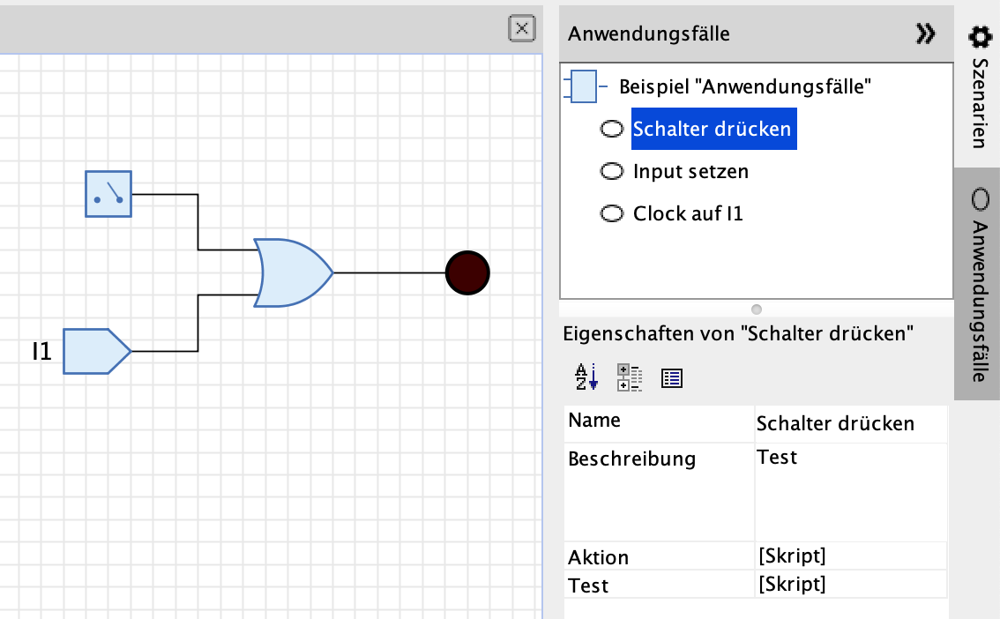

== Anwendungsfälle

Anwendungsfälle in Antares sind mit Hilfe von <<../scripting/scripting.adoc#, Skripts>> programmierte Verwendungen einer Schaltung. Im Skript eines Anwendungsfall können simulierte Interaktionen des Benützers wie das Drücken eines Schalters oder das Vorliegen eines besimmten Signals an einem Eingangs-Anschluss programmiert werden. Der Benützer einer Schaltung kann die ausprogrammierten Anwendungsfälle starten und beobachten, wie sich die Schaltung verhält, ohne dass er zum richtigen Zeitpunkt mit der Schaltung interagieren muss.

=== Beispiele

Ein einfaches Beispiel von Anwendungsfällen sind die möglichen Verwendungen eines SR-Flipflops, also "Setzen" und "Zurücksetzen". Beim Setzen werden zuerst beide Eingänge "S" und "R" auf 0 und anschliessend der Eingang "S" auf 1 gesetzt.

Ein komplexeres Beispiel ist die Ausführung eines bestimmten Maschinenbefehls in einem Mikroprozessor, ohne dass der Mikroprozessor in eine verwendende Schaltung mit ROM, RAM und Timer eingebaut ist. Wenn z.B. ein LODD-Befehl (Load Direct) ausgeführt werden soll, muss - je nach Mikroprozessor - nach Start der Simulation das folgende passieren:

* An der Adresse 0 des (nicht vorhandenen) Programmspeichers muss der Befehl LODD mit Adresse der auszulesenden Speicherzelle vorhanden sein
* Der Takteingang des Mikroprozessors muss mit einer nicht zu grossen Periode wechselnde Signale liefern.
* Am Datenbus muss zum richtigen Zeitpukt der Maschinenbefehlt LODD vorliegen.
* Am Datenbus müssen zum richtigen Zeitpukt die Daten der ausgelesenen Speicherzelle vorliegen.

Mit dem Feature "Anwendungsfälle" von Antares ist es möglich, in der Mikroprozessor-Schaltung einen Anwendungsfall "LODD" zu definieren, der die richtigen Aktionen zum richtigen Zeitpunkt vornimmt. Der Benützer, der die Mikroprozessor-Schaltung geöffnet hat, startet nur noch diesen Anwendungsfall und kann dann beobachten, wie der Mikroprozessor den Maschinenbefehl ausführt.

=== Anwendungsfälle ausführen

Die Simulationswerkzeugleiste von Antares enthält ein Auswahlfeld, in dem alle Anwendungsfälle zur Ausführung angeboten werden, die in einer Schaltung definiert sind.

Wenn der Benüter die Ausführung eines Anwendungsfalls startet, wechselt Antares automatisch in den Simulationsmodus und startet das Skript des Anwendungsfalls. Dabei stehen alle Möglichkeiten des Simulationsmodus zur Verfügung, wie Steuerung der Simulationsgeschwindigkeit, Einzelschritt-Modus oder Signalanimation. Falls für die aktuelle Schaltung <<../scenarios/scenarios.adoc#, Szenarien>> definiert sind, werden diese ebenfalls angewendet, und ihre Beschreibungen werden während der Ausführung des Anwendungsfalls eingeblendet.

Am Ende der Ausführung eines Anwendungsfalls bleibt Antares im Simulationsmodus.

=== Testfälle

Für jeden Anwwendungsfall kann zusätzlich ein Testfall definiert werden, der dazu dient, die korrekte Funktionsweise der Schaltung bei Ausführung dieses Anwendungsfalls zu überprüfen.

Ein Testfall besteht aus einem eigenen Skript, das typischerweise Zustände der Schaltung überprüft, wie z.B. ob ein Ausgang einen bestimmten Wert hat oder ob eine LED leuchtet. Bei der Ausführung eines Testfalls führt Antares zunächst den Anwendungsfall aus und anschliessend das Skript des Testfalls. Für jede Testbedingung, die nicht erfüllt ist, fügt Antares einen neuen Eintrag in der "Probleme-Ansicht" am unteren Rand des Hauptfensters hinzu.

=== Konfiguration

Anwendungsfälle der geöffneten Schaltung werden in der aufklappbaren Seitenleiste "Anwendungsfälle" am rechten Rand des Antares-Fensters konfiguriert.

Die Seitenleiste enhält einen Baum mit allen Anwendungsfällen (Oval-Icon). Wenn Du einen Knoten im Baum auswählst, werden im Eigenschaftenfenster darunter die Attribute des Anwendungsfalls angezeigt und zur Änderung angeboten.

==== Aktionen

Um Anwendungsfälle hinzuzufügen oder zu löschen, wählst Du einen Knoten im Baum aus und führst eine Aktion des Hauptmenüs oder des Kontextmenüs (rechte Maustaste) aus.

Neuer Anwendungsfall:: Kontextmenü auf dem Schaltungs-Knoten. Nach Eingabe des Namens des neuen Anwendungsfalls (in der aktuellen Sprache) wird er im Baum hinzugefügt.

Anwendungsfall löschen:: Kontextmenü auf dem Anwendungsfall-Knoten. Nach einer Sicherheitsabfrage wird der ausgewählte Anwendungsfall gelöscht.

Ausführen:: Kontextmenü auf dem Anwendungsfall-Knoten. Startet die Ausführung des Anwendungsfalls.

Test ausführen:: Kontextmenü auf dem Anwendungsfall-Knoten, das nur aktiv ist, falls für den ausgewählten Anwendungsfall ein Testfall vorhanden ist. Führt den Anwendungsfall sowie das Testfall-Skrit aus.

Alle Tests ausführen:: Kontextmenü auf dem Schaltungs-Knoten. Führt die Tests aller Anwendungsfälle aus.

==== Attribute von Anwendungsfällen

Name:: Der Name des Anwendungsfalls, der in alle unterstützten Sprachen übersetzt werden kann.

Beschreibung:: Die Beschreibung des Anwendungsfalls, die in alle unterstützten Sprachen übersetzt werden kann. Sie wird in der aktuellen Version von Antares nur in der Eigenschaften-Ansicht verwendet.

Aktion:: Das Skript, das die Logik des Anwendungsfalls enthält. +
+
.Beispiel
[source,javascript]
----
circuit.pressButtonAt(10000, 1);
----

Test:: Das Skript, das die Testbedingungen des Anwendungsfalls enthält. +
+
.Beispiel
[source,javascript]
----
circuit.assertLedOnAt(20000, 2);
----
